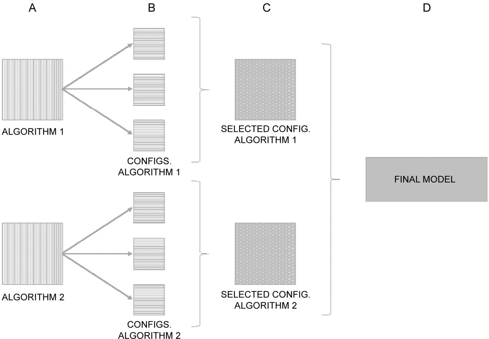
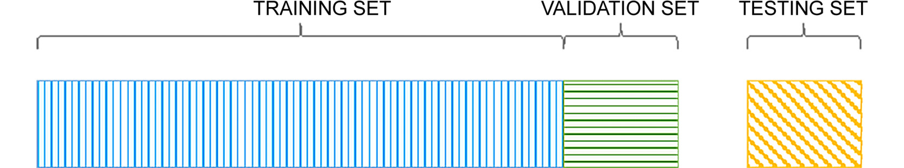
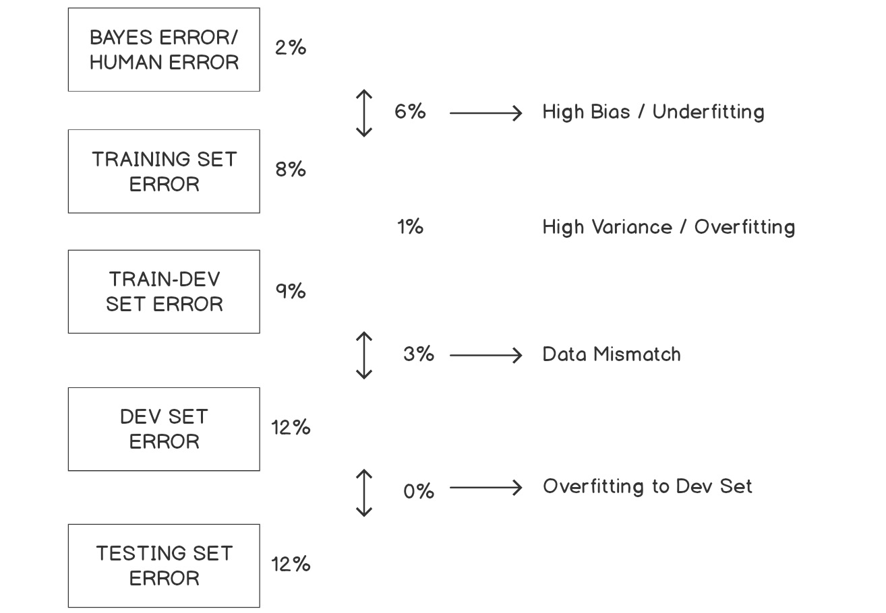

Lab 3. Supervised Learning -- Key Steps
===================================


**Overview**

In this lab, you will learn about key concepts for solving a
supervised learning data problem. Starting from splitting the dataset to
effectively create unbiased models that perform well on unseen data, you
will learn how to measure the performance of the model in order to
analyze it and take the necessary actions to improve it. By the end of
this lab, you will have a firm understanding of how to split a
dataset, measure a model\'s performance, and perform error analysis.


#### Pre-reqs:
- Google Chrome (Recommended)

#### Lab Environment
Notebooks are ready to run. All packages have been installed. There is no requirement for any setup.

All examples are present in `~/work/ml-workshop/Lab03` folder. 

You can access lab at `http://<host-ip>/lab/workspaces/lab3_Supervised`


The following diagram shows the process of selecting the ideal model and
using the sets mentioned:





The following diagram displays the proportional partition of the dataset
into three subsets. It is important to highlight that the training set
must be larger than the other two, as it is the one to be used for
training the model. Additionally, it is possible to observe that both
the training and validation sets have an effect on the model, while the
testing set is mainly used to validate the actual performance of the
model with unseen data. Considering this, the training and validation
sets must come from the same distribution:




Exercise 3.01: Performing a Data Partition on a Sample Dataset
--------------------------------------------------------------

In this exercise, we will be performing a data partition on the
`wine` dataset using the split ratio method. The partition in
this exercise will be done using the three-splits approach. Follow these
steps to complete this exercise:

Note

For the exercises and activities within this lab, you will need to
have Python 3.7, NumPy, Jupyter, Pandas, and scikit-learn installed on
your system.

1.  Open a Jupyter Notebook to implement this exercise. Import the
    required elements, as well as the `load_wine` function
    from scikit-learn\'s `datasets` package:

    ```
    from sklearn.datasets import load_wine
    import pandas as pd
    from sklearn.model_selection import train_test_split
    ```

    The first line imports the function that will be used to load the
    dataset from scikit-learn. Next, `pandas` library is
    imported. Finally, the `train_test_split` function is
    imported, which will be in charge of partitioning the dataset. The
    function partitions the data into two subsets (a train and a test
    set). As the objective of this exercise is to partition data into
    three subsets, the function will be used twice to achieve the
    desired result.

2.  Load the `wine` toy dataset and store it in a variable
    named `data`. Use the following code snippet to do so:

    ```
    data = load_wine()
    ```

    The `load_wine` function loads the toy dataset provided by
    scikit-learn.

    Note

    To check the characteristics of the dataset, visit the following
    link:
    <https://scikit-learn.org/stable/modules/generated/sklearn.datasets.load_wine.html>.

    The output from the preceding function is a dictionary-like object,
    which separates the features (callable as data) from the target
    (callable as target) into two attributes.

3.  Convert each attribute (data and target) into a Pandas DataFrame to
    facilitate data manipulation. Print the shape of both DataFrames:

    ```
    X = pd.DataFrame(data.data)
    Y = pd.DataFrame(data.target)
    print(X.shape,Y.shape)
    ```

    The output from the `print` function should be as follows:

    ```
    (178, 13) (178, 1)
    ```

    Here, the values in the first parenthesis represent the shape of
    DataFrame `X` (known as the features matrix), while the
    values in the second parenthesis refer to the shape of DataFrame
    `Y` (known as the target matrix).

4.  Perform your first split of the data using the
    `train_test_split` function. Use the following code
    snippet to do so:

    ```
    X, X_test, Y, Y_test = train_test_split(X, Y, test_size = 0.2)
    ```

    The inputs of the `train_test_split` function are the two
    matrices `(X,Y)` and the size of the test set, as a value
    between 0 and 1, which represents the proportion.

    Note

    Considering that we are dealing with a small dataset, as per the
    explanation in the *Split Ratio* section, we\'re using a split ratio
    of 60/20/20%. Remember that for larger datasets, the split ratio
    usually changes to 98/1/1%.

    The outputs of the preceding function are four matrices:
    `X` divided into two subsets (train and test) and
    `Y` divided into two corresponding subsets:

    ```
    print(X.shape, X_test.shape, Y.shape, Y_test.shape)
    ```

    By printing the shape of all four matrices, as per the preceding
    code snippet, it is possible to confirm that the size of the test
    subset (both `X` and `Y`) is 20% of the total
    size of the original dataset (150 \* 0.2 = 35.6) rounded to an
    integer, while the size of the train set is the remaining 80%:

    ```
    (142, 13) (36, 13) (142, 1) (36, 1)
    ```

5.  To create a validation set (dev set), we will use the
    `train_test_split` function to divide the train sets we
    obtained in the previous step. However, to obtain a dev set that\'s
    the same shape as the test set, it is necessary to calculate the
    proportion of the size of the test set over the size of the train
    set before creating a validation set. This value will be used as the
    `test_size` for the next step:

    ```
    dev_size = 36/142
    print(dev_size)
    ```

    Here, `36` is the size of the test set we created in the
    previous step, while `142` is the size of the train set
    that will be further split. The result from this operation is around
    `0.25`, which can be verified using the `print`
    function.

6.  Use the `train_test_split` function to divide the train
    set into two subsets (train and dev sets). Use the result from the
    operation in the previous step as the `test_size`:

    ```
    X_train, X_dev, Y_train, Y_dev = train_test_split(X, Y, \
                                     test_size = dev_size)
    print(X_train.shape, Y_train.shape, X_dev.shape, \
          Y_dev.shape, X_test.shape, Y_test.shape)
    ```

    The output of the `print` function is as follows:

    ```
    (106, 13) (106, 1) (36, 13) (36, 1) (36, 13) (36, 1)
    ```


Cross-Validation
----------------

**Cross-validation** is also a procedure that\'s used to partition data
by resampling the data that\'s used to train and validate the model. It
consists of a parameter, *K,* that represents the number of groups that
the dataset will be divided into.

Due to this, the procedure is also referred to as K-fold
cross-validation, where *K* is usually replaced by a number of your
choice. For instance, a model that\'s created using a 10-fold
cross-validation procedure signifies a model where data is divided into
10 subgroups. The procedure of cross-validation is illustrated in the
following diagram:


![](data:application/octet-stream;base64,/9j/4AAQSkZJRgABAgEBLAEsAAD/7QAsUGhvdG9zaG9wIDMuMAA4QklNA+0AAAAAABABLAAAAAEAAQEsAAAAAQAB/+4AE0Fkb2JlAGSAAAAAAQUAAklE/9sAhAACAgIDAgMFBAQFBwYGBgcIBwgIBwgJCQoKCgkJCwoLCwsLCgsLDAwMDAwLDAwMDAwMDAwMDAwMDAwMDAwMDAwMAQMEBAoFCg8KCg8PDg4ODw8ODg4ODw8MDg4ODA8PDBEREREMDwwREREREQwRERERERERERERERERERERERERERH/wAARCADLBoEDAREAAhEBAxEB/8QBogAAAAcBAQEBAQAAAAAAAAAABAUDAgYBAAcICQoLAQACAgMBAQEBAQAAAAAAAAABAAIDBAUGBwgJCgsQAAIBAwMCBAIGBwMEAgYCcwECAxEEAAUhEjFBUQYTYSJxgRQykaEHFbFCI8FS0eEzFmLwJHKC8SVDNFOSorJjc8I1RCeTo7M2F1RkdMPS4ggmgwkKGBmElEVGpLRW01UoGvLj88TU5PRldYWVpbXF1eX1ZnaGlqa2xtbm9jdHV2d3h5ent8fX5/c4SFhoeIiYqLjI2Oj4KTlJWWl5iZmpucnZ6fkqOkpaanqKmqq6ytrq+hEAAgIBAgMFBQQFBgQIAwNtAQACEQMEIRIxQQVRE2EiBnGBkTKhsfAUwdHhI0IVUmJy8TMkNEOCFpJTJaJjssIHc9I14kSDF1STCAkKGBkmNkUaJ2R0VTfyo7PDKCnT4/OElKS0xNTk9GV1hZWltcXV5fVGVmZ2hpamtsbW5vZHV2d3h5ent8fX5/c4SFhoeIiYqLjI2Oj4OUlZaXmJmam5ydnp+So6SlpqeoqaqrrK2ur6/9oADAMBAAIRAxEAPwD7+Yq7FXYq7FXYq7FXYq7FXYq7FXYq7FXYq7FXYq7FXYq7FXYq7FXYq7FXYq7FXYq7FXYq7FXYq7FXYq7FXYq7FXYq7FXYq7FXYq7FXYq7FXYq7FXYq7FXYq7FXYq7FXYq7FXYq7FXYq7FXYq7FXYq7FXYq7FXYq7FXYq7FXYq7FXYq7FXYq7FXYq7FXYq7FXYq7FXYq7FXYq7FXYq7FXYq7FXYq7FXYq7FXYq7FXYq7FXYq7FXYq7FXYq7FXYq7FXYq7FXYq7FXYq7FXYq7FXYq7FXYq7FXYq7FXYq7FXYq7FXYq7FXYq7FXYq7FXYq7FXYq7FXYq7FXYq7FXYq7FXYq7FXYq7FXYq7FXYq7FXYq7FXYq7FXYq7FXYq7FXYq7FXYq7FXYq7FXYq7FXYq7FXYq7FXYq7FXYq7FXYq7FXYq7FXYq7FXYq7FXYq7FXYq7FXYq7FXYq7FXYq7FXYq7FXYq7FXYq7FXYq7FXYq7FXYq7FXYq7FXYq7FXYq7FXYq7FXYq7FXYq7FXYq7FXYq7FXYq7FXYq7FXYq7FXYq7FXYq7FXYq7FXYq7FXYq7FXYq7FXYq7FXYq7FXYq7FXYq7FXYq7FXYq7FXYq7FXYq7FXYq7FXYq7FXYq7FXYq7FXYq7FXYq7FXYq7FXYq7FXYq7FXYq7FXYq7FXYq7FXYq7FXYq7FXYq7FXYq7FXYq7FXYq7FXYq7FXYq7FXYq7FXYq7FXYq7FXYq7FXYq7FXYq7FXYq7FXYq7FXYq7FXYq7FXYq7FXYq7FXYq7FXYq7FXYq7FXYq7FXYq7FXYq7FXYq7FXYq7FXYq7FXYq7FXYq7FXYq7FXYq7FXYq7FXYq7FXYq7FXYq7FXYq7FXYq7FXYq7FXYq7FXYq7FXYq7FXYq7FXYq7FXYq7FXYq7FXYq7FXYq7FXYq7FXYq7FXYq7FXYq7FXYq7FXYq7FXYq7FXYq7FXYq7FXYq7FXYq7FXYq7FXYq7FXYq7FXYq7FXYq7FXYq7FXYq7FXYq7FXYq7FXYq7FXYq7FXYq7FXYq7FXYq7FXYq7FXYq7FXYq7FXYq7FXYq7FXYq7FXYq7FXYq7FXYq7FXYq7FXYq7FXYq7FXYq7FXYq7FXYq7FXYq7FXYq7FXYq7FXYq7FXYq7FXYq7FXYq7FXYq7FXYq7FXYq7FXYq7FXYq7FXYq7FXYq7FXYq7FXYq7FXYq7FXYq7FXYq7FXYq7FXYq7FXYq7FXYq7FXYq7FXYq7FXYq7FXYq7FXYq7FXYq7FXYq7FXYq7FXYq7FXYq7FXYq7FXYq7FXYq7FXYq7FXYq7FXYq7FXYq7FXYq7FXYq7FXYq7FXYq7FXYq7FXYq7FXYq7FXYq7FXYq7FXYq7FXYq7FXYq7FXYq7FXYq7FXYq7FXYq7FXYq7FXYq7FXYq7FXYq7FXYq7FXYq7FXYq7FXYq7FXYq7FXYq7FXYq7FXYq7FXYq7FXYq7FXYq7FXYq7FXYq7FXYq7FXYq7FXYq7FXYq7FXYq7FXYq7FXYq7FXYq7FXYq7FXYq7FXYq7FXYq7FXYq7FXYq7FXYq7FXYq7FXYq7FXYq7FXYq7FXYq7FXYq7FXYq7FXYq7FXYq7FXYq7FXYq7FXYq7FXYq7FXYq7FXYq7FXYq7FXYq7FXYq7FXYq7FXYq7FXYq7FXYq7FXYq7FXYq7FXYq7FXYq7FXYq7FXYq7FXYq7FXYq7FXYq7FXYq7FXYq7FXYq7FXYq7FXYq7FXYq7FXYq7FXYq7FXYq7FXYq7FXYq7FXYq7FXYq7FXYq7FXYq7FXYq7FXYq7FXYq7FXYq7FXYq7FXYq7FXYq7FXYq7FXYq7FXYq7FXYq7FXYq7FXYq7FXYq7FXYq7FXYq7FXYq7FXYq7FXYq7FXYq7FXYq7FXYq7FXYq7FXYq7FXYq7FXYq7FXYq7FXYq7FXYq7FXYq7FXYq7FXYq7FXYq7FXYq7FXYq7FXYq7FXYq7FXYq7FXYq7FXYq7FXYq7FXYq7FXYq7FXYq7FXYq7FXYq7FXYq7FXYq7FXYq7FXYq7FXYq7FXYq7FXYq7FXYq7FXYq7FXYq7FXYq7FXYq7FXYq7FXYq7FXYq7FXYq7FXYq7FXYq7FXYq7FXYq7FXYq7FXYq7FXYq7FXYq7FXYq7FXYq7FXYq7FXYq7FXYq7FXYq7FXYq7FXYq7FXYq7FXYq7FXYq7FXYq7FXYq7FXYq7FXYq7FXYq7FXYq7FXYq7FXYq7FXYq7FXYq7FXYq7FXYq7FXYq7FXYq7FXYq7FXYq7FXYq7FXYq7FXYq7FXYq7FXYq7FXYq7FXYq7FXYq7FXYq7FXYq7FXYq7FXYq7FXYq7FXYq7FXYq7FXYq7FXYq7FXYq7FXYq7FXYq7FXYq7FXYq7FXYq7FXYq7FXYq7FXYq7FXYq7FXYq7FXYq7FXYq7FXYq7FXYq7FXYq7FXYq7FXYq7FXYq7FXYq7FXYq7FXYq7FXYq7FXYq7FXYq7FXYq7FXYq7FXYq7FXYq7FXYq7FXYq7FXYq7FXYq7FXYq7FXYq7FXYq7FXYq7FXYq7FXYq7FXYq7FXYq7FXYq7FXYq7FXYq7FXYq7FXYq7FXYq7FXYq7FXYq7FXYq7FXYq8T/wCchPNWs+TvJdxeaPOLe6ae1gSX00k4etOkZYJICpIDbctq4qkf/KsfzOP/AE3030aTp/4fCd/nUe3iq7/lWP5nH/pvpvo0nT/w+E7/ADqPbxVd/wAqx/M4/wDTfTfRpOn/AIfCd/nUe3iq7/lWP5nf9T9N9Gk6f/zT9/t0p1xV3/KsfzO/6n6b/uE6f/zT0/HruNqKu/5Vj+Z3/U/Tf9wnT/8Amnp+PXcbUVd/yrH8zv8Aqfpv+4Tp/wDzT0/HruNqKu/5Vj+Z3/U/Tf8AcJ0//mnp+PXcbUVd/wAqx/M7/qfpv+4Tp/8AzT0/HruNqKu/5Vj+Z3/U/Tf9wnT/APmnp+PXcbUVd/yrH8zv+p+m/wC4Tp//ADT0/HruNqKu/wCVY/md/wBT9N/3CdP/AOaen49dxtRV3/KsfzO/6n6b/uE6f/zT0/HruNqKu/5Vj+Z3/U/Tf9wnT/8Amnp+PXcbUVd/yrH8zv8Aqfpv+4Tp/wDzT0/HruNqKu/5Vj+Z3/U/Tf8AcJ0//mnp+PXcbUVd/wAqx/M7/qfpv+4Tp/8AzT0/Gvem2Ku/5Vj+Z3/U/Tf9wnT/APmnp+PTc71Vd/yrH8zv+p+m/wC4Tp//ADT0/Hpud6qu/wCVY/md/wBT9N/3CdP/AOaen49NzvVV3/KsfzO/6n6b/uE6f/zT0/Hpud6qu/5Vj+Z3/U/Tf9wnT/8Amnp+PTc71Vd/yrH8zv8Aqfpv+4Tp/wDzT0/Hpud6qu/5Vj+Z3/U/Tf8AcJ0//mnp+PTc71Vd/wAqx/M7/qfpv+4Tp/8AzT0/Hpud6qu/5Vj+Z3/U/Tf9wnT/APmnp+PTc71Vd/yrH8zv+p+m/wC4Tp//ADT0/Hpud6qu/wCVY/md/wBT9N/3CdP/AOaen49NzvVV3/KsfzO/6n6b/uE6f/zT0/Hpud6qu/5Vj+Z3/U/TfTpOn/8ANP3e3WvXFXf8qx/M4f8ATfTfTpOn/j8I3+VB7eCrzn83dH/NX8tvJera9B54kmewtZJ1jfS9PUNwFaEhOvuB/sTir7Gs5GmgjdurKpPzI+Q/ViqIxV2KuxV2KuxV2KuxV2KuxV8rapdee/PH5la9oml+Y20m00yy0uZVjsrW4Z3vDdcyWmBIp6C07b9PFVkP/KsfzOP/AE3030aTp/4fCd/nUe3iq7/lWP5nH/pvpvo0nT/w+E7/ADqPbxVd/wAqx/M4/wDTfTfRpOn/AIfCd/nUe3iq7/lWP5nH/pvpvo0nT/w+E7/Oo9vFV3/KsfzOP/TfTfRpOn/h8J3+dR7eKrv+VY/mcf8Apvpvo0nT/wAPhO/zqPbxVd/yrH8zj/03030aTp/4fCd/nUe3iq7/AJVj+Zx/6b6b6NJ0/wDD4Tv86j28VXf8qx/M4/8ATfTfRpOn/h8J3+dR7eKrv+VY/mcf+m+m+jSdP/D4Tv8AOo9vFV3/ACrH8zj/ANN9N9Gk6f8Ah8J3+dR7eKrv+VY/mcf+m+m+jSdP/D4Tv86j28VXf8qx/M7/AKn6b6NJ0/8A5p+/26U64q7/AJVj+Z3/AFP03/cJ0/8A5p6fj13G1FXf8qx/M7/qfpv+4Tp//NPT8eu42oq7/lWP5nf9T9N/3CdP/wCaen49dxtRV3/KsfzO/wCp+m/7hOn/APNPT8eu42oq7/lWP5nf9T9N/wBwnT/+aen49dxtRV3/ACrH8zv+p+m/7hOn/wDNPT8eu42oq7/lWP5nf9T9N/3CdP8A+aen49dxtRV3/KsfzO/6n6b/ALhOn/8ANPT8eu42oq7/AJVj+Z3/AFP03/cJ0/8A5p6fj13G1FXf8qx/M7/qfpv+4Tp//NPT8eu42oq7/lWP5nf9T9N/3CdP/wCaen49dxtRV3/KsfzO/wCp+m/7hOn/APNPT8eu42oq7/lWP5nf9T9N/wBwnT/+aen41702xV3/ACrH8zv+p+m/7hOn/wDNPT8em53qq7/lWP5nf9T9N/3CdP8A+aen49NzvVV3/KsfzO/6n6b/ALhOn/8ANPT8em53qq7/AJVj+Z3/AFP03/cJ0/8A5p6fj03O9VXf8qx/M7/qfpv+4Tp//NPT8em53qqu8ow+c/Kvnm20nWPMLavb3emXt0FeztrYxyW9xZoCDCoJBFw+x9up3xV9DYq7FXYq7FXYq7FXYq7FXYq8W/5yF826v5H8galqekzrBdRCIRyMiPxLzIhPF/hbZuhB+WKpB/yrH8zv+p+m/wC4Tp//ADT0/HruNqKu/wCVY/md/wBT9N/3CdP/AOaen49dxtRV3/KsfzO/6n6b/uE6f/zT0/HruNqKu/5Vj+Z3/U/Tf9wnT/8Amnp+PXcbUVd/yrH8zv8Aqfpv+4Tp/wDzT0/HruNqKu/5Vj+Z3/U/Tf8AcJ0//mnp+PXcbUVd/wAqx/M7/qfpv+4Tp/8AzT0/HruNqKu/5Vj+Z3/U/Tf9wnT/APmnp+PXcbUVd/yrH8zv+p+m/wC4Tp//ADT0/HruNqKu/wCVY/md/wBT9N/3CdP/AOaen41702xV3/KsfzO/6n6b/uE6f/zT0/Hpud6qu/5Vj+Z3/U/Tf9wnT/8Amnp+PTc71Vd/yrH8zv8Aqfpv+4Tp/wDzT0/Hpud6qu/5Vj+Z3/U/Tf8AcJ0//mnp+PTc71Vd/wAqx/M7/qfpv+4Tp/8AzT0/Hpud6qu/5Vj+Z3/U/Tf9wnT/APmnp+PTc71Vd/yrH8zv+p+m/wC4Tp//ADT0/Hpud6qu/wCVY/md/wBT9N/3CdP/AOaen49NzvVV3/KsfzO/6n6b/uE6f/zT0/Hpud6qu/5Vj+Z3/U/Tf9wnT/8Amnp+PTc71Vd/yrH8zv8Aqfpv+4Tp/wDzT0/Hpud6qu/5Vj+Z3/U/Tf8AcJ0//mnp+PTc71Vd/wAqy/M8f9N7L9OkWH/NI/z8cVd/yrH8zh/030306Tp/4/CN/lQe3gq7/lWP5nD/AKb6b6dJ0/8AH4Rv8qD28FXf8qx/M4f9N9N9Ok6f+Pwjf5UHt4Ku/wCVY/mcP+m+m+nSdP8Ax+Eb/Kg9vBV3/KsfzOH/AE30306Tp/4/CN/lQe3gq7/lWP5nD/pvpvp0nT/x+Eb/ACoPbwVd/wAqx/M4f9N9N9Ok6f8Aj8I3+VB7eCrv+VY/mcP+m+m+nSdP/H4Rv8qD28FUHqH5d/mfY2ssw8+zH00ZgDpOn78QTv8ACPD2HXbwVZ5+RXmbUvOX5f6JqmpzCa6ubRHmkCKgd9wWCqAorSuwA8MVesYq7FXYq7FXYq7FXYq7FXYq+W/MF15684/mRqeh6T5hOk2thYWVwAllbXJd7h51YMZgStBGpFDvXpsaqp5/yrH8zv8Aqfpv+4Tp/wDzT0/Hpud6qu/5Vj+Z3/U/Tf8AcJ0//mnp+PTc71Vd/wAqx/M7/qfpv+4Tp/8AzT0/Hpud6qu/5Vj+Z3/U/Tf9wnT/APmnp+PTc71Vd/yrH8zv+p+m/wC4Tp//ADT0/Hpud6qu/wCVZfmeP+m9l+nSLD/mkf5+OKu/5Vj+Zw/6b6b6dJ0/8fhG/wAqD28FXf8AKsfzOH/TfTfTpOn/AI/CN/lQe3gq7/lWP5nD/pvpvp0nT/x+Eb/Kg9vBV3/KsfzOH/TfTfTpOn/j8I3+VB7eCrv+VY/mcP8Apvpvp0nT/wAfhG/yoPbwVd/yrH8zh/030306Tp/4/CN/lQe3gq7/AJVj+Zw/6b6b6dJ0/wDH4Rv8qD28FXf8qx/M4f8ATfTfTpOn/j8I3+VB7eCrv+VY/mcP+m+m+nSdP/H4Rv8AKg9vBV3/ACrH8zh/030306Tp/wCPwjf5UHt4Ku/5Vj+Zw/6b6b6dJ0/8fhG/yoPbwVd/yrH8zh/030306Tp/4/CN/lQe3gq7/lWP5nf9T9P/ANwnT6/8Q6/RT28FXf8AKsfzOP8A03030aTp/wCHwnf51Ht4qu/5Vj+Zx/6b6b6NJ0/8PhO/zqPbxVd/yrH8zj/03030aTp/4fCd/nUe3iq7/lWP5nH/AKb6b6NJ0/8AD4Tv86j28VXf8qx/M4/9N9N9Gk6f+Hwnf51Ht4qu/wCVY/mcf+m+m+jSdP8Aw+E7/Oo9vFV3/KsfzOP/AE3030aTp/4fCd/nUe3iq7/lWP5nH/pvpvo0nT/w+E7/ADqPbxVd/wAqx/M4/wDTfTfRpOn/AIfCd/nUe3iq7/lWP5nH/pvpvo0nT/w+E7/Oo9vFV3/KsfzOP/TfTfRpOn/h8J3+dR7eKrv+VY/mcf8Apvpvo0nT/wAPhO/zqPbxVSzyDqPnPQPzMufLeta8dWtzo0eoIWtLe2ZHa6eE/wByASCq9zir6bxV2KuxV2KuxV2KuxV2KuxV4d/zkd5t1ryP+X99qOjXAtrxZrGGOUxpKE+sX0EDHg4Kt8EjdcVSj/lWP5nD/pvpvp0nT/x+Eb/Kg9vBV3/KsfzOH/TfTfTpOn/j8I3+VB7eCrv+VY/md/1P0/8A3CdPr/xDr9FPbwVd/wAqx/M4/wDTfTfRpOn/AIfCd/nUe3iq7/lWP5nH/pvpvo0nT/w+E7/Oo9vFV3/KsfzOP/TfTfRpOn/h8J3+dR7eKrv+VY/mcf8Apvpvo0nT/wAPhO/zqPbxVd/yrH8zj/03030aTp/4fCd/nUe3iq7/AJVj+Zx/6b6b6NJ0/wDD4Tv86j28VXf8qx/M4/8ATfTfRpOn/h8J3+dR7eKrv+VY/mcf+m+m+jSdP/D4Tv8AOo9vFV3/ACrH8zj/ANN9N9Gk6f8Ah8J3+dR7eKrv+VY/mcf+m+m+jSdP/D4Tv86j28VXf8qx/M4/9N9N9Gk6f+Hwnf51Ht4qu/5Vj+Zx/wCm+m+jSdP/AA+E7/Oo9vFV3/KsfzO/6n6b6NJ0/wD5p+/26U64q7/lWP5nf9T9N/3CdP8A+aen49dxtRV3/KsfzO/6n6b/ALhOn/8ANPT8eu42oq7/AJVj+Z3/AFP03/cJ0/8A5p6fj13G1FXf8qx/M7/qfpv+4Tp//NPT8eu42oq7/lWP5nf9T9N/3CdP/wCaen49dxtRV3/KsfzO/wCp+m/7hOn/APNPT8eu42oq7/lWP5nf9T9N/wBwnT/+aen49dxtRV3/ACrH8zv+p+m/7hOn/wDNPT8eu42oq7/lWP5nf9T9N/3CdP8A+aen49dxtRV3/KsfzO/6n6b/ALhOn/8ANPT8eu42oq7/AJVj+Z3/AFP03/cJ0/8A5p6fj13G1FXf8qx/M7/qfpv+4Tp//NPT8eu42oq7/lWP5nf9T9N/3CdP/wCaen41702xV3/KsfzO/wCp+m/7hOn/APNPT8em53qq7/lWP5nf9T9N/wBwnT/+aen49NzvVV5L+aGpfmb+Tuo+UppPNjajBqnmTTtJnhk06zirFc+ozkPGvIGkdBShFetRuq+4sVdirsVdirsVdir5z/5yop/gGSvT67p/h/y2ReO337Yq+jMVdirsVdirsVdirsVdirsVdirsVdirsVdirsVdirsVdirsVdirsVdirsVdirsVdirsVdirsVdirsVeBf8AOU9P+VReaK0/45s/Wv8AL7f5+OKvcNNp9Uhp09NPD+UeG33bYqjcVdirsVdirsVdirsVdirsVfOfkWv/ACufzrX/AKtvl6nXx1Lx/ht9NcVfRmKuxV2KuxV2KuxV2KuxV2KuxV2KuxV2KuxV2KuxV2KuxV2KuxV2KuxV2KuxV2KuxV2KuxV2KuxV2KvItV/8mjo//bE1b/qL0zFXruKuxV2KuxV2KuxV2KuxV2KvnP8A5ywr/wAqw1Snjb+P/LRH4f7Xjtir6MxV2KuxV2KuxV2KuxV2KuxV2KuxV2KuxV2KuxV2KuxV2KuxV2KuxV2KuxV2KuxV2KuxV2KuxV2KuxVKdfPHTLo9KQyeP8h8N/uxV5B/zjLX/lVnl6pqfqad69z/AJ9/meuKvdcVdirsVdirsVdirsVdirsVfOnlYU/OvzLUf9KjSaH29W77nfr2G3jucVfReKuxV2KuxV2KuxV2KuxV2KuxV2KuxV2KuxV2KuxV2KuxV2KuxV2KuxV2KuxV2KuxV2KuxV2KuxV2KvnWLl/yvibpT/DENPGv6Rlr/DFX0VirsVdirsVdirsVdirsVdir5v8A+ctf/JY33/MZpP8A3VbTFX0hirsVdirsVdirsVdirsVdirsVdirsVdirsVdirsVdirsVdirsVdirsVdirsVdirsVdirsVdirsVdir48/5y++3+Xn/gcaN/xG4xV9h4q7FXYq7FXYq7FXzr/zlKSPIb06/XtOp/0mRfL9eKvorFXYq7FXYq7FXYq7FXYq7FXYq7FXYq7FXYq7FXYq7FXYq7FXYq7FXYq7FXYq7FXYq7FXYq7FXYq7FXgX/OU4r+UXmjYn/cbP0/1cVe4aaa2kJ/4rT/iI9z+s/PFUbirsVdirsVdirsVdirsVdir5z8iin5z+df8Atm+Xv16l7D+Pz7BV9GYq7FXYq7FXYq7FXYq7FXYq7FXYq7FXYq7FXYq7FXYq7FXYq7FXYq7FXYq7FXYq7FXYq7FXYq7FXYq8i1X/AMmjo/8A2xNW/wCovTMVeu4q7FXYq7FXYq7FXYq7FXYq+dP+cr//ACV+qjxNv2r/AMfEZ8D/AJ9x1xV9F4q7FXYq7FXYq7FXYq7FXYq7FXYq7FXYq7FXYq7FXYq7FXYq7FXYq7FXYq7FXYq7FXYq7FXYq7FXYqlWusV0y6IqSIZKU6/YPzxV4/8A84yjj+Vnl4bbWaDb2JHif14q91xV2KuxV2KuxV2KuxV2KuxV86eVRT86vMx8dI0mnT/ft3X38P4noFVfReKuxV2KuxV2KuxV2KuxV2KuxV2KuxV2KuxV2KuxV2KuxV2KuxV2KuxV2KuxV2KuxV2KuxV2KuxV2KvnSEf8h5m/8BeHt/2sZe/+dPpxV9F4q7FXYq7FXYq7FXYq7FXYq+b/APnLX/yWN9/zGaT/AN1W0xV9IYq7FXYq7FXYq7FXYq7FXYq7FXYq7FXYq7FXYq7FXYq7FXYq7FXYq7FXYq7FXYq7FXYq7FXYq7FXYq+PP+cvvt/l5/4HGjf8RuMVfYeKuxV2KuxV2KuxV86f85T/APKBSb0/07T9/D/TIvlir6LxV2KuxV2KuxV2KuxV2KuxV2KuxV2KuxV2KuxV2KuxV2KuxV2KuxV2KuxV2KuxV2KuxV2KuxV2KuxV4D/zlQK/lF5o3p/uOn/4jir3HTTW0hP/ABWn/ER7n9Z+eKo3FXYq7FXYq7FXYq7FXYq7FXzn5FFPzn86/wDbN8vfr1L2H8fn2Cr6MxV2KuxV2KuxV2KuxV2KuxV2KuxV2KuxV2KuxV2KuxV2KuxV2KuxV2KuxV2KuxV2KuxV2KuxV2KuxV5Fqv8A5NHR/wDtiat/1F6Zir13FXYq7FXYq7FXYq7FXYq7FXzp/wA5X/8Akr9VHibftX/j4jPgf8+464q+i8VdirsVdirsVdirsVdirsVdirsVdirsVdirsVdirsVdirsVdirsVdirsVdirsVdirsVdirsVdirsVSnXwTpl0B19GTtX9g9t8VeQf8AOMpB/Kzy7x6fUkp8qmnj2/zGKvdcVdirsVdirsVdirsVdirsVfOnlYf8hq8y7f8ASo0qn/I26r4e3Y/63bFX0XirsVdirsVdirsVdirsVdirsVdirsVdirsVdirsVdirsVdirsVdirsVdirsVdirsVdirsVdirsVdir50hP/ACHmb/wF4e//AGsZe3+dfoxV9F4q7FXYq7FXYq7FXYq7FXYq+b/+ctf/ACWN9/zGaT/3VbTFX0hirsVdirsVdirsVdirsVdirsVdirsVdirsVdirsVdirsVdirsVdirsVdirsVdirsVdirsVdirsVdir48/5y++3+Xn/AIHGjf8AEbjFX2HirsVdirsVdirsVfOn/OU5A8hSE9Pr2n96f8fkXfbFX0XirsVdirsVdirsVdirsVdirsVdirsVdirsVdirsVdirsVdirsVdirsVdirsVdirsVdirsVdirsVdirwH/nKin/ACqLzRX/AKt0/wDxHFXuOmmtpCf+K0/4iPc/rPzxVG4q7FXYq7FXYq7FXYq7FXYq+c/Iop+c/nX/ALZvl79epew/j8+wVfRmKuxV2KuxV2KuxV2KuxV2KuxV2KuxV2KuxV2KuxV2KuxV2KuxV2KuxV2KuxV2KuxV2KuxV2KuxV2KvItV/wDJo6P/ANsTVv8AqL0zFXruKuxV2KuxV2KuxV2KuxV2KvnT/nK//wAlfqo8Tb9q/wDHxGfA/wCfcdcVfReKuxV2KuxV2KuxV2KuxV2KuxV2KuxV2KuxV2KuxV2KuxV2KuxV2KuxV2KuxV2KuxV2KuxV2KuxV2KpR5gAOl3denoS1/4A/P8AViryL/nGYk/lb5eJ6/U0rvWhqdvo6f0xV7pirsVdirsVdirsVdirsVdir508rD/kNXmXb/pUaVT/AJG3VfD27H/W7Yq+i8VdirsVdirH/Nb6vHo122kCNr0ROYBNXgZAPhDUqaE/5jFX5Mfm9+c3/OW35KaDJruurpMVmsqRExpDIwaQ/CKBqke+KvR/K+vf85l67FZXqxaIbadY5Kt6Qqj0NSA3IbHtir0r/nLH/nIvz1+Uur+VfLnlq1tZdS1xxDyn+x6rSRxIoqQoBdzUselKdDirz2XzT/zmfoameTRdJvkrX04XgVgPD4pUr+uv0DFXqv8Azj1/zl7d/mL5ml8m+bdGl0TX4oy4ikBVJQu54czyrShH2g4qykitFX3BJIsKF2NAoJJ8AMVfmT/zjz/znZdfm3+b2peWrxYU02d5V0xlUq/7kmnMmhYyqOfQFT8NKVIVfprN6npt6dOVDx5VpWm1adsVflj+W/5//n9rf55T+RNSXS/Tsn9e6VUpxtSY25JIDVm4SLT4R8R37Yqy3/nJv/nNbVP+cfvzY0rRWto5NINskt7Qcpj6rsOSHbiYwteO/KvyxV+hvl7X7DzVplvqVhMs1vcxrLG6EEFWFR0+4jsdjir5S8tfn/rusf8AOQWqeQpYoRYW2m/Wo3APqc1aMGpNKg+p0FaU/wCBVfYuKrJJEhQu5CqoJJJoAB1JOKvzL/5xx/5zrufzh/NnUvLd2sMenTvN+jHUEOREx4h2NKmRByApUH4d8VfpJreoHSNOubsLy9GKSXj48FLU2r1pir86/wDnDn/nOOT87NavPLvmVYbfUDI8lm0dFSWOprEan+8QUp/OK7AimKvun80/NNx5I8n6vrFuFaWys5rhA/2S0aFgDSu22+KviLVv+crfNsP/ADjOPzBijgXVXaOL7IMSs10IS3An+X9knqfDFWFaB50/5zK8zaZb6zZ2OjvbXMKTxRkwBmR1Dqd5NiQehI8Dvvir0b8pP+cztZHm6DyZ+ZWiNoOq3LBLeQ1EEzMaKoYkr8R+FGV2Rm+EHkQCq/QrFXYq7FXYq7FXzrFX/lfE3Wn+GIfCn/HRl+n/AD+eKvorFXYq7FXYq7FXYq7FXYq7FXzf/wA5a/8Aksb7/mM0n/uq2mKvpDFXYq7FUFqWoW+k2k13cMEihjeV2PQKilmP0AYq/MXSP+cmPz4/5yInvbr8tNCtLfSbeV4Eu9Qdf3jKR0DEVJUgkKrBagM1eqqY2X/OX/5m/kprVpp/5teXVtLO6kEUepWdGi5b1LFXZKbcuPwuFq3Erir6d/5yp/Om+/Jv8rb3zRovpTTg2wgZxzjInlReWx3HAkjffbFXsv5ceYbnzb5U0rVLlVWa7s4J5FUEANJGrEAH3OKvm7/nNH8/9e/5x38q6fq+kQwyvLfxwyiZWYGPgzMBQihbjSvbFWH/APOa/wDzk/5l/wCccV8v3WkQQTw3cz+uswNWSMKeANaryB+1SoxV9Tfk/wDm15f/ADs8rWuv6LMJIZ1o6GgeKQD44pFBPFlP0EUZSVIJVeOf85b/APOT2nf843eWBMnGbVLuqWduT1I+1Iw/32m1fEkAdcVeJ65/zlb5ysv+cabT8w44bYanNIsbDj+7FbtoeQQk9VWtK7E4q96/5xT/AOcmNJ/5yS8rC7TjDqVqFS9tgRVHI2dRWpjeh4t41XqpxV6X+dn5xaF+RXlO68w6vIBHEAsUYPxzSt9iNB3J6nsqhmaiqTir57/5wk/5yP8AMP8Azkfo2sX+sQwQm2vfShWEEUjZA4U13YrUDl3702xVNf8AnNj/AJyMvf8AnHbyVDdaV6R1K+nENuJRyVVUcpH4/tcRxWn+XXFXqf8Azjd+ckP58eQNP8xKqpNKGiuI16JNGaOOp2OzD/JYYq8Z/wCcxP8AnIbzZ+Sx0DTvLFrbzXusXX1ZGualQzFVQDcDdmFSx2H04q8km8zf85oaQDO2j6PeKTURRPCrAUO3xTJ+uuKvQ/yI/wCcxNR82ebv8EeedEl0LXCrNErgiKWhJAXlv8QHwFSyPQ8WxVhn/Oav59fnD+ReuabLoAsBpd+yW0Rmj9SQ3B3YMCV4rSnEgkHfwxV9Y+ZdX/NDS/y0F3p1hZ3vmYQRE24kCQNIWX1OLOyiiqSVqwDEUrvir49Osf8AOampDnHp+jWtd+DvbsRUdP7xht33P68VYN+U3/OTH573H512PkTzF+jrr4ib1bONG9GP0y5YyRkhSo41B7sF6nFX0x/zmb/zkF5p/JGy0O18tQ28l9q94bVDcbqv2QvUhfiZqVY0XriryFtT/wCc1XNBZ6KnTq0Ld/Z/8+vyVe+f8493H/OQMurXI/MOPTVsxD+6Npx9T1eXfiSONK/hsa1Cr66xV2KuxV8ef85ffb/Lz/wONG/4jcYq+w8VdirsVdirsVdir51/5ylJHkN6dfr2nU/6TIvl+vFX0VirsVdirsVdirsVdirsVdirsVdirsVdirsVdirsVdirsVdirsVdirsVdirsVdirsVdirsVdirsVdirwL/nKev8AyqLzRQV/3Gz9q/s4q9w001tIT/xWn/ER7n9Z+eKo3FXYq7FXYq7FXYq7FXYq7FXzn5FFPzn86/8AbN8vfr1L2H8fn2Cr6MxV2KuxV2KuxV2KuxV2KuxV2KuxV2KuxV2KuxV2KuxV2KuxV2KuxV2KuxV2KuxV2KuxV2KuxV2KuxV5Fqv/AJNHR/8Atiat/wBRemYq9dxV2KuxV2KuxV2KuxV2KuxV86f85X/+Sv1UeJt+1f8Aj4jPgf8APuOuKvovFXYq7FXYq7FXYq7FXYq7FXYq7FXYq7FXYq7FXYq7FXYq7FXYq7FXYq7FXYq7FXYq7FXYq7FXYq7FUp1//jmXW1f3Mm3j8B+eKvIf+cZv/JW+XqmpFmgJ8SCa+P3dumKvdMVdirsVdirsVdirsVdirsVfOflWn/K6/MvY/ojSq9N/3t1TwO2/iN+vbFX0ZirsVdirsVdir89f+fmzEfkw/vqVp+qTFX21+XoA8q6TTp9Rtv8Akyvuf1nFX5gf8/DfNVv5C/Mv8u9duVZ4bC6F06p9orBcwyMB0BNB0r86A4qm+rf8/W/JlvCTZ6FezSdleSOMdu9G/V2xVA/84zWnmj/nKr81IvzY1WK2tLDTEktrSGGQO5co0dHoaiiuxPOm5HEEb4q+nv8AnOr83D+VH5U6iYJOF3qSmxgoRyHqgiRh/qpX5Vr1pir82vzE/KzQfyO/K3yZ5m0W/sm1/R7lLu9jiuoWkc3DK7pRGZj6VFjJFaLyNNzir9v/ACD5wsvzB8uadrdk3KC+t47hD7OoNKb0odiO2Kvzn/Lklf8AnNTzUBQV0pdq/wDFFka0qK/cf6qsS/PzyXpH5gf85baBousQrLaXukTROrb1BtLwAipFGVgCpFaMAw36Ksg/5xf856r/AM40/mLc/lF5nmZrWdzLo1zITxYSGqxAnb46EKO0oKj7YBVTbyHxP/OZ+v8ATbRW++tt8vGnf7uir9PcVfHP/Od/5oz/AJWflBqU1sxWfUGXTYmUkFTcK5cgjuI0envir82fzE/K/RfyG/LTyT5p0LULJ9e0edLm+SG5hMrtckSNG3BixEVPRqOi8iPtbKv2bi812P5h/l42s2LBoL/THnQg9pYCaHrQitD4EHFX4qfk7+QE/wCZv5HSeafLoMfmHQdaupYHiBDyxokEhhJX4iVrzj8CWHRzir9AvL35/Wv/ADkD/wA486/qfwpf22m3VvfQ90mWE78TX4XHxKT13GxBAVfJ2rpy/wCcGVLVNJYCKn/tYoPE/Lt8sVfqd+QDs/5a+XC3X9G2oP0RKPE/rxV8g/8APzTyjp2p/lbHrLKEvdOvYDBKB8fGQlXQECtOj+xWvjir7h/K7WrvzJ5M0TUbwFZ7rTrSeUE1IeSBHYE1P7RPfFWdYq7FXYq7FXzpCP8AkPM3/gLw9v8AtYy9/wDOn04q+i8VdirsVdirsVdirsVdirsVfN//ADlr/wCSxvv+YzSf+6raYq+kMVdirsVS3WdJtte0+4sbleUNzFJDIPFJFKsPuJxV+Unlby5+eP8Azg6bqw0nSh5n8stO88Yg5fWIQ3X4FqwNB8QVXUt8VVrTFXo15/zkp+Sn/OW+jP5M80vc6RcSzxVgu/3DCWNqrwlIKgmnEhuLUbj1NcVV/wDn4zZ23lz8jbPTLWvoi/sLWMEljwSOQr8Rr2Trir7r/LWzTT/KOjW6fZisLVB8lhQD9WKvgP8A5+mFD+V+nLtzOqRBR3P7mWtNq+Hf6D2VSD/n4Lp8cs35dQ3UayA6rDFIjgFWBMQZWU12PQg/LFWGebdP1X/n3v5+/TukxS3Xk7WJKTW6Et9WkO4VSTQEbmMk/EnwkkrirzzS/wAvtX/5yP0Dzf8AnD5uiJh+p3MOj2z1ZFjjBX1F2+yh5KDxHKX1H+HY4qyLXFE//OCtrT9l4ztU9NVNa0B+XYYqs8zflNrv5A6J5b/N/wAiIVVLC2OsWSV4SRMil5OI/ZI/vKn4WCyDo2Kpr5WOof8APxH8x01a+gkt/KegqCtu/wDu64ZQeDcepY7v14xDgN5K4q9W/wCfaccdvY+c4owqImtSBVUUAAWlABQUFPo9u6rBPPesaH/zkD/zk9b2Or3VtHonlWPlILmRI45Z0IbgQ7KG/ekVG44xsp60KqZf84Z+YdP/ACh/NzzN+XVvexXOn3UjX2nPDKJEI2JUFSRUR0BpueBbpiqN/wCfkuuQ+UtY8i6vMheOz1IXDKv2isLxyMATtUgf1xVfqf8Az9a8kwwlrXQ76V+yu8SD6T8X+dd+lVWM/kLceav+c0vzXsPzI1CC2sdJ8vs0EEMUoeUyAF1V6EP+2GZmAUj4UU1Y4q9D/wCfmQ/3D+TjQ/8AHbTft9jFX6aQmsan2H6vmf1n54q+KP8AnMH/AJydk/J6wh8veXk+teY9VpFawoA5jEh4iVl3qa7Ip+025+EHFU6/5xF/5xpX8i9ElvtWYXOvamfWvbhviYFvi9INvUBiSxr8Tb4q+bf+fl+r/wCHrjyPqBjaX6tqhn4J9p/SMblV9zQDqNyPoVTb/opHIQWHkPWiu+4rTb/nlir6y/5x3/5yDH5/2N9cjQ7/AEn6pKsZF6lA/IE/AaCtKfEKfDUeIxV9F4q7FXYq+PP+cvvt/l5/4HGjf8RuMVfYeKuxV2KuxV2KuxV86f8AOU//ACgUm9P9O0/fw/0yL5Yq+i8VdirsVdirsVdirsVY/r/mzQ/KcQl1W/trNDWjXM0cSmnXd2UYqidF8waX5ktxcaddwXUR6PBKkq/8EhIxVEalqtlotu1xeTxwRKQC8rqigsQBVmIG5IA8TtiqNR1kUMpBBFQRuCDiqXX+t6dpUsEV1cxQvcP6cKySKjSPSvFAxBZqb0WpxVfc6tY2dzDbTTxJNPy9KNnUO/EVbgpNWoNzQGgxVMMVS46xYLeixNxF9ZKeoIea+oUrTlwry412rSmKsR8xfmv5J8oXZtNV1zTrOcAExXF3BFIAwqCUdw2/bbftiqTR/n1+Wkr8F80aQWrSn6QtupNAP7zqew79sVT7zB+aPk3ynLHDqut6fZySKHRLi7giZlboyh3BKnxG2Ksd/wCV/wD5Y/8AU06Pt/2sLb26/vPcYqzi085aBfw2s0Go2skd23C3dJ42WZqFuMZDEOaAmi1NN8VZJirsVecXH5x+QbQkS+YdLQiteV9bClOvWTtiqy0/Of8AL7ULhLeDzHpUkrsEWNL+2ZmY7UCiQkn2xV6VirsVdirsVdirsVdirwH/AJyoFfyi80b0/wBx0/8AxHFXuOmmtpCf+K0/4iPc/rPzxVG4q7FXYq7FXYq7FXYq8w/Nf84fKv5KaQuq+YrsW8DyLEmxZmc70UDrQAk+wxVnOha7p/mfT4NQ0+dJ7edFkjkjYMrKwqCCKjocVeE+RRT85/Ov/bN8vfr1L2H8fn2Cr6MxV2KuxV2KuxV2KuxV2KuxV2KsKuvzK8o2N6LGfWbCO5JKiF7qFZCQaEBC4aoO3TFWaAhhUbg4qkWteadF8tJz1G+trVacq3E0cQp41cjbFUN5e87+XfNoJ0rUrS9A6/VriKanz9NmxVOdR1Oz0e3a4u5o4Ik+1JK6oo+bMQBiqMR1kUMpBBFQRuCDiq7FWEH8zfJ66idNOtaf9bDcDb/W4PV5fy+nz5V9qVxVMvMnnTy/5NjSTV9RtLFHNFa6njhDHwBkZQfoxVh3/K9/y0rT/FGjV/7aNr/1UxVPtB/M7yd5puvqmma1p95PQn0ra7gleg6nijk/hirOMVdirsVdirsVdirsVdirsVdiryLVf/Jo6P8A9sTVv+ovTMVeu4q7FXYq7FXYq7FXYq7FXjX5d/n/AORPzU1nUtI0PUo7i605+EqfZJ23aMGhdFPwswFAwp4VVYz/AM5X/wDkr9VHibftX/j4jPgf8+464q+i8VdirsVdirsVdirsVdirEdf8/wDlfypKsWqarZWbsQFW5uYoiSdwAHZSa4qyOyv7bU4VntpUljYVV42DKR7EEg4qlWvebND8rKjanf21mHJCm4mjiDEdac2FfoxVhz/nh+XMX2vM2kD56haj/mZ7Yqy7y75x0DzfbvcaTqFrexI3FntZ45lU0rQtGzAGm9DiqZaXrFhrkHr2VxFcR8mTnC6uvJTRhVSRUHYjscVTHFWO695v0Hyr6f6U1C1s/Urw+szxxcqUrx5staVFaeOKsQf88Py5i+15m0gfPULUf8zPbFWZeXfNeieb7Y3Ok31tewhuJktZo5kBHblGzCvtXFU7mmjt0LyMFVRUliAAPcnFWJ6R+YXlXzBdtZ2GrWNzOv2ooLmGRx81Riw+7FWXO6xqWYgACpJ2AAxV5dP+ef5b2shjl8z6OjA0KtqFqCDWnQye+KtR/np+W0xATzPo7FqUpqFqa16U/eYq9RjkSZA6EMrAEEGoIPQg4qvxV2KuxV2KuxV2KuxVKdfBOmXQHX0ZO1f2D23xV5B/zjKQfys8u8en1JKfKpp49v8AMYq91xV2KuxV2KuxV2KuxV5t+av5t+V/yW0JtZ8w3Qt7YOsS7Fmd2qQiKN2agJ+QJ7YqzDy95h03zZpsGo6dOlxbXCCSOSMhlZWFQQRirw3ysafnV5lFf+lRpRp/z1ut6bV+e/TqOmKvovFXYq7FXYq7FX58f8/NP/JLyf8AbRtP+N8Vfa35d1/wppFTU/UbWprX/dK98VfnN/znLGkn5w/lWHVWB1SMfEARQ3lttv8A5/PFX6Z3/l/S9Vs2s7q0gmt3Uo0UkSPGVIoQUYFSCNqU6Yq/L/8AJfTI/wDnG7/nJjVvJ1sPQ0nX7c3dnF0QSAFwidvhpKAP2VCgDxVS7/nJvSIv+cnPz/0P8vGkl+oabA9zfGIhWUuvJgDQgNwCUJB+3sO2KvV3/wCfY35OLA6p+kS5UhWe6BoSKAkLGAaHfFWP/wDPvHz1e6DZa/8AltrT8bvy5dzemGNP3DSMHA5GpVZQzV4gcZVxV5n+Xf5j+VD/AM5jeYL9dTtvqt1Zpawy+ovpyTejarwV68S3JWX3YEDvirNvzYP1f/nM3yaw25aa3TatY71e5Ffx+Xgq96/5zT/5x5m/Ozykl9o/7rXNHb61ZSoeLtw+JouQ3qaco/5ZAKEAtir4W/5wd/MfVPza/wCcg9Q1rVIjFeHQ3guBSlZIpLZGJBoVJK1K02NcVfttir88/wDnLHy5afn7+YnlT8tJnkFtWbWL4xOqusUSNEnHkCKsXYA703264qozf8+xvyd9CVY/0j6jIwRnugQrEbNQRitD2O2KsL/5wQ86X1h5W80/ltq7UvfL013HEh6+i5cOoB6hZgzA0oRIvbFU+/59dyV/LbXE8PMF0a797W07Hft3xV84/wDOW/kPW/8AnFbzPq3mLy7CToPmq1uLK9hSgSGeVTQ0AovxEvEaf78SvxbqorzCfT/5wcgFSOU1vsT1/wBPU+PtWmKvtH8qP+cqPyl8pfl7okN95jso5bfT7ZZYw5Z1YRqCCqhjWv8An4KvlT83/wAxZf8AnPfzXpnkjyjHMdCtLhbnUb9lKLRaiqhqb8C3AH4mZvs0VsVfr9Z2kNhBHBCoWONVRFHQKooB9AGKojFXYq7FXYq+dIT/AMh5m/8AAXh7/wDaxl7f51+jFX0XirsVdirsVdirsVdirRIUVOwGKvH/AMt/z68jfmzqeo6boOpR3NxpzlJkGxoCAXSv2k5fDyG3LbuKqsQ/5y1/8ljff8xmk/8AdVtMVfSGKuxV2KoHU4bi4s5o7d/TlaN1jf8AlYqQrdD0O/Q/LFX5sf8AOK//ADlzFo8Wr+VvzP1kWutaffzKj3wEXOEgELyoF5IwagPH4GTjXsq82/5zi/OP8l/zX8vtpGixRa15jmeKO0msoSZIyWBIM3CrqVFPTBYGo6UxV7T+d35LebfOH/OL9polwHuda0+1s7orXk7SQfbUGrVYRM4FDuQAOtMVTj8gP+c3/wAstX8k6fDrWrR6df2VrHBcxXIZW5QoELLseQaldiT4gHbFXgPnXzvF/wA5y/m7oGieX1ll8u6FcC8vLnjwSQqwag5AH4woRQd6FmC7Gqr0H/n4f8Wtfl6vY63Fv/z0j+j7yP6Kv0U82+TdF8+6TNpWtWkV5azgCSKVaq1DUHxBB6EGo8cVeQ/85BaXY+XPyc1+ys4lt7e30uWKKOJQFRFTiqqoGwpttir83/MNYf8AnBe1BG5eLwPXVCfft9OKv1C/JKwgu/yz0K2nRZI3023RlcAhlMQBBB8R1B+RxVlvlTyD5d/LnRW0zQrKGxtV9RxHCvFQz1LHuep/gMVfmB/zhj55tfy28i/mZ5gumKxWWpXUwFQPiCHiop3diqrt1+eKsP8A+cWf+cIfKv59+Tm84+cHvDd6ndXE6i3mWNShc1Ygxsas/L9rpirf/OSX/OMuh/8AOIA0Hz/5KW6rp2oR/WlmlMtUbpvxHEMOUbH/ACh33xV6R/zm75i07znfflZrFi6y217qdtPGdqMkjwuK036NuO3sa4q/Um60bT721a0mt4pIGFDE8ashHgVIp+GKvyw8m6LF/wA4vf8AOU76JYILfRvNNqJIYlJEayfEQqjoCsyOFH7McgUUBxVW/wCfmvnDQ44PK2mm9h+t2+qJdSwB1MiQ8CPUZQeSqe22+Kvs386f+ciND/Kv8sZvONtKl7GyIlr6Dc0lll2QcxyAUUJZj2U9TQFV8Cf84kax+XVhqlx+ZHn3zLp8vmLUS7xRyzqxtI322AJCyFfh8UT4R9pqqv0Si/5yg/KSalPNOmCv811Gv6yMVfFP/PxPWLGy1P8AL2/kmRbePVknMtaoI1eJy9R1Xj8VQemKvssf85WflATT/FOnV3/3cO2Ks08lfnR5F/Ma7e00LWbS+mjT1GjglDMFrStOtKnFXp2KuxV2Kvjz/nL77f5ef+Bxo3/EbjFX2HirsVdirsVdirsVfOn/ADlOQPIUhPT69p/en/H5F32xV9F4q7FXYq7FXYq7FUFqU81taTSQpzkSN2Vd/iYKSBtvudtsVfiP/wA4rflF5P8A+cutT1vW/wAxNTub7WVvGjFk1wYSkQAPIKpDcQzFAicUTjTvir1T86f+cR73/nGO0Pnj8qr3UYbi0eMz2Idp1miLqCAAvJ0HVkfntUqQQBir0b/nP3Wr3Xv+cebe9uomt5ri4sJJYiCOJapZCNwCGp18PoxV95fleeXk3RDUn/cfabnr/cJir89P+c63ab81PyrhqQv6YhNQSCC15bDY9unz6eGKoz/nICZr/wD5yq/Lu2DGkUUjkV7gTP7dh+v5Yq/TjFX5k+Z5W0//AJzQ0s1IE2hhep3B9YfrX9ffFXi4/I/yn+dv/OV3nPR/M0Mk8CW8VxGEleI8/QtaboQSOLH8Dir6yb/n3D+RrHbTLkfK9uP4vir5J88/kZ5R/MD/AJyv/wAK6vbu2mtpEJiijldCvoWihByU8gBwPffFX1uf+fcP5GEU/Rdz/wBJtx7f5ft+Pyoq+ZP+covyy8vfkt5u/KXRdAha3s4NXd1VpGc8nu7RmJZzUkn/ACvAUpQFV+w2KvF/+cjria1/KnzXJCxVxo9/RlqCK2zioIBIPgR0O+Kvza/5xE/5wn/K384fyv03X9btbmS8uGnEjR3Lov7uZ0Wir0+ED6cVfVuif8+8PyV0G/tr2HT7lpLeVJU53k5HJG5CoDDvT7vnVV9vIgjUKOgFBiq7FXYq7FXYq7FXYq8B/wCcqKf8qi80V/6t0/8AxHFXuOmmtpCf+K0/4iPc/rPzxVG4q7FXYq7FXYq7FXYqwL8y/wAtPL35t+XrnQtctlntbhaEbckPZ42IPF1O6sOnyxV+U3k/zb50/wCfevm1fLvmJpL7yhfyk2l0AzCFmoTx/kYDeWHcHeRKnlVV95/lPrun+ZvzX83ahp86T29xpPlySOSNgysrfpEggjY7e5/gFX1HirsVdirsVdirsVdirsVdir8+f+fkXn3zN5G/LO2XRp5bWO+v47W7uIeQdITHI/EMpBXmygE1FQClfjxVi3kf/n3r+RPm/wAq29zZ3F1qBniBF/FdmpYjchFBjG/VWQkdDviqz8gvKfn7/nG/82z5CWe81TyxdWr3NtNOjFbcqT8IenFadHUUVjRlAPIYql3nr8gfK/8Azkb/AM5Ga7ZeZDctBpukWMkUcMpjqXdqhiVJpuTRSOv2sVYt+fH/ADgl5f8Aye8u3XnLyFqd9peoaTH9ZUNcFlIQgtRyA6kjsWKt0IocVa/5yI/NW7/OT/nEKy8x3IC3F1Laxz8RxBkhumgkIFTs7RlgPA0xV+lH5QytP5H0N2NSbC1Nf+eS+5/WcVei4q/FvW/yC8kw/wDOXlho31NvqdzC+pPF6rgG4WGSfkCCGAMihioNPYDFX6R/nV/zjJ5C/P8Ams5vMlrLK9orLGYpmiPFjUglaEiv3b4q/LD8xv8AnEv8utA/5yE8reSrO2uE03UbeWS4U3Ds7FIpnHFzuu8YrQ4q/SP8rP8AnC38rPyc1+LXdEsZlvIVZUeW5lkC8xxJ4k0rTxG1du1FX1birsVdirsVdirsVdirsVdirsVeRar/AOTR0f8A7Ymrf9RemYq9dxV2KuxV2KuxV2KuxV2KvzJ/5yo/5xT1fRdc/wCVl/lqWtNatm9e4toAQtxQfE6KopzYbSp9mWpJ+MksqoT/APOU+kf85E/kvq8Uira6zaC2W8s22YEXMYMkYILFOXXaqH4WI64q/T3FXYq7FXYq7FXYq7FXiv8AzkZ5o1ryV+WfmDVdHBN5bWUzxELyKnjTkAag8K8t+wxV+cP/ADin/wA4kflN+fPkuPzFr15c6vq11ye8reOrQyFiACEPItQV5SE8uwpir1jyT+Tusf8AOIf5saFpnlWW9v8Ay95kNzHeQTKZBaPbqGSUyqoVamSgJCl1DKeTBWxVgX/OVPkHSfzc/wCcmfJ/lvWhI9jc2UwdY2KN8Mc8oow3FWRa+2KveB/z7Z/JAf8AHjeH/o8l/rir2nyF/wA49+S/yA8s61b+WLWSEXcMjymSaSVmZI3C0Lk0pX9mle9Tir5n/wCfXUrt+VmpoxJCa5cgVp3t7Y+Pj7DeuKv0kxV+Pv8AzkV+XOjfnL/zlnonl3XVlksZtIHJYnKN8CXcq0YUp8YFaVqNvkq+jE/59sfkio3srw7d7yX79qYq+kfyh/I3yZ/zj9pNzZeXLV7eGaQ3EvqTSSszBQtayMafCo2FBtvvir857+PzT/z8L85ahZ22oy6d5M0qYQkwkE3TqQeXYPy48k5cljHFqFjTFXpnmz/n2P5CGjV8tX1/Y6rAvOC5efmDIpqpcKqkb/tRlSux3pir6C/5xsg/MTzL5EvND/Myx/0iF5bAyuwJu7cpx9RipNagkc9i/wBojlU4q+Zvzz/5wM/J7yD+X+uazZWVytzaWkk0TPdykBwNqr0Ir2pirE/+cVP+cG/yr/M/8sNF1/XLO4mvLtJXlK3Msamk0iqOKNt8IXwrSvfdV+smk6XbaJZQ2dsnCGBFjRdzRVFAN/bFUwxV2KuxV2KuxV2KuxVKtdHLTLoeMMnav7B7d/lirx7/AJxjPL8q/LprWtmnevc7Vqa0xV7tirsVdirsVdirsVdirC/zC/L7QvzS0C60PW7Zbi0uV4urAVBG4ZSQeLqd1Ybg7jFX5M+XfMPnL/n3V5uTRtaMuoeTdRmrBOAWMDGpPHoFcVJki2ElPVSh5BlX3p+WXmPTfNv5r69qWmzpcW1zoukSxyRtVWUyXVOlBUd+pB2bjSmKvqbFXYq7FXYq7FWH+efIHl38y9KbStesor20Z0kMUoJXkhqp2IOx/wA6YqyuCCO1iWKNQqIoVVGwAAoAPkMVYZ5n/LXyx5z1PTNT1SwiubrS5TPZyuDyhc0+JaEV3UGjVAIDAVAOKs4xVgOrfld5V13zLY+ZLvT4pNTsFdLe5PIPGJBRtgQp2JALAlanjSpxVW038tfK+j+ZLzzJbafDHqd6iR3FyoPORYxRQd6bAAEgAkABiaDFWcYqwDT/AMrPKWleYb/zBbabBHqOoxCC6uFWjyoKfC29N6DkQAW4ryJ4iirxfSP+cKPyU0LWItXtvLkS3UUonRmuLt1DhuQPpvM0fXsVp7bDFXuV/wDlz5Z1TzJaeZLjT4ZNTs4nhgumX94iPUMoP+ybqKjk1KcjVVmuKvNPLn5OeS/KPmO+8xaZpcNvqN+KXE8fIFxUE7V4ipALcVHJhyap3xV6XirEV8h+X08ynzItlENTa2NmbkA+oYC6v6Z3oRyUEbVHY0JxVl2KsE0z8sPKmi+Yb/zBa6dBHqOoRrFdXCr8UqLQANvT9kVoPioOVaYqiPI35eeW/wAs7CSw0GwisbeSZ7h44RQNJJTk5qTuaAeygKKAAYqjPOXkvQ/zC0e40fWrSO7s7hQskUoJVqEEHahBBAIYEEEVBBxVilz+Snki88m/4Ol0uJtG4CP6qS/EBWDijcuYYMAwYNyDb1rirxfTv+cD/wAiNLlWWLyxExXoJbm8lX6VlnZT9IOKvpjyv5R0PyRYLYaNY29jbISRFbRJEgJ3J4oAKnxxVkWKuxV2KuxV2KvnSE/8h5mFf+mXh2/7eMuKvovFXYq7FXYq7FXYq7FXYq/MH/nKP/nFjX/Kmvj8zfywLW2r2zGe5tYBtMP22SMCjFhX1YjtIK0HLYqqmpf85S6H/wA5G/ktfFeNrq1tdaQLuzZhyUjVrQF0B3MZPelVrxbfFX6dYq7FXYq7FXiv5kf845/lp+bk31jzDoNrdzkBTNxaKYgdAZYikhA7AtQYqrflz/zj3+W/5SyCXy9oNnZzBSgmCepNxJqR60heWh7jnvQeAxV7Jir5688f84o/lH+Y2ofpDV/LlpLclubSRh4GdvGT0Gj9T358q98VeueT/I/l78v9PXT9D0+3sLZdxHbRLGtfE8QKse7GpPc4qg/Nv5c+WfPk1jNrGnw3b2E63Ns0q1MUq9GX3HXfaoB6gYqzXFUq13Q7DzNp9xp9/Cs9tcRtFLG4qrKwoQf69R1G+KsLl/J7yZP5RTylJpcD6RGixraMCyBVbkNyS1Q3xcq8q71rirPdP0+20q1itbaNY4okWNEUUCqooAPkMVRZAYUO4OKvJrP8iPINhoWp6HDo9uthqkjy3cA5cZXcgljVqg1AK8SOJFVocVeiaDoOn+V9Ot9O0+BLe2to1iiijFFRFFAB/nU9TviqB83+T9F8/aPcaRrNrHd2dyvCWKQVVhWo6UIIIBDAhlIBBBGKsZ1P8nfJWs2mk2tzpNtJDo7RPYIVoLcxABOFCPsgDY1GwJ3xV6VirAfM35XeVfOOtabrOp6fFcXulsz2kz8uURbrQAgHoDRgwBAYUIrirzf8y/8AnFL8qvzg1n9MeYtES7vDGsRlE9zCWVPs8hDLGrEdKsCePw1ptirPk/KDyYnlJfKZ0uB9IWNYxaSAvHxUgj7ZLVDDlyry5fFXlvirxK0/5wV/IqyYsnliAkmvxz3bj7nmYDFV91/zgx+Rd4fj8rwDevwTXSf8QmGKvWfP/wCRfkP80dEtNF13SYrmys+H1eLlJH6XBeChGiZHUcQFoGoRsa4q8O/6J+fkFSn+Gh0p/vfqPjX/AJaf8+mKvUfys/5xj/LL8ldQl1Dyzo62dxLH6TSevczNw8B68snGtN+NK98Ve84q7FXYq+PP+cvvt/l5/wCBxo3/ABG4xV9h4q7FXYq7FXYq7FXzp/zlOQPIUhPT69p/en/H5F32xV9F4q7FXYq7FXYq7FVkkiwoXY0CgknwAxV+dXmL/nGr8nv+crZZ/Nvk7VJNO1FJ3ikvNMfgDMtCWki2+I1rzQxlweRLYqwLWtX/AOckP+cRLJ9R1K+g82eX7biZmlqLmKOtC3M/vO43dpVG3QVxVPP+c3PPunfmx/zjVD5isAfq93cWU6B6BlJkKlSBXcGoO/0nFWF+SP8AnC/81vMXl/Tr1fzQ1WKKe2hljjSe8KorIGVQBcgUFR0pTFXhP5s/kP5m/JH81fy6/TXmi818XWs2pjN0Zm9H07y3qF9SWX7XIdKV44q+pfzgJtP+cwPI0k3wxvZzBCehJguVFNh+0QOp3+7FX6fYq/MEzw+ev+czVe1HqJo2kejO614rJxdwCaDf98B33r1pirwTzv8Alh5p/Nf/AJys83ad5e8wXGhXC21tK1xbSSxuyiytRwJieNiCSCRXtWm2Kvp/yF/zh7+a/lbzFY6le/mdql3DbzLJJC8lzIJFBqUKyzulG6Gqnqe+Kvnf/nIfyFr/AOZf/OV8OkaFrM2i3kulIy3du7o6hIJGKgxOj/GBxPxdD0K4q9dj/wCcIfzl5hm/NbVqg1qZ71vbobmhqOtdu24xVI/+c4rC50Dzb+UsdxctczQX/pvcOOLSsk1lVyARuTvTlXfq29VX6w4q8P8A+cmBX8pPNu1f9w1/tStf9Hf2P6sVflT/AM4v/wDONH5q/mN+XOn6pofn++0iylab07SCa6VYyszK20cqqORHL3rv1xV9m/lF/wA4x/m95D802ep6t+Yl7qVnCzGW1me4lWUFCApEsrAfFQ1G4pt1xV984q7FXYq7FXYq7FXYq8D/AOcpSB+Unmcntp05+4fI/qxV8p2f/PvOKe3jf/HXmH4kU7XA8Kim5FBX39jiqIP/AD7uiav/ADvXmHev/Hx419+h2r1rTrirZ/594Rk1/wAdeYa1r/vR3oRtv4U8Tt1xVr/ondF/1PXmEdOlx0pWlN+g+n5jFXH/AJ93RNX/AJ3rzDvX/j48a+/Q7V61p1xVs/8APvCMmv8AjrzDWtf96O9CNt/CniduuKtf9E7ov+p68wjp0uOlK0pv0H0/MYq4/wDPu6Jq/wDO9eYd6/8AHx419+h2r1rTrirj/wA+74zU/wCO/MNSa/70dPlv4bb12xV+f/8AzlF+T2keVtdtfJXl/wAxa15k1uaVQ9tNL6kUNfsh+oMlKmgp6YqzkbDFX39/zgf+TOp/kRr/AJp0LUrn17n6hoVxIBUrGZTqDGNa/sqaio2Lcj3xV+kWKuxV2KuxV2KuxV2KuxV2KvHPzx8y/l9oHlsweeGt/wBG30qWpS5Xkju+6j2Ipy5bFKcgRSuKvjDVP+cCdY8hXJ1L8rPN97o7kF1tp5GlgYncDkvVd/8AdkcvjU4qnn5W/wDOTH5j+SfP1j+X/wCaFhALu+qLPULQBY5qVALLULRiv2kC0J4lB2VeX/ml5f8Aza1n/nIjX0/LrVbfTrv9E2L3BuEiYOnIhQBLBKNiK9K+7CpxVNdR/wCcTP8AnID85lFj5/8APCfo0sDLBZIqlwNwCkcUEZ/2XIKd6NTFWe/85weQtJ8g/wDOOEuh6XF6Vpp7WUcS7k0SUbkmpJYkszE1JJ33xV9g/kdMJ/y88vP46baf8mV9z+vFXqeKvy/8ynj/AM5r6JQ9dLmr/wBIU/8AZ44q/UDFX5g/mz8P/OYXkjb/AI9Lj/qFufl/H+GKv0+xV2KuxV2KuxV2KuxV2KuxV2KuxV8W/wDORn5Ij88fPnl+wOs3+liHTNUnD2L8Gbjc6evFjseLc6kV6qtKUNVXmQ/594rTfz75j7/8fH3d/wDP2xVr/ondF/1PXmEdOlx0pWlN+g+n5jFXH/n3dE1f+d68w71/4+PGvv0O1etadcVbP/PvCMmv+OvMNa1/3o70I238KeJ264q1/wBE7ov+p68wjp0uOlK0pv0H0/MYq4/8+7omr/zvXmHev/Hx419+h2r1rTrirj/z7uiJJPnrzDv1H1jbc/OtKCnX6cVd/wBE746/8p35i8a/WN60p4/5jauKvPPzS/5xC8t/k55cuNc1v8w/MMFtADQC43diPgjQVJLE9B3xV+f/AOV//OOnmLzTpGpefw9xa6TZzI0Dz1ae65XCIFJFBxo1ZH+zUcVBrXFX9MeKuxV2KuxV2KuxV2Ksd8269pHljRrvUNXkSOyt4mkneQclCAblhQ1H0Yq/PHUf+cI/I/5hpD5y/LHX7vQJbxfWjeydjbsGqTRAySR1JIKhygGwjxVvyx+eH5qf843ebNI8r/mlLDqllrExt7HU7YKrq4ZFpKAqVWsqCrBXUcmPMbhV5R/zl75Q1zz3/wA5JeVdK0XVH0u9uLFxFdxlg0RRJ3YqUKtVlUrse/zxV6Cv/OGH55xGq/mrqZNa73N6f1zH7umKvtL8tPIfmPyD+X8uk+YNal1q8EdwWuZgSxDqaJU1Zgvi1W3p2GKvkH/n1o//ACDTV02+HWpxtT/lnt+1TT6fxxV+mOKvxk/5yd8l+YPzA/5ys0nStB1Z9HvZtJQx3cZdWQIly7AFCjfEqldm7/Rir1cf84Y/nmhqPzV1MmoO9xe0/wCTx+7FX2j5V8g+aPK/5aT6HqWsS6vqX1O5jF3ICHZ3RggqSzGhI+ImpxV8qf8APsbVLBvyuudNQBby01GcXKkUYF+JXl36CntT54q/R7FXmf5e/nB5U/NOfUodDvFuW024NtccQRxcEjYn7QNDQjbFWEf85WqW/KDzRT/q3ynrTpTFWIf84Mty/I7yzvX9xL3r/u+T3P8AD5DFX1lirsVdirsVdirsVdirsVSnXyBpl1Xp6Mn/ABA+x/UcVfln+U3/ADg8nn3yjpmtN5x1y0N5F65ggnAjiLMarGBQCm46d+mKvQh/z7uiFP8AnevMPYbXHYUpTf5+I32GKu/6J3RHr568w9wf9I7Gle/fv1G/TFXH/n3fGwNfPfmLfr/pHXanifp+7bFWz/z7wjJr/jrzDWtf96O9CNt/CniduuKtf9E7ov8AqevMI6dLjpStKb9B9PzGKuP/AD7uiav/ADvXmHev/Hx419+h2r1rTrirZ/594Rk1/wAdeYa1r/vR3oRtv4U8Tt1xVr/onfEKU89eYO23r7bEkAfF0/H3xV8B/wDOVP5QaL5G1O08m6J5k1rzFrdzMim0lmEkUZboHG9ZCdwvw8ASzttQqvur/nBT8ktW/IXzRr2jardCa6k0zTLmRFrxiMkt1+7Uljy403YLx5VocVfplirsVdirsVdirsVdirsVdirsVdirsVdirsVdirsVdirsVdirsVdirsVdirsVdirsVdirsVdirsVdir8+/wA9/wAjP+V6/nLFZHWr/Sfq3l2OYSWEgRnJvpV4t3I3r86e+KpJ/wBE8V/6n3zH0/5aO/34q7/oniv/AFPvmPp/y0d/vxV3/RPFf+p98x9P+Wjv9+Ku/wCieK/9T75j6f8ALR3+/FXf9E8V/wCp98x9P+Wjv9+Ku/6J4r/1PvmPp/y0d/vxV3/RPFf+p98x9P8Alo7/AH4q7/oniv8A1PvmPp/y0d/vxV5p+bf/ADiV5Z/Jby5ca5r35h+YY7eJaKn1gF5XI2jRagszeHYbk0BOKvhD8qv+cefMWs6LefmCZJ7TSre/sRAJzylu/V1G3T4qUBC8w5YghnA4jvir+lnFXYq7FXYq7FXYq7FXYq7FXYq7FXYq7FXYq7FXYq7FXYq7FXYq7FXYq7FXYq7FXYq7FXYq7FXYq7FXx5/zl99v8vP/AAONG/4jcYq+w8VdirsVdirsVdir50/5ynIHkKQnp9e0/vT/AI/Iu+2KvovFXYq7FXYq7FXYq0QGFDuDir8n9O/LX86v+cPfM+uS+R9Gg17QNUuTcpbBissJJaihQwKlA3AsFYSKqHYigVXebdH/AOcm/wDnKy2Gh6pptr5W0W4I+sE1aZkH7DcnZ2rWvFFjB6M3UYq9r/5yb/5x61CX8gI/JPlK2e6ks2slij5Dm6xSDm25pU1Lncd+/VV9hfl3pNzoPlbS7K6XjNBaQRyLUGjLGARUbbHFXxx/zl1+Tnmr8x/Pf5falo1mbiDTdTSW7cMB6UazwScmrTbijU71FKb4qyn/AJy5/wCcbdZ/OSPTNe8r3i2XmDRpPVtJWPEOA3LhzoeJDCq1BUmof4TUKvAZfzg/5y/1K2bRY/KFnBeUKHUKfuxUU5LymMXIbmvxL/kEdVX0Z/ziT/zjJcfkLYX+oa1eC/1zVpPWvJxUhaksUVm+JqsSzuacmptQDFWHfl9+T/mrR/8AnJ3zV5rubRl0u7sYEguOQ4u3oW6FQKlqqY2rUU2BHbFX3nir4NuPyc81S/8AOVMPnEWp/RKaSYzcVFPU9JovTp15VNelOPftir7yxV+cf/PwD8s/O3nCbyhrfljS31OTRryaeSGMVapaB0PEUYqTCQ1DtttirHR/zlB/zk1Of3f5ZU/1jMO/iWXFXvFlqH5l/nh+UHmWy8x+X10jU7qzu7a3txJUSc4WCk8i3EljxoajofEBV8Ufkf8AmP8A85G/kR5OtPLFr+Xct1FaGYrLIsoY+pI0hqEamxbanUD7lXu/l/8A5yb/AOci9S1S2t7n8s3jiklRJHLyoFUtRm5N8IoATv7eIxV+kiEsoJFDTceGKrsVdirsVdirsVdirwL/AJynr/yqLzRQV/3Gz9q/s4q9w001tIT/AMVp/wARHuf1n54qjcVdirsVdirsVdirsVfOv/OUOr/mTpXkaf8AwFZi41KZ1iLAj1IY32aSNSKMw2G5HAEv2xV5j/ziP/ziTY/kRYPq+rsL3zDfDlc3D/F6QY1McRNT13eT7TnwUAYq9M8iin5z+df+2b5e/XqXsP4/PsFX0ZirsVdirsVdirsVdirsVdir50/5ym/Itf8AnITyBdaFHIkN2jpc2kriqpPFWlabgOrPGSN1DV3pxKr5B8v/AJv/APOVP5f6bbeX7nyPBqM9vGsEd6ruY2VBxVpSklGNBUkMnLw5VxVlH5P/APOOv5n+fPzDtfzD/NG5hjubEMLKwtePGKqkAkoWCgVJoWdy27MKDFX0FoP5f63YfnxrPmJ4Kafc6NZ28ctdjKkshZaeIG/hRvGtFX0/ir5Z/wCczvIGt/mZ+UuraVo1ubi7f0pEiWnJ/TkViFr322/WMVfH3kn8+/8AnJTyZoGn6NB+WryLZW8NsryevVhGgWp+LvQd6Df6FX1h/wA48/mv+cH5gatdQec/KK6Laxwc4phI1Wl5qOHBmaoKljyH2StCDy2VfDnmd/zxuP8AnIS3872/kW4ZbLnYpGXJikiKyQeoJqALVX5/ZIB8QcVfswhLKCRQ03Hhir4R/Mj8n/Neuf8AOSnlPzVa2pfTLK1nWeeooh9GZApGxqxcU+nwpir7wxV2KuxV2KuxV2KuxV2KuxV2KuxV5Fqv/k0dH/7Ymrf9RemYq9dxV2KuxV2KuxV2KuxV2Kvyq1L/AJx2/Mr/AJyj/Na5vvzGh+oeX9ImKWlnE/JJgeJHBgfi5ihmmI3b92gAFEVfXf8Azk3pNnov5SX9naRJDBAtrHHGi0VVWeMBVABpQf7Y64q+msVdirsVdirsVdirsVYt538pWXnzy/f6NeryhvbeW3ce0iFT+vFX5ffl8/8Azkf/AM4n6a3lez8sQ+Y9Nhlc2k8LsHVXatDxJou9eLL8JJ+IqMVZt5W/Jn82P+ck/O+k+ZvzPtrbSrDQZRcWOn2w+KWRijkuxkdgA0UZfkfipxRVBY4ql/8Azld5P/MzQPzp8u+evKfl99YWxtJI/TQEqHZZIzz4kMPhkqu/7P3qqi/85T/85Kj7X5YOfl648B4nv+Hyrir6n/IL8xPzG/NLSdSPnDyydCkQhIAzt+9V0PIlWBZeJpv79Nt1X5v/AJBan/zkL/zjBpmoaDYeQZb9Jr6W5Mz+oRXgsdFKHiV+AMD3qfnir6w/Lv8AP/8A5yI8yeYrGz1b8vks7KaULPOZHT00PVvjcjbwpv0264q8y/5yY8n/AJp+Tvz+0vz/AOU/L0msxw6d6IVORUOUmiZX4EEbShl7HFU1X/nKn/nJVR8X5YOfkLj+3wP4e1VX1/8A84+fmD5//MfR7q584+XP0HMk3pxRFy3qJxBLcW3G9Rv17Yq+T/zP/wCccPzL/KDz1deefymlhf68S99plxT03Y1LFVJXkCTyAVkkUk8WoSCqkerfnB/zln+YVlJo1j5Nt9InlHpSXrlgFDChaIySFVPv+8KjoK/EFX1l/wA4of8AOO8P/OOHksaVJOtze3MpubyZa8TKVC8UrvwQCgJALbsQK0CrPfz+8sah50/LnXtK0+P1bm6spYokrTkxGwBPSuKsU/5xN8k6x+XX5TaDo2rwmC7t4H9SNiCVLyvIAaEioDCvTftir6KxV2KuxV2KuxV2KuxV2KpTr/8AxzLrav7mTbx+A/PFXkP/ADjN/wCSt8vVNSLNAT4kE18fu7dMVe6Yq7FXYq7FXYq7FXYq8C/5yX1f8w9G8h3j+RbMXWqSFYl3HOJHqGljU7O67cRXavOjBeJVeN/84j/84k2/5K2za/r7C98x3wL3E7nn6PPdo42Namv236uf8kAYq9W8rN/yGvzKOn+4jSfp/e3e9K/RWn+y7Yq+i8VdirsVdirsVdir5X/5zI/MTzn+U/5bT+YPKzRrcWdzbvOZIxIPq5fi4CkEbsUDHsnIghqHFXtf5X+ebX8y/Kema7bMCl7bRzbdmZRyHU9GqMVfKH/OU3/OQHm3yb5z8qeTPJjRfpPVbyNpzLEJVWDmAVYHopHJnYUYIp4kHcKvL/8AnOT/AJzE8x/kP5l0fSPLjxGVVW7vUkRXDR8qLEagsgff4lKt0ocVfot5L826d590Gx1rTn5219BHcRHvxkUMAfAitGHYgjFXyZrf57eaLD/nJOw8jJJENKm0v6w6GMczKfUIYP1H2QOPT2qcVfbOKvHvz6fzrB5H1GbyfdQWupxIJY5LhA6BEPKSgZXXlwDcOSleVK7Yq+Vv+cB/zT/NT84tA1DXfNmpW97Z8/RtQsEUUwkT+85ehGi8aUpszEmuwoCq+ePJ35q/85Rfn1rfmBPKWsWVrbabqE1tSWC05KA7BFHqwOxFB9orWp+I9MVZ3qn54f8AOTf/ADjoo1HzxpNprmjoR69xZiNJY1JUFqw8VWm/24eJP7Sjoq/RX8r/AMzNC/N3y5a67o03q21wtQSKMpH2lZakqwOxBxV8W+ff+cyZ/KH/ADkJp/koNF+iiiWl2zKKrdXNGiPIhSOI4LTlxPqsSG4rir0L/nIPy/8A85Har5gjb8v9YsLLTRAtVmigaUy8m5cjNDKKU48eNNq1Fd8VfDGl/mH/AM5a6n+ZV95Bh8z2jalZwJcSk2un+kFeGOUUb6pWoWRe1OXzxV98/wDOOmgf85BaTq92/wCYur2V7ZNDSFIIYFkWXkKENDFCOPHly58t+NO+Kvjryj+cP/OTf/OQmta9L5N1GwtLHT757QJLDbVWlQu8sTs2y8iT3PQCgCrPh5L/AOc2ZCD/AIl0xen+6LH8f9EP00+jFX6Q+TYtbg0OyTW5Ipb9YUFw8K8Y2kA+IqOwJ/zHTFWS4q7FXYq7FXYq7FXzpCP+Q8zf+AvD2/7WMvf/ADp9OKvovFXYq7FXYq7FXYq7FWjWm3XFX5XP/wA43/mL/wA5O/mncar+ZkZstC0mcraWEUnJLhQQQFYEfA43lloHb+7UJ9pFX1r/AM5R6da6R+U9za2sSxQxXWjoiIAqqq6paAAAdAMVfTuKuxV2KuxV8Ff856f85Mav/wA4++XNOi0GaOPU9QuDwLoJOMMIBkbiwK7lkTfxNMVfRv8Azj5+bEP52eQdL8xLxElzEPWVNgsyErIoBJNAwNMVfJv/ADnR/wA5S+bv+cd9Y8sR6EIjHcPNPdxyRh/WjjKKIqkVQNyY8kKvyC78eQKr7Q/KP809F/OXyvaa9pMgaG4QFlqOUb0HJHAJoynah+fQ4q+cvP8A+evmjy5/zkJ5Y8lWzRDTNRtZnnVkBcsscsisrUBWhipSpBDGu9OKr538/fnB/wA5Aee/zp8xeTfImo2trBpiwlVngtjRTGjM3KWJ2Ysznbf4QKDqcVR1952/5zA/JiA6lrNpp/mKyhXnMIkiWQKPtFfq4hYEDv6bjb7JxV9t/wDOPv8AzkD5b/5yI8tLq+ksUkRvTuLaQj1IZKVo1Oqkbqw2Ye4ICr3bFX5efmv+eH54ecPzp1PyB5BuLGyFjaLcc7iON2YcYy7FpEcV5SqFULSnWuKrJrz/AJzV8kKbiRdK1qNFLMnC3DH2CxfV3J8OO/se6r378hf+csIvzk8ua1Lc6e2n6vokcjXlm5PwlFY1BI5UJVhQrUEEHsSq+Nvym/MT/nLb/nILQm8w6DrGm29pJPLEqmC0XiUYVAEkUjUFaDkxJA6k9VXqln5N/wCc1RdxNJ5l0ooGXkrwWfAiu/LhaB6ePFg1Om+KvUv+c0fz788fkzF5dsvKq2zXurXn1atxHVSSAqqOTALydl3J+EDc4q8fuYf+c2tFRtSNzpd2FHI2Sx2h2HYFUjck9aCX5Htir6R/5xV/5yeP5+Wt/p+q2J03XNKf07y1NaDcqHTl8Q+IEMp3QilSCpKr4z8nfnF/zk5/zkLrGvT+TdRsLSx0+9e2EckFuCtK8QDLFI52WtWPU707KvQT5L/5zZdl/wCdm0xRXf8AcWNPp/0Qn7sVfpF5Qi1qDRLNNakilvhCguHhXijSU+IqOwr/AJjFX53/APOdX/OX/mP8hdb0bSvLTxev/vXdiWMSK0XIKsTV3UPvUrRgKUYHFX0X+YPmT8xPzX/L3SdZ/K6+tLaa+WOcvdIj0idKlV5rIgZW+FgVJqKbEHFX54fm3+YX/OW/5MXmjWur+Z7Qvq9yLSD0bXT2+MsqjlW0FBVhir6k/L3yn/zl1a+Y7GXX/MGmTacsoNzH6FrVoydwPSt43r4Uce9ehVfonirsVdir48/5y++3+Xn/AIHGjf8AEbjFX2HirsVdirsVdirsVfOn/OU5A8hSE9Pr2n96f8fkXfbFX0XirsVdirsVdirsVdirsVdirsVdirsVdirsVdirsVdirsVdirsVdirsVdirsVdirsVdirsVdirsVdirwH/nKgV/KLzRvT/cdP8A8RxV7jppraQn/itP+Ij3P6z88VRuKuxV2KuxV2KuxV2KuxV2KvnPyKKfnP51/wC2b5e/XqXsP4/PsFX0ZirsVdirsVdirsVdirsVdirsVdirsVdirsVdirsVdirsVdirsVdirsVdirsVdirsVdirsVdirsVdiryLVf8AyaOj/wDbE1b/AKi9MxV67irsVdirsVdirsVdirsVdir50/5yvXl+V+q/O3/6iI/Y/wCfcYq+i8VdirsVdirsVdirsVdirsVdirsVdirsVdirsVdirsVdirsVdirsVdirsVdirsVdirsVdirsVdirsVSrXQW0y6AFT6Mm238h8dsVePf84x/+Sr8u06fUo6bU2qadz2xV7tirsVdirsVdirsVdirsVdir508rE/8AK6/Mv/bI0r8JbqlNhXqfGntWmKvovFXYq7FXYq7FXYqxHz75Qs/P/lzUNFu1DRXtvLA1fCRCtforir4F/wCfd3nC60bRde8h6s5W78u3cgAav9w7NvQ9AHDfIMoxVh//ADjNcJ+dH51eb/zOvCGsdLV7OxdiAigKVZwfaJSeW+0hqemKvEvyf1DyB/zkP5t8++afOOq2tpFqUcmm2C3c0aPHE60WRQ5HxKqoR8Oz1IxV9H/8+1vzPa/8tal5IvJ0luNEuZPRZHDI0DyGvA9Sok5FTQVDDFVDzgwt/wDnNLRiD9vRRWvyuB4jw9/lir9PcVYz51FfL2pD/l0uP+TTex/Uflir4S/59jAj8oGB7ajcih7H4T0r7+2KsV/595VTX/zDSuw1p6fTJL4gHt4Yq/TDUdOtdYtJbS6iWWGZGjkjcBlZWFGVgdiCDQ4q/J3/AJwZ88Wv5Q+S/wAw5biQyaZoN/PJH8W5CK4ABpSsnBaGlST8hir4vsPL2i/mD+UXmfzlq2tWieZLvVBqUMRmRJuMBk5qi8uS8zK5RRTaJQu1MVfuB/zjB+by/nd+W+k667KblohDdhSNriL4JDSpoGI5qDvxYYq+Pvy0PL/nM3zkTvSwt+//AC52g+n/AD8MVfqBir8Ef+cYP+ci/Mf5J3vmy10jyjd68t1qjyM0E7RLEVd1CmlvNUtX27bb4q+wNK/5zx8+Xt3DDN+V2qIsjqpZLl3NCVFVDWaBj8QoOQB8cVfpXG/qIGoRUA0PUV7HFV+KuxV2KuxV2KuxV86Qj/kPM3/gLw9v+1jL3/zp9OKvovFXYq7FXYq7FXYq7FXYq7FXzf8A85a/+Sxvv+YzSf8Auq2mKvpDFXYq7FXYq/GFPOnlL8+P+cmtT1TzNqFrBovl63eztVupUjWVl5JVQzCtZGll5AfZVA3bFWZf84F+fdP8g/mF5p/LeG+iurF5nv8ATZYnVo2A4iRVNerRmNgoG3pvXFU9/wCc5rSC6/OL8rUuY1eGTUFRwwqrL9btwysNgQQd6np4b4qxvRbib/nAz84zpk7MPKHmSTlC2/G1mY0AJJCjgaB/+KirfskFVmv5tSLL/wA5f+RmU1Bs56EdDW2uTUHvirf5RFU/5zB88KOps4Ceg/497ap/z7n6cVfp4QGFDuDir8sP+cXbGPyZ/wA5OfmFoeljhp7RfWDEPsrIXifYdAFaaRRt0oMVfqhir8SPzB/OyL8gP+crPMWtSabcaiJLBLYQ2xo9ZIrd+W4+yOHgeo69cVZr57/5+i6vpliTpvkye3dhRZtQmcRqT0+BYl513/3avTvir0v/AJxZ/KrWtM8kea/P+vXkF1f+ZrKaci3ZSiRCORgCy1UOeW678eIVjyDYq+Vv+cQ/+cqfNn5Q+QV0fSvI97rcQuZ5vrMM8kaVbjVQFtpgSu3ff6MVfb35Z/8AOZ3nPz15msNIvfy61GwjupVje4NwZFiVv92EPbQgoOrHmNq0qdsVeUf8/JNaTytrfkPVpI3kS01ITlUALMIpI5Cq1pViBQCo3602xVk11/z838rzxsum+VddubgDaN4okBbsCySSsN6CvAn27FVMP+cM/wAsvO2o+evM35meaNO/RL60PTgszUNxZ0cuykA0oiBS1Gdub8QKVVfGX/OLv/ORnmT8kbnzTaaT5RuddW61R5C0E5iERVnXgQtvNUkb9fo74q+xNI/5zu8+395DBP8AldqkaySBCyXLuQCQCQDZoCR4ch0O/Wir9IZryO2tmuJaoqoXblSoAFTX5Yq/E78otY8hf85A/mD5581ec9UtLa0uoJdKs0nmjRxDIvD1UDUNVUKVamzucVe/f8+2fzI56RrHkW6uY55tGuZGgkjfmkkDOVJQ90Diq+z9sVd/zn9t5z/LauynWoancdJ4e/alT38MVfp9irsVdirsVfHn/OX32/y8/wDA40b/AIjcYq+w8VdirsVdirsVdir50/5ynIHkKQnp9e0/vT/j8i77Yq+i8VdirsVdirsVdirsVdirsVdirsVdirsVdirsVdirsVdirsVdirsVdirsVdirsVdirsVdirsVdirsVeA/85UU/wCVReaK/wDVun/4jir3HTTW0hP/ABWn/ER7n9Z+eKo3FXYq7FXYq7FXYq7FXYq7FXzn5FFPzn86/wDbN8vfr1L2H8fn2Cr6MxV2KuxV2KuxV2KuxV2KuxV2KuxV2KuxV2KuxV2KuxV2KuxV2KuxV2KuxV2KuxV2KuxV2KuxV2KuxV5Fqv8A5NHR/wDtiat/1F6Zir13FXYq7FXYq7FXYq7FXYq7FXzp/wA5Xry/K/Vfnb/9REfsf8+4xV9F4q7FXYq7FXYq7FXYq7FXYq7FXYq7FXYq7FXYq7FXYq7FXYq7FXYq7FXYq7FXYq7FXYq7FXYq7FXYqlOvgnTLoDr6Mnav7B7b4q8g/wCcZSD+Vnl4itDZoRWvSpp1J/z8OmKvdcVdirsVdirsVdirsVdirsVfOflU0/OvzMP+1RpJ/wCSt32qPvof9b9kKvozFXYq7FXYq7FXYq7FX4k/851QeYf+cePzMfzb5fJji8y6Zc2E5FaeqU4PSgADAGKVOtWVveqr0Lz9Zt/zit/zidFpKqY9T1xUhkoKtzvBzmqQduMAZBvsxFMVeqflH/z7v/Kz/B+ky+YdMln1KS1ikum+tXCD1JAHK8VcKOFeGwFaE98VePeevImk/wDOFX53+V9a0GFrbQ9YH6Puk5uyK7MBUs7eJV9yeKq22+6qcfnx510X8uP+cttA1jWblbSzXRo+c0inivJ7ld6Cvt3IP3Yq+u5P+c3/AMkoqV8yW2/gJD+pTirPvOf5v+TX/Li78yHU4BplxbSLHclvgZpFZFUbE1L/AAUIry2pir4w/wCfYPnfQbjyHd6DHeRnUIbq4untgT6ghJRRIFoKrUgVA2JAIFRiryb/AJw0/PbyH+UWteeE8y6rFYSXGsTPGsokPJVkcEiinoT7E+GKvafzn/5+B+XNR02bQvy4S51nW7xWt4Ggt5AkTP8AD6nxoDIy1qoVShO7MB1VfMX5uflzqn5DfknoH5bx8W1zzTqMct2qsNiWULEWBPJVcxqW3FQSDTFX3Po3/Puz8k9OtoUn0qSeVI1V5Hurj42AALcQ4AqamgFBWnYUVeJ/84kvL/zj7+cvmr8r7hmWyuHOoabzJpwO6hSTufTYK1PtPGfDFUy/LkEf85n+cOv/ABz7br/zBWny/wA/HFX6f4q/GH/nB38/PIn5PN5wtfM2qxWMtxqzSRrKr1YLzVjsvY0G4X7q0VffB/5zX/JIf9NPaf8AJT3/AMn2/Ee9FX0foGv6f5p06DUdPnSe2uEEkckbBlZT0II2OKpvirsVdirsVdirsVfOkI/5DzN/4C8Pb/tYy9/86fTir6LxV2KuxV2KuxV2KuxV2KuxV83/APOWv/ksb7/mM0n/ALqtpir6QxV2KuxV4j/zkd+Yy/lT+W+ta3U84bZ1ipT+8kHBOoI+0fDFXwP/AM4rf84Lfl/56/LjTfMHm+wkudR1L1LssLmaMCORm9IcY2ValKOdqgtTtTFWMf8AOUf5DaH/AM4k6h5W/MHyRZtaxaffiK9jEkr8lkA4FixYhSqyRP8AzeooxVmX/OZ+r22ufmL+UWq2prFc36SRt0NHuLNloSB/N49thvir7n/5yK/I7TP+cgfJN5oF3xSZlMlrORUwzqDwfx4k/C4G7IWHXFX46f8AOOnmPzdqn/ORXlLR/NUbR3+gxXenEvXkyxWtwE5E05UUhQ1aMoUivQqvf/Lv5reVfyq/5yu873/mO/jsoZIIYkeStCwgt6L8Kneg9sVfQX5lf8/FPyw8uWMsXl2eXWtRdSsEFtDKFLkHiWd1UcQeoXk/+TiqL/5wc/JPzF5JsNX83+alZNa8x3H1mWNgA0URZnAanR3ZyzL+yAg2blir7zxV+XPkyIP/AM5reYVdK/7h1O4H++bTffFX6NedPJWj+ftHutL1S1iuILmJ4mWRVbZhSoqDQg7g9jvir8x/+cPtXv8Ayl5b/MT8u7xmaTQ/rjwqak+lIki7beK8qU6v0GKpT/zgV/zkp+Wv5W/lcmk6/rUFndfXbqX05A1eLcOJ2Ujem2KvtVP+c1fyTdgo8z2lT4lwPpJWnt4eO2+KvmX/AJ+F+m2ufl5MKMP01FuKEEGSI/SPp/Xir9MINNs4DzSCNGO9Qig/ePliqPxV+MH/ADgx+fPkL8nF83WfmXVItPln1ZnjSYPUqvJCfhU9Cd/kcVffH/Q7H5J/9TNaf8P4V/l+j+zfFWFf85ofnfY+VvyQvdR0m5WVtbjSxs5ImqHFyDzZWWvSESEEftUocVeYfkp/z70/K6byRpFx5k0uWfU5raOa5ZrmeOjyDlx4JIFHAHj8xU79FXkf5m+QNE/5wl/OTyr5k0GJrTRNSP1C7j9R3VSzAMx5EnYMrmtfsfCKnFXpX/Of6lPOH5cSAVP6agA2qdp4j7fdXFX6e4q7FXYq7FXx5/zl99v8vP8AwONG/wCI3GKvsPFXYq7FXYq7FXYq+dP+cpyB5CkJ6fXtP70/4/Iu+2KvovFXYq7FXYq7FXYq7FXYq7FXYq7FXYq7FXYq7FXYq7FXYq7FXYq7FXYq7FXYq7FXYq7FXYq7FXYq7FXgX/OU9f8AlUXmigr/ALjZ+1f2cVe4aaa2kJ/4rT/iI9z+s/PFUbirsVdirsVdirsVdirsVdir5z8iin5z+df+2b5e/XqXsP4/PsFX0ZirsVdirsVdirsVdirsVdirsVdirsVdirsVdirsVdirsVdirsVdirsVdirsVdirsVdirsVdirsVdiryLVf/ACaOj/8AbE1b/qL0zFXruKuxV2KuxV2KuxV2KuxV2KvnT/nK9eX5X6r87f8A6iI/Y/59xir6LxV2KuxV2KuxV2KuxV2KuxV2KuxV2KuxV2KuxV2KuxV2KuxV2KuxV2KuxV2KuxV2KuxV2KuxV2KuxVKdfBOmXQHX0ZO1f2D23xV5B/zjKQfys8vEVobNCK16VNOpP+fh0xV7rirsVdirsVdirsVdirsVdir508rN/wAhr8yjp/uI0n6f3t3vSv0Vp/su2KvovFXYq7FXYq7FXYq7FWLebPJGgeeoIbfWbGG8jhmS4jWdA4WSM1VgD3H+3irfmnyToPneKGLV7KG7SCVJ4xMgYLIhqrCvcfj3xVlGKsa8y+TdD85RwJqtlDdLBKs8QmQNwkXowr0IxViP5gfkj5D/ADVmhn8xaNa38kKlUeZKsqnqKgg08PDtirAoP+cQPyYtvseVrAe/pmv3lsVem3/5TeTtU8tL5auNKtn0tQALUoPSHE8hQDpQ7164qlv5ffkd5C/Km4luPLujWthLMgjkeFKMyg8uJJJNK7/d4YqxXW/+cVvyj8x6hNf3vlmwluJnaSRzFQszdSQCASflir0Lyf8Alb5Q/L8f7hdJtLI8ePKGFVangWpy/HFU41fyboev6hZahe2UM1zYsz20roC8TMKEoe1RirJcVY1J5N0KXXE1xrKE6gkRgW54D1RGxqV5daYq638m6Haa3NrcVlCl/PEsMtwqASOifZVm70oKV7bdMVZLirwDXf8AnFb8o/M1/Nf33lmwmuJ2Z5JDHQszdSaECuKpMP8AnDf8lFNf8K2H/AN/zVir6H0jSLLQbKGysoVhghUJHGgoqqOgA7AYqmOKuxV2KuxV2KuxV86Qj/kPM3/gLw9v+1jL3/zp9OKvovFXYq7FXYq7FXYq7FXYq7FXzf8A85a/+Sxvv+YzSf8Auq2mKvpDFXYq7FUh8zeV9I85adLp2q2sV3azAB4plDI1DUVB8CKjFU3tbWGxhSCFFSONQiKooFVRQAAdAAKDFUo8zeV9I85adLp2q2sV3azAB4plDI1DUVB8CKjFUDf+RPLuqPp73Gn28jaa4ktC0a/uGAABj2+HoOngPAYqyzFWFr+XPlhfMX+IRp1uNS4GP61wHq8SCCOXuCcVYV50/wCcdPyz/MTVH1TW/L9neXbqqtNLH8TBaBakEVoBTftt0xVNvKP5IeQPIbrJpGh2Vq6/ZaOFOS9ejEEjr2PTbpir1PFXYqxiHyVoNtrsuux2MK6jLCLd7kIBK0YIIQt1I2H3DwxVk+KsQ07yD5c0nVL7VLawgju9QAW6lVBymCigD/zUHjirx+4/5xB/Ji6laR/KunlmbkSIiKmpPQEDviqnb/8AOHv5L2siyJ5VsAysGBKMdwajqx+7oe+KvbNf8laD5p+qfpGxhuPqcqz2/qIG9KRfsun8rDsRirJ8Vdir5+1z/nFX8o/Mt/Nf33lmwluJ3aSRzHQszdSeJAqcVSlf+cOPyVX/AKZSw6g7ox6f7LFXr2rfll5U13SLbSLzTLaaytWjeCB4wUjaP7BUdqfqqOhxVnOKsb8zeTtD85wRQatZQ3ccUqTIsyBwsiGqsK9wcVa17yboXmie0n1GyhuZLOUTQNKgYxuP2kJ6HFWS4q7FXYq7FXx5/wA5ffb/AC8/8DjRv+I3GKvsPFXYq7FXYq7FXYq+dP8AnKcgeQpCen17T+9P+PyLvtir6LxV2KuxV2KuxV2KuxV2KuxV2KuxV2KuxV2KuxV2KuxV2KuxV2KuxV2KuxV2KuxV2KuxV2KuxV2KuxV4D/zlQK/lF5o3p/uOn/4jir3HTTW0hP8AxWn/ABEe5/WfniqNxV2KuxV2KuxV2KuxV2KuxV85+RRT85/Ov/bN8vfr1L2H8fn2Cr6MxV2KuxV2KuxV2KuxV2KuxV2KuxV2KuxV2KuxV2KuxV2KuxV2KuxV2KuxV2KuxV2KuxV2KuxV2KuxV5Fqv/k0dH/7Ymrf9RemYq9dxV2KuxV2KuxV2KuxV2KuxV86f85Xry/K/Vfnb/8AURH7H/PuMVfReKuxV2KuxV2KuxV2KuxV2KuxV2KuxV2KuxV2KuxV2KuxV2KuxV2KuxV2KuxV2KuxV2KuxV2KuxV2KpTr4J0y6A6+jJ2r+we2+KvIP+cZSD+Vnl4itDZoRWvSpp1J/wA/Dpir3XFXYq7FXYq7FXYq7FXYq7FXzp5W+H86/MvvpGkmlf8Ai27HSv8AA/63bFX0XirsVdirsVdirsVdirsVdirsVdirsVdirsVdirsVdirsVdirsVdirsVdirsVdirsVdirsVdirsVdir50hH/IeZv/AAF4e3/axl7/AOdPpxV9F4q7FXYq7FXYq7FXYq7FXYq+b/8AnLX/AMljff8AMZpP/dVtMVfSGKuxV2KuxV2KuxV2KuxV2KuxV2KuxV2KuxV2KuxV2KuxV2KuxV2KuxV2KuxV2KuxV2KuxV2KuxV2Kvjz/nL77f5ef+Bxo3/EbjFX2HirsVdirsVdirsVfOn/ADlP/wAoFJ/zHaf4/wDLZF4b/dir6LxV2KuxV2KuxV2KuxV2KuxV2KuxV2KuxV2KuxV2KuxV2KuxV2KuxV2KuxV2KuxV2KuxV2KuxV2KuxV4D/zlRT/lUXmiv/Vun/4jir3HTa/VIa9fTTx/lHjv9++Ko3FXYq7FXYq7FXYq7FXYq7FXzn5Fp/yufzrT/q2+Xq9PHUvD+O/0UxV9GYq7FXYq7FXYq7FXYq7FXYq7FXYq7FXYq7FXYq7FXYq7FXYq7FXYq7FXYq7FXYq7FXYq7FXYq7FXYq8i1X/yaOj/APbE1b/qL0zFXruKuxV2KuxV2KuxV2KuxV2KvnT/AJyv4/8AKr9V5eNvTp1+sR+P+34b4q+i8VdirsVdirsVdirsVdirsVdirsVdirsVdirsVdirsVdirsVdirsVdirsVdirsVdirsVdirsVdirsVSnX/wDjmXX/ABhk8P5D47ffiryD/nGWv/KrPL1aj/Q0O9a0JNK17+OKvdcVdirsVdirsVdirsVdirsVfOflWv8AyuvzNTp+iNJr16+rd+G3Tx+L/Y0xV9GYq7FXYq7FXYq7FXYq7FXYq7FXYq7FXYq7FXYq7FXYq7FXYq7FXYq7FXYq7FXYq7FXYq7FXYq7FXYq+c4SP+V9T9P+UXh+f/HRl/z6f2KvozFXYq7FXYq7FXYq7FXYq7FXzf8A85a/+Sxvv+YzSf8Auq2mKvpDFXYq7FXYq7FXYq7FXYq7FXYq7FXYq7FXYq7FXYq7FXYq7FXYq7FXYq7FXYq7FXYq7FXYq7FXYq7FXx5/zl99v8vP/A40b/iNxir7DxV2KuxV2KuxV2KvnT/nKf8A5QKTav8Ap2n7eP8ApkXzxV9F4q7FXYq7FXYq7FXYq7FXYq7FXYq7FXYq7FXYq7FXYq7FXYq7FXYq7FXYq7FXYq7FXYq7FXYq7FXYq8C/5ynr/wAqi80UNP8AcbP3p+zir3DTRS0hH/Faf8RHsP1D5YqjcVdirsVdirsVdirsVdirsVfOfkU1/Ofzr/2zfL369S9z/D5dyq+jMVdirsVdirsVdirsVdirsVdirsVdirsVdirsVdirsVdirsVdirsVdirsVdirsVdirsVdirsVdirsVeRar/5NHR/+2Jq3/UXpmKvXcVdirsVdirsVdirsVdirsVfOn/OV9B+V+q1NN7f/AKiI/cf59jir6LxV2KuxV2KuxV2KuxV2KuxV2KuxV2KuxV2KuxV2KuxV2KuxV2KuxV2KuxV2KuxV2KuxV2KuxV2KuxVKdf8A+OZdb0/cyb+HwH5Yq8g/5xlAX8rPL1BxH1NDTpSpJ8B/n49cVe64q7FXYq7FXYq7FXYq7FXYq+dPK3xfnX5l9tI0kVp/xbdnrT+I/wBXvir6LxV2KuxV2KuxV2KuxV2KuxV2KuxV2KuxV2KuxV2KuxV2KuxV2KuxV2KuxV2KuxV2KuxV2KuxV2KuxV86Qn/kPMw/79eHw/6uMv0/57d8VfReKuxV2KuxV2KuxV2KuxV2Kvm//nLX/wAljff8xmk/91W0xV9IYq7FXYq7FXYq7FXYq7FXYq7FXYq7FXYq7FXYq7FXYq7FXYq7FXYq7FXYq7FXYq7FXYq7FXYq7FXYq+PP+cvvt/l5/wCBxo3/ABG4xV9h4q7FXYq7FXYq7FWAfmb+X9r+Z/l+bR7maSBJWjcSRU5q0bh1K8gRsyjqCPbFXmp/JbzYaf8AO96z/wAirD/snxVaPyV82/8AU+az2/3VYdv+jbv/ALVMVcfyV82/9T5rPf8A3VYd/wDo27f7dcVcfyV82mv/ADvms/8AIqw2/wCnbFW/+VLebK/8p3rPX/fVh4dP95vpxVofkr5t/wCp81nt/uqw7f8ARt3/ANqmKuP5K+bf+p81nv8A7qsO/wD0bdv9uuKt/wDKlvNlf+U71nr/AL6sPDp/vN9OKtD8lfNv/U+az2/3VYdv+jbv/tUxVx/JXzb/ANT5rPf/AHVYd/8Ao27f7dcVb/5Ut5sr/wAp3rPX/fVh4dP95vpxVofkr5t/6nzWe3+6rDt/0bd/9qmKuP5K+bf+p81nv/uqw7/9G3b/AG64q3/ypbzZX/lO9Z6/76sPDp/vN9OKtD8lfNv/AFPms9v91WHb/o27/wC1TFXH8lfNv/U+az3/AN1WHf8A6Nu3+3XFXH8lfNpr/wA75rP/ACKsNv8Ap2xVv/lS3myv/Kd6z1/31YeHT/eb6cVaH5K+bf8AqfNZ7f7qsO3/AEbd/wDapirj+Svm3/qfNZ7/AO6rDv8A9G3b/brirf8AypbzZX/lO9Z6/wC+rDw6f7zfTirQ/JXzb/1Pms9v91WHb/o27/7VMVcfyV82/wDU+az3/wB1WHf/AKNu3+3XFW/+VLebK/8AKd6z1/31YeHT/eb6cVaH5K+bf+p81nt/uqw7f9G3f/apirj+Svm3/qfNZ7/7qsO//Rt2/wBuuKt/8qW82V/5TvWev++rDw6f7zfTirQ/JXzb/wBT5rPb/dVh2/6Nu/8AtUxVx/JXzb/1Pms9/wDdVh3/AOjbt/t1xVx/JXzaa/8AO+az/wAirDb/AKdsVb/5Ut5sr/ynes9f99WHh0/3m+nFUj8x/wDOOWtebtLudL1PzrrFxa3MZiljaOyAdT1BK26nf2I9sVfUFtCLaFIwa8VC1pToKdsVVsVdirsVdirsVdirsVdirsVeC+Z/yRutX80XnmDTPMN/pU97BbQTrbLbsrrber6f99HIRT1X6U674ql//KlvNvfz3rHXtFY/9k+Krf8AlSnm2lP8ea18/SsPCn/LN9Pz9tsVbP5K+bTX/nfNZ/5FWG3/AE7Yq7/lSvm3/qfNZ/5FWHjX/lm+j+3fFXf8qV82/wDU+az/AMirDxr/AMs30f274q4fkr5tFP8AnfNZ/wCRVhv/ANO2Ktf8qU820p/jzWvn6Vh4U/5Zvp+fttirZ/JXzaa/875rP/Iqw2/6dsVd/wAqV82/9T5rP/Iqw8a/8s30f274q7/lSvm3/qfNZ/5FWHjX/lm+j+3fFXD8lfNop/zvms/8irDf/p2xVr/lSnm2lP8AHmtfP0rDwp/yzfT8/bbFV3/KlvNn/U96z1/31Yfd/vNirQ/JXzaKf875rP8AyKsN/wDp2xVr/lSnm2lP8ea18/SsPCn/ACzfT8/bbFWz+Svm01/53zWf+RVht/07Yq7/AJUr5t/6nzWf+RVh41/5Zvo/t3xV3/KlfNv/AFPms/8AIqw8a/8ALN9H9u+KuH5K+bRT/nfNZ/5FWG//AE7Yq1/ypTzbSn+PNa+fpWHhT/lm+n5+22Ktn8lfNpr/AM75rP8AyKsNv+nbFXf8qV82/wDU+az/AMirDxr/AMs30f274q7/AJUr5t/6nzWf+RVh41/5Zvo/t3xVw/JXzaKf875rP/Iqw3/6dsVa/wCVKebaU/x5rXz9Kw8Kf8s30/P22xVd/wAqW82f9T3rPX/fVh93+82KtD8lfNop/wA75rP/ACKsN/8Ap2xVr/lSnm2lP8ea18/SsPCn/LN9Pz9tsVbP5K+bTX/nfNZ/5FWG3/Ttirv+VK+bf+p81n/kVYeNf+Wb6P7d8Vd/ypXzb/1Pms/8irDxr/yzfR/bvirJPJX5TXvlnXxrOoa/farMlrLaRi7WBRGk0kMjlfRjj3JhTrXptTFXs+KuxV2KuxV2KuxV2KuxV2KsF/MvyFafmb5bu9EupZIY7lVBkiIDqVcOCtajqvcEYq8w/wCVL+ba/wDKdaxT/jFY/wDZPiqwfkp5tH/Tea1/yKsPb/l29vxPtRVw/JTzaP8ApvNa/wCRVh7f8u3t+J9qKuH5KebR/wBN5rX/ACKsPb/l29vxPtRVw/JTzaP+m81r/kVYe3/Lt7fifairh+Snm0f9N5rX/Iqw9v8Al29vxPtRVw/JTzaP+m81r/kVYe3/AC7e34n2oq4fkp5tH/Tea1/yKsPb/l29vxPtRVw/JTzaP+m81r/kVYe3/Lt7fifairv+VKebaU/x5rXz9Kw8Kf8ALN9Pz9tsVcfyU82n/pvNa/5FWHv/AMu3v+A96quP5KebT/03mtf8irD3/wCXb3/Ae9VXH8lPNp/6bzWv+RVh7/8ALt7/AID3qq4/kp5tP/Tea1/yKsPf/l29/wAB71VcfyU82n/pvNa/5FWHv/y7e/4D3qq4/kp5tP8A03mtf8irD3/5dvf8B71VcfyU82n/AKbzWv8AkVYe/wDy7e/4D3qq4/kp5tP/AE3mtf8AIqw9/wDl29/wHvVVx/JTzaf+m81r/kVYe/8Ay7e/4D3qq4/kp5tP/Tea1/yKsPf/AJdvf8B71VcfyU82n/pvNa/5FWHv/wAu3v8AgPeqrj+Snm0/9N5rX/Iqw9/+Xb3/AAHvVVv/AJUr5t/6nzWf+RVh41/5Zvo/t3xVofkp5tH/AE3mtf8AIqw9v+Xb2/E+1FXD8lPNo/6bzWv+RVh7f8u3t+J9qKuH5KebR/03mtf8irD2/wCXb2/E+1FXD8lPNo/6bzWv+RVh7f8ALt7fifairh+Snm0f9N5rX/Iqw9v+Xb2/E+1FXD8lPNo/6bzWv+RVh7f8u3t+J9qKuH5KebR/03mtf8irD2/5dvb8T7UVcPyU82j/AKbzWv8AkVYe3/Lt7fifaiqyT8j/ADVNGY3896yysCCPTsNwRQja2GKvXfy98l2v5deW7DQ7WR5IrKFYVeSnJgO54gCp9hirMsVdirsVdirsVdirsVdirsVeD+bvyTuNe8zT6/puv32lXNxbxW0v1VbdgyQlylfWjkpQux2p1Na4qlZ/JTzaf+m81r/kVYe//Lt7/gPeqrj+Snm0/wDTea1/yKsPf/l29/wHvVVx/JTzaf8ApvNa/wCRVh7/APLt7/gPeqrj+Snm0/8ATea1/wAirD3/AOXb3/Ae9VXH8lPNp/6bzWv+RVh7/wDLt7/gPeqrf/KlfNv/AFPms/8AIqw8a/8ALN9H9u+KtD8lPNo/6bzWv+RVh7f8u3t+J9qKuH5KebR/03mtf8irD2/5dvb8T7UVcPyU82j/AKbzWv8AkVYe3/Lt7fifairh+Snm0f8ATea1/wAirD2/5dvb8T7UVcPyU82j/pvNa/5FWHt/y7e34n2oq4fkp5tH/Tea1/yKsPb/AJdvb8T7UVcPyU82j/pvNa/5FWHt/wAu3t+J9qKuH5KebR/03mtf8irD2/5dvb8T7UVcPyU82j/pvNa/5FWHt/y7e34n2oq4fkp5tH/Tea1/yKsPb/l29vxPtRVw/JTzaP8ApvNa/wCRVh7f8u3t+J9qKuH5KebR/wBN5rX/ACKsPb/l29vxPtRVr/lSfm7/AKn3Wv8AkVp/hT/lm+n+zbFWz+Snm0/9N5rX/Iqw9/8Al29/wHvVVx/JTzaf+m81r/kVYe//AC7e/wCA96quP5KebT/03mtf8irD3/5dvf8AAe9VXH8lPNp/6bzWv+RVh7/8u3v+A96quP5KebT/ANN5rX/Iqw9/+Xb3/Ae9VXH8lPNp/wCm81r/AJFWHv8A8u3v+A96quP5KebT/wBN5rX/ACKsPf8A5dvf8B71VcfyU82n/pvNa/5FWHv/AMu3v+A96quP5KebT/03mtf8irD3/wCXb3/Ae9VXH8lPNp/6bzWv+RVh7/8ALt7/AID3qq4/kp5tP/Tea1/yKsPf/l29/wAB71Vb/wCVK+bf+p81n/kVYeNf+Wb6P7d8VT/yH+Tk3lHzHPr19rd7qt1LZrZBrtYVCRLKZQFEUaD7RPWvXFXtmKuxV2KuxV2KuxV2KuxV2KvPvzS/L21/NTyzdaFczy28c7QP6sNOaNBPHOhXkCPtRjqMVecf8qX82f8AU9ax/wAirH/snxVTP5Kebaf8p5rXT/fVh9/+83+dMVb/AOVK+bf+p81n/kVYeNf+Wb6P7d8VaH5KebR/03mtf8irD2/5dvb8T7UVcPyU82j/AKbzWv8AkVYe3/Lt7fifairh+Snm0f8ATea1/wAirD2/5dvb8T7UVcPyU82j/pvNa/5FWHt/y7e34n2oq4fkp5tH/Tea1/yKsPb/AJdvb8T7UVcPyU82j/pvNa/5FWHt/wAu3t+J9qKuH5KebR/03mtf8irD2/5dvb8T7UVcPyU82j/pvNa/5FWHt/y7e34n2oq4fkp5tH/Tea1/yKsPb/l29vxPtRVw/JTzaP8ApvNa/wCRVh7f8u3t+J9qKuH5KebR/wBN5rX/ACKsPb/l29vxPtRVw/JTzaP+m81r/kVYe3/Lt7fifairX/Kk/N3/AFPutf8AIrT/AAp/yzfT/ZtirZ/JTzaf+m81r/kVYe//AC7e/wCA96quP5KebT/03mtf8irD3/5dvf8AAe9VXH8lPNp/6bzWv+RVh7/8u3v+A96quP5KebT/ANN5rX/Iqw9/+Xb3/Ae9VXH8lPNp/wCm81r/AJFWHv8A8u3v+A96quP5KebT/wBN5rX/ACKsPf8A5dvf8B71VcfyU82n/pvNa/5FWHv/AMu3v+A96quP5KebT/03mtf8irD3/wCXb3/Ae9VXH8lPNp/6bzWv+RVh7/8ALt7/AID3qq4/kp5tP/Tea1/yKsPf/l29/wAB71VcfyU82n/pvNa/5FWHv/y7e/4D3qq4/kp5tP8A03mtf8irD3/5dvf8B71Vb/5Ur5t/6nzWf+RVh41/5Zvo/t3xVofkp5tH/Tea1/yKsPb/AJdvb8T7UVbH5K+bR/03msn/AJ5WHhT/AJZvp/s2xVKtQ/5xuuvMeoaTc615p1PUU0rUbfU4IZltVT17cngSYokbozLStKN8sVfUGKuxV2KuxV2KuxV2KuxV2KuxV2KuxV2KuxV2KuxV2KuxV2KuxV2KuxV2KuxV2KuxV2KuxV2KuxV2KuxV2KuxV2KuxV2KuxV2KuxV2KuxV2KuxV2KuxV2KuxV2KuxV2KuxV2KuxV2KuxV2KuxV2KuxV2KuxV2KuxV2KuxV2KuxV2KuxV2KuxV2KuxV2KuxV2KuxV2KuxV2KuxV2KuxV2KuxV2KuxV2KuxV2KuxV2KuxV2KuxV2KuxV2KuxV2KuxV2KuxV2KuxV2KuxV2KuxV2KuxV2KuxV2KuxV2KuxV2KuxV2KuxV2KuxV2KuxV2KuxV2KuxV2KuxV2KuxV2KuxV2KuxV2KuxV2KuxV2KuxV2KuxV2KuxV2KuxV2KuxV2KuxV2KuxV2KuxV2KuxV2KuxV2KuxV2KuxV2KuxV2KuxV2KuxV2KuxV2KuxV2KuxV2KuxV2KuxV2KuxV2KuxV2KuxV2KuxV2KuxV2KuxV2KuxV2KuxV2KuxV2KuxV2KuxV2KuxV2KuxV2KuxV2KuxV2KuxV2KuxV2KuxV2KuxV2KuxV2KuxV2KuxV2KuxV2KuxV2KuxV2KuxV2KuxV2KuxV2KuxV2KuxV2KuxV2KuxV2KuxV2KuxV2KuxV2KuxV2KuxV2KuxV2KuxV2KuxV2KuxV2KuxV2KuxV2KuxV2KuxV2KuxV2KuxV2KuxV2KuxV2KuxV2KuxV2KuxV2KuxV2KuxV2KuxV2KuxV2KuxV2KuxV2KuxV2KuxV2KuxV2KuxV2KuxV2KuxV2KuxV2KuxV2KuxV2KuxV2KuxV2KuxV2KuxV2KuxV2KuxV2KuxV2KuxV2KuxV2KuxV2KuxV2KuxV2KuxV2KuxV2KuxV2KuxV2KuxV2KuxV2KuxV2KuxV2KuxV2KuxV2KuxV2KuxV2KuxV2KuxV2KuxV2KuxV2KuxV2KuxV2KuxV2KuxV2KuxV2KuxV2KuxV2KuxV2KuxV2KuxV2KuxV2KuxV2KuxV2KuxV2KuxV2KuxV2KuxV2KuxV2KuxV2KuxV2KuxV2KuxV2KuxV2KuxV2KuxV2KuxV2KuxV2KuxV2KuxV2KuxV2KuxV2KuxV2KuxV2KuxV2KuxV2KuxV2KuxV2KuxV2KuxV2KuxV2KuxV2KuxV2KuxV2KuxV2KuxV2KuxV2KuxV2KuxV2KuxV2KuxV2KuxV2KuxV2KuxV2KuxV2KuxV2KuxV2KuxV2KuxV2KuxV2KuxV2KuxV2KuxV2KuxV2KuxV2KuxV2KuxV2KuxV2KuxV2KuxV2KuxV2KuxV2KuxV2KuxV2KuxV2KuxV2KuxV2KuxV2KuxV2KuxV2KuxV2KuxV2KuxV2KuxV2KuxV2KuxV2KuxV2KuxV2KuxV2KuxV2KuxV2KuxV2KuxV2KuxV2KuxV2KuxV2KuxV2KuxV2KuxV2KuxV2KuxV2KuxV2KuxV2KuxV2KuxV2KuxV2KuxV2KuxV2KuxV2KuxV2KuxV2KuxV2KuxV2KuxV2KuxV2KuxV2KuxV2KuxV2KuxV2KuxV2KuxV2KuxV2KuxV2KuxV2KuxV2KuxV2KuxV2KuxV2KuxV2KuxV2KuxV2KuxV2KuxV2KuxV2KuxV2KuxV2KuxV2KuxV2KuxV2KuxV2KuxV2KuxV2KuxV2KuxV2KuxV2KuxV2KuxV2KuxV2KuxV2KuxV2KuxV2KuxV2KuxV2KuxV2KuxV2KuxV2KuxV2KuxV2KuxV2KuxV2KuxV2KuxV2KuxV2KuxV2KuxV2KuxV2KuxV2KuxV2KuxV2KuxV2KuxV2KuxV2KuxV2KuxV2KuxV2KuxV2KuxV2KuxV2KuxV2KuxV2KuxV2KuxV2KuxV2KuxV2KuxV2KuxV2KuxV2KuxV2KuxV2KuxV2KuxV2KuxV2KuxV2KuxV2KuxV2KuxV2KuxV2KuxV2KuxV2KuxV2KuxV2KuxV2KuxV2KuxV2KuxV2KuxV2KuxV2KuxV2KuxV2KuxV2KuxV2KuxV2KuxV2KuxV2KuxV2KuxV2KuxV2KuxV2KuxV2KuxV2KuxV2KuxV2KuxV2KuxV2KuxV2KuxV2KuxV2KuxV2KuxV2KuxV2KuxV2KuxV2KuxV2KuxV2KuxV/9k=)


Figure 3.3: Cross-validation procedure

The preceding diagram displays the general procedure that\'s followed
during cross-validation:

1.  Data is shuffled randomly, considering that the cross-validation
    process is repeated.
2.  Data is split into *K* subgroups.
3.  The validation/testing set is selected as one of the subgroups that
    were created. The rest of the subgroups become the training set.
4.  The model is trained on the training set, as usual. The model is
    evaluated using the validation/testing set.
5.  The result from that iteration is saved. The parameters are tuned
    based on the results, and the process starts again by reshuffling
    the data. This process is repeated K number of times.

According to the preceding steps, the dataset is divided into *K* sets
and the model is trained *K* times. Each time, one set is selected as
the validation set and the remaining sets are used for the training
process.

Cross-validation can be done using a three-split approach or a two-split
one. For the former, the dataset is initially divided into training and
testing sets, after which the training set is divided using
cross-validation to create different configurations of training and
validation sets. The latter approach, on the other hand, uses
cross-validation on the entire dataset.

The popularity of cross-validation is due to its capacity to build
\"unbiased\" models as it allows us to measure the performance of the
algorithm on different segments of the dataset, which also provides us
with an idea of its performance on unseen data. It is also popular
because it allows you to build highly effective models out of a
small dataset.

There is no exact science to choosing the value for *K*, but it is
important to consider that lower values for *K* tend to decrease
variance and increase bias, while higher *K* values result in the
opposite behavior. Also, the lower *K* is, the less expensive the
processes, which results in faster running times.

Note

The concepts of variance and bias will be explained in the *Bias,
Variance, and Data Mismatch* section.


Exercise 3.02: Using Cross-Validation to Partition the Train Set into a Training and a Validation Set
-----------------------------------------------------------------------------------------------------

In this exercise, we will be performing a data partition on the
`wine` dataset using the cross-validation method. Follow these
steps to complete this exercise:

1.  Open a Jupyter Notebook to implement this exercise and import all
    the required elements:

    ```
    from sklearn.datasets import load_wine
    import pandas as pd
    from sklearn.model_selection import train_test_split
    from sklearn.model_selection import KFold
    ```

    The last line in the preceding code imports the `KFold`
    class from scikit-learn, which will be used to partition the
    dataset.

2.  Load the `wine` dataset as per the previous exercise and
    create the Pandas DataFrames containing the features and target
    matrices:
    ```
    data = load_wine()
    X = pd.DataFrame(data.data)
    Y = pd.DataFrame(data.target)
    ```

3.  Split the data into training and testing sets using the
    `train_test_split` function, which you learned about in
    the previous exercise, using a `test_size` of 0.10:
    ```
    X, X_test, Y, Y_test = train_test_split(X, Y, \
                                            test_size = 0.10)
    ```

4.  Instantiate the `KFold` class with a 10-fold
    configuration:

    ```
    kf = KFold(n_splits = 10)
    ```

    Note

    Feel free to experiment with the values of `K` to see how
    the output shapes of this exercise vary.

5.  Apply the `split` method to the data in `X`.
    This method will output the index of the instances to be used as
    training and validation sets. This method creates 10 different split
    configurations. Save the output in a variable named
    `splits`:

    ```
    splits = kf.split(X)
    ```

    Note that it is not necessary to run the `split` method on
    the data in `Y`, as the method only saves the index
    numbers, which will be the same for `X` and `Y`.
    The actual splitting is handled next.

6.  Perform a `for` loop that will go through the different
    split configurations. In the loop body, create the variables that
    will hold the data for the training and validation sets. Use the
    following code snippet to do so:

    ```
    for train_index, test_index in splits:
        X_train, X_dev = X.iloc[train_index,:], \
                         X.iloc[test_index,:]
        Y_train, Y_dev = Y.iloc[train_index,:], \
                         Y.iloc[test_index,:]
    ```

    The `for` loop goes through `K` number of
    configurations. In the body of the loop, the data is split using the
    index numbers:

    ```
    print(X_train.shape, Y_train.shape, X_dev.shape, \
          Y_dev.shape, X_test.shape, Y_test.shape)
    ```

    By printing the shape of all the subsets, as per the preceding
    snippet, the output is as follows:

    ```
    (144, 13) (144, 1) (16, 13) (16, 1) (18, 13) (18, 1)
    ```


Activity 3.01: Data Partitioning on a Handwritten Digit Dataset
---------------------------------------------------------------

Your company specializes in recognizing handwritten characters. It wants
to improve the recognition of digits, which is why they have gathered a
dataset of 1,797 handwritten digits from 0 to 9. The images have already
been converted into their numeric representation, and so they have
provided you with the dataset to split it into
training/validation/testing sets. You can choose to either perform
conventional splitting or cross-validation. Follow these steps to
complete this activity:

1.  Import all the required elements to split a dataset, as well as the
    `load_digits` function from scikit-learn to load the
    `digits` dataset.

2.  Load the `digits` dataset and create Pandas DataFrames
    containing the features and target matrices.

3.  Take the conventional split approach, using a split ratio of
    60/20/20%.

4.  Using the same DataFrames, perform a 10-fold cross-validation split.


Evaluation Metrics
==================


Model evaluation is indispensable for creating effective models that not
only perform well on the data that was used to train the model but also
on unseen data. The task of evaluating the model is especially easy when
dealing with supervised learning problems, where there is a ground truth
that can be compared against the prediction of the model.

Determining the accuracy percentage of the model is crucial for its
application to unseen data that does not have a label class to compare
to. For example, a model with an accuracy of 98% may allow the user to
assume that the odds of having an accurate prediction are high, and
hence the model should be trusted.

The evaluation of performance, as mentioned previously, should be done
on the validation set (dev set) to fine-tune the model, and on the test
set to determine the expected performance of the selected model on
unseen data.


Evaluation Metrics for Classification Tasks
-------------------------------------------

A classification task refers to a model where the class label is a
discrete value, as mentioned previously. Considering this, the most
common measure to evaluate the performance of such tasks is calculating
the accuracy of the model, which involves comparing the actual
prediction to the real value. Even though this may be an appropriate
metric in many cases, there are several others to consider as well
before choosing one.

Now, we will take a look at the different performance metrics.


### Confusion Matrix

The **confusion matrix** is a table that contains the performance of the
model, and is described as follows:

-   The columns represent the instances that belong to a predicted
    class.
-   The rows refer to the instances that actually belong to that class
    (ground truth).

The configuration that confusion matrices present allows the user to
quickly spot the areas in which the model is having greater difficulty.
Consider the following table:


The following can be observed from the preceding table:

-   By summing up the values in the first row, it is possible to know
    that there are 600 observations of pregnant women. However, from
    those 600 observations, the model predicted 556 as pregnant, and 44
    as non-pregnant. Hence, the model\'s ability to predict that a woman
    is pregnant has a correctness level of 92.6%.
-   Regarding the second row, there are also 600 observations of
    non-pregnant women. Out of those 600, the model predicted that 123
    of them were pregnant, and 477 were non-pregnant. The model
    successfully predicted non-pregnant women 79.5% of the time.

Based on these statements, it is possible to conclude that the model
performs at its worst when classifying observations that are not
pregnant.

Considering that the rows in a confusion matrix refer to the occurrence
or non-occurrence of an event, and the columns refer to the model\'s
predictions, the values in the confusion matrix can be explained as
follows:

-   **True positives** (**TP**): Refers to the instances that the model
    correctly classified the event as positive---for example, the
    instances correctly classified as pregnant.
-   **False positives** (**FP**): Refers to the instances that the model
    incorrectly classified the event as positive---for example, the
    non-pregnant instances that were incorrectly classified as pregnant.
-   **True negatives** (**TN**): Represents the instances that the model
    correctly classified the event as negative---for example, the
    instances correctly classified as non-pregnant.
-   **False negatives** (**FN**): Refers to the instances that the model
    incorrectly classified the event as negative---for example, the
    pregnant instances that were incorrectly predicted as non-pregnant.

The values in the confusion matrix can be demonstrated as follows:


Figure 3.5: A table showing confusion matrix values


### Accuracy

**Accuracy**, as explained previously, measures the model\'s ability to
correctly classify all instances. Although this is considered to be one
of the simplest ways of measuring performance, it may not always be a
useful metric when the objective of the study is to minimize/maximize
the occurrence of one class independently of its performance on other
classes.

The accuracy level of the confusion matrix from *Figure 3.4* is measured
as follows:


Figure 3.6: An equation showing the calculation for accuracy

Here, *m* is the total number of instances.

The `86%` accuracy refers to the overall performance of the
model in classifying both class labels.


### Precision

This metric measures the model\'s ability to correctly classify positive
labels (the label that represents the occurrence of the event) by
comparing it with the total number of instances predicted as positive.
This is represented by the ratio between the *true positives* and the
sum of the *true positives* and *false positives*, as shown in the
following equation:


Figure 3.7: An equation showing the calculation for precision

The precision metric is only applicable to binary classification tasks,
where there are only two class labels (for instance, true or false). It
can also be applied to multiclass tasks considering that the classes are
converted into two (for instance, predicting whether a handwritten
number is a 6 or any other number), where one of the classes refers to
the instances that have a condition while the other refers to those that
do not.

For the example in *Figure 3.4*, the precision of the model is equal to
81.8%.


### Recall

The recall metric measures the number of correctly predicted positive
labels against all positive labels. This is represented by the ratio
between *true positives* and the sum of *true positives* and *false
negatives*:


Exercise 3.03: Calculating Different Evaluation Metrics on a Classification Task
--------------------------------------------------------------------------------

In this exercise, we will be using the breast cancer toy dataset to
calculate the evaluation metrics using the scikit-learn library. Follow
these steps to complete this exercise:

1.  Open a Jupyter Notebook to implement this exercise and import all
    the required elements:

    ```
    from sklearn.datasets import load_breast_cancer
    import pandas as pd
    from sklearn.model_selection import train_test_split
    from sklearn import tree
    from sklearn.metrics import confusion_matrix
    from sklearn.metrics import accuracy_score
    from sklearn.metrics import precision_score
    from sklearn.metrics import recall_score
    ```

    The fourth line imports the `tree` module from
    scikit-learn, which will be used to train a decision tree model on
    the training data in this exercise. The lines of code below that
    will import the different evaluation metrics that will be calculated
    during this exercise.

2.  The breast cancer toy dataset contains the final diagnosis
    (malignant or benign) of the analysis of masses found in the breasts
    of 569 women. Load the dataset and create features and target Pandas
    DataFrames, as follows:
    ```
    data = load_breast_cancer()
    X = pd.DataFrame(data.data)
    Y = pd.DataFrame(data.target)
    ```

3.  Split the dataset using the conventional split approach:

    ```
    X_train, X_test, \
    Y_train, Y_test = train_test_split(X,Y, test_size = 0.1, \
                                       random_state = 0)
    ```

    Note that the dataset is divided into two subsets (train and test
    sets) because the purpose of this exercise is to learn how to
    calculate the evaluation metrics using the scikit-learn package.

    Note

    The `random_state` parameter is used to set a seed that
    will ensure the same results every time you run the code. This
    guarantees that you will get the same results as the ones reflected
    in this exercise. Different numbers can be used as the seed;
    however, use the same number as suggested in the exercises and
    activities of this lab to get the same results as the ones shown
    here.

4.  First, instantiate the `DecisionTreeClassifier` class from
    scikit-learn\'s `tree` module. Next, train a decision tree
    on the train set. Finally, use the model to predict the class label
    on the test set. Use the following code to do this:

    ```
    model = tree.DecisionTreeClassifier(random_state = 0)
    model = model.fit(X_train, Y_train)
    Y_pred = model.predict(X_test)
    ```

    First, the model is instantiated using a `random_state` to
    set a seed. Then, the `fit` method is used to train the
    model using the data from the train sets (both `X` and
    `Y`). Finally, the `predict` method is used to
    trigger the predictions on the data in the test set (only
    `X`). The data from `Y_test` will be used to
    compare the predictions with the ground truth.

    Note

    The steps for training a supervised learning model will be explained
    further in *Lab 4*, *Supervised Learning Algorithms: Predicting
    Annual Income* and *Lab 5*, *Artificial Neural Networks:
    Predicting Annual Income*.

5.  Use scikit-learn to construct a confusion matrix, as follows:

    ```
    confusion_matrix(Y_test, Y_pred)
    ```

    The result is as follows, where the ground truth is measured against
    the prediction:

    ```
    array([[21, 1],
           [6, 29]])
    ```

6.  Calculate the accuracy, precision, and recall of the model by
    comparing `Y_test` and `Y_pred`:

    ```
    accuracy = accuracy_score(Y_test, Y_pred)
    print("accuracy:", accuracy)
    precision = precision_score(Y_test, Y_pred)
    print("precision:", precision)
    recall = recall_score(Y_test, Y_pred)
    print("recall:", recall)
    ```

    The results are displayed as follows:

    ```
    accuracy: 0.8771
    precision: 0.9666
    recall: 0.8285
    ```


Exercise 3.04: Calculating Evaluation Metrics on a Regression Task
------------------------------------------------------------------

In this exercise, we will be calculating evaluation metrics on a model
that was trained using linear regression. We will use the
`boston` toy dataset for this purpose. Follow these steps to
complete this exercise:

1.  Open a Jupyter Notebook to implement this exercise and import all
    the required elements, as follows:

    ```
    from sklearn.datasets import load_boston
    import pandas as pd
    from sklearn.model_selection import train_test_split
    from sklearn import linear_model
    from sklearn.metrics import mean_absolute_error
    from sklearn.metrics import mean_squared_error
    import numpy as np
    ```

    The fourth line imports the `linear_model` module from
    scikit-learn, which will be used to train a linear regression model
    on the training dataset. The lines of code that follow import two
    performance metrics that will be evaluated in this exercise.

2.  For this exercise, the `boston` toy dataset will be used.
    This dataset contains data about 506 house prices in Boston. Use the
    following code to load and split the dataset, the same as we did for
    the previous exercises:
    ```
    data = load_boston()
    X = pd.DataFrame(data.data)
    Y = pd.DataFrame(data.target)
    X_train, X_test, Y_train, Y_test = train_test_split(X,Y, \
                                       test_size = 0.1, random_state = 0)
    ```

3.  Train a linear regression model on the train set. Then, use the
    model to predict the class label on the test set, as follows:

    ```
    model = linear_model.LinearRegression()
    model = model.fit(X_train, Y_train)
    Y_pred = model.predict(X_test)
    ```

    As a general explanation, the `LinearRegression` class
    from scikit-learn\'s `linear_model` module is instantiated
    first. Then, the `fit` method is used to train the model
    using the data from the train sets (both `X` and
    `Y`). Finally, the `predict` method is used to
    trigger the predictions on the data in the test set (only
    `X`). The data from `Y_test` will be used to
    compare the predictions to the ground truth.

4.  Calculate both the MAE and RMSE metrics:

    ```
    MAE = mean_absolute_error(Y_test, Y_pred)
    print("MAE:", MAE)
    RMSE = np.sqrt(mean_squared_error(Y_test, Y_pred))
    print("RMSE:", RMSE)
    ```

    The results are displayed as follows:

    ```
    MAE: 3.9357
    RMSE: 6.4594
    ```


Activity 3.02: Evaluating the Performance of the Model Trained on a Handwritten Dataset
---------------------------------------------------------------------------------------

You continue to work on creating a model to recognize handwritten
digits. The team has built a model and they want you to evaluate the
performance of the model. In this activity, you will calculate different
performance evaluation metrics on a trained model. Follow these steps to
complete this activity:

1.  Import all the required elements to load and split a dataset in
    order to train a model and evaluate the performance of the
    classification tasks.

2.  Load the `digits` toy dataset from scikit-learn and create
    Pandas DataFrames containing the features and target matrices.

3.  Split the data into training and testing sets. Use 20% as the size
    of the testing set.

4.  Train a decision tree on the train set. Then, use the model to
    predict the class label on the test set.

    Note

    To train the decision tree, revisit *Exercise 3.04*, *Calculating
    Different Evaluation Metrics on a Classification Task*.

5.  Use scikit-learn to construct a confusion matrix.

6.  Calculate the accuracy of the model.

7.  Calculate the precision and recall. Considering that both the
    precision and recall can only be calculated on binary classification
    problems, we\'ll assume that we are only interested in classifying
    instances as the number `6` or
    `any other number`.

    To be able to calculate the precision and recall, use the following
    code to convert `Y_test` and `Y_pred` into a
    one-hot vector. A one-hot vector consists of a vector that only
    contains zeros and ones. For this activity, the 0 represents the
    *number 6*, while the 1 represents `any other number`.
    This converts the class labels (`Y_test` and
    `Y_pred`) into binary data, meaning that there are only
    two possible outcomes instead of 10 different ones.

    Then, calculate the precision and recall using the new variables:

    ```
    Y_test_2 = Y_test[:]
    Y_test_2[Y_test_2 != 6] = 1
    Y_test_2[Y_test_2 == 6] = 0
    Y_pred_2 = Y_pred
    Y_pred_2[Y_pred_2 != 6] = 1
    Y_pred_2[Y_pred_2 == 6] = 0
    ```

    You should obtain the following values as the output:

    ```
    Accuracy = 84.72%
    Precision = 98.41%
    Recall = 98.10%
    ```


Bias, Variance, and Data Mismatch
---------------------------------

The following diagram is useful for analyzing the error rates among the
different sets of data and determining the condition that is affecting
the model in a greater proportion. The purpose of this diagram is to
find the errors that differ to a greater extent from each other so that
the model can be diagnosed and improved accordingly. It is important to
highlight that the value of the error for each set is calculated by
subtracting the evaluation metrics (for instance, the accuracy) of that
set from 100%:





In the next exercise, we will calculate the error rate of the model on
the different sets of data, which can be used to perform error analysis.


Exercise 3.05: Calculating the Error Rate on Different Sets of Data
-------------------------------------------------------------------

In this exercise, we will calculate error rates for a model that has
been trained using a decision tree. We will use the breast cancer
dataset for this purpose. Follow these steps to complete this exercise:

1.  Open a Jupyter Notebook to implement this exercise and import all
    the required elements to load and split the dataset. These will be
    used to train a model and evaluate its recall:
    ```
    from sklearn.datasets import load_breast_cancer
    import pandas as pd
    from sklearn.model_selection import train_test_split
    import numpy as np
    from sklearn import tree
    from sklearn.metrics import recall_score
    ```

2.  For this exercise, the `breast cancer` dataset will be
    used. Use the following code to load the dataset and create the
    Pandas DataFrames containing the features and target matrices:
    ```
    breast_cancer = load_breast_cancer()
    X = pd.DataFrame(breast_cancer.data)
    Y = pd.DataFrame(breast_cancer.target)
    ```

3.  Split the dataset into training, validation, and testing sets:

    ```
    X_new, X_test, Y_new, Y_test = train_test_split(X, Y, \
                                   test_size = 0.1, random_state = 101)
    test_size = X_test.shape[0] / X_new.shape[0]
    X_train, X_dev, Y_train, Y_dev = train_test_split(X_new, Y_new, \
                                     test_size = test_size, \
                                     random_state = 101)
    print(X_train.shape, Y_train.shape, X_dev.shape, \
          Y_dev.shape, X_test.shape, Y_test.shape)
    ```

    The resulting shapes are as follows:

    ```
    (455, 30) (455, 1) (57, 30) (57, 1) (57, 30) (57, 1)
    ```

4.  Create a train/dev set that combines data from both the training and
    validation sets:

    ```
    np.random.seed(101)
    indices_train = np.random.randint(0, len(X_train), 25)
    indices_dev = np.random.randint(0, len(X_dev), 25)
    X_train_dev = pd.concat([X_train.iloc[indices_train,:], \
                             X_dev.iloc[indices_dev,:]])
    Y_train_dev = pd.concat([Y_train.iloc[indices_train,:], \
                             Y_dev.iloc[indices_dev,:]])
    print(X_train_dev.shape, Y_train_dev.shape)
    ```

    First, a random seed is set to ensure the reproducibility of the
    results. Next, the NumPy `random.randint()` function is
    used to select random indices from the `X_train` set. To
    do that, 28 random integers are generated in a range between 0 and
    the total length of `X_train`. The same process is used to
    generate the random indices of the dev set. Finally, a new variable
    is created to store the selected values of `X_train` and
    `X_dev`, as well as a variable to store the corresponding
    values from `Y_train` and `Y_dev`.

    The variables that have been created contain 25 instances/labels
    from the train set and 25 instances/labels from the dev set.

    The resulting shapes of the sets are as follows:

    ```
    (50, 30) (50, 1)
    ```

5.  Train a decision tree on the train set, as follows:
    ```
    model = tree.DecisionTreeClassifier(random_state = 101)
    model = model.fit(X_train, Y_train)
    ```

6.  Use the `predict` method to generate the predictions for
    all of your sets (train, train/dev, dev, and test). Next,
    considering that the objective of the study is to maximize the
    model\'s ability to predict all malignant cases, calculate the
    recall scores for all predictions. Store all of the scores in a
    variable named `scores`:

    ```
    sets = ["Training", "Train/dev", "Validation", "Testing"]
    X_sets = [X_train, X_train_dev, X_dev, X_test]
    Y_sets = [Y_train, Y_train_dev, Y_dev, Y_test]
    scores = {}
    for i in range(0, len(X_sets)):
        pred = model.predict(X_sets[i])
        score = recall_score(Y_sets[i], pred)
        scores[sets[i]] = score
    print(scores)
    ```

    The error rates for all of the sets of data are as follows:

    ```
    {'Training': 1.0, 'Train/dev': 0.9705882352941176, 'Validation': 0.9333333333333333, 'Testing': 0.9714285714285714}
    ```

    From the preceding values, the following table containing the error
    rates can be created:

    


Activity 3.03: Performing Error Analysis on a Model Trained to Recognize Handwritten Digits
-------------------------------------------------------------------------------------------

Based on the different metrics that you have provided to your team to
measure the performance of the model, they have selected accuracy as the
ideal metric. Considering this, your team has asked you to perform an
error analysis to determine how the model could be improved. In this
activity, you will perform an error analysis by comparing the error rate
of the different sets in terms of the accuracy of the model. Follow
these steps to achieve this:

1.  Import the required elements to load and split a dataset. We will do
    this to train the model and measure its accuracy.
2.  Load the `digits` toy dataset from scikit-learn and create
    Pandas DataFrames containing the features and target matrices.
3.  Split the data into training, validation, and testing sets. Use 0.1
    as the size of the test set, and an equivalent number to build a
    validation set of the same shape.
4.  Create a train/dev set for both the features and target values that
    contains 90 instances/labels of the train set and 90
    instances/labels of the dev set.
5.  Train a decision tree on that training set data.
6.  Calculate the error rate for all sets of data in terms of the
    accuracy of the model and determine which condition is affecting the
    performance of the model.

By completing this activity, you should obtain the following error
rates:


#### Summary

This lab explained the different tasks that can be solved through
supervised learning algorithms: classification and regression. Although
both of these tasks\' goal is to approximate a function that maps a set
of features to an output, classification tasks have a discrete number of
outputs, while regression tasks can have infinite continuous values as
outputs.

In the next lab, we will focus on applying different algorithms to a
real-life dataset, with the underlying objective of applying the steps
we learned about here to choose the best performing algorithm for the
case study.
