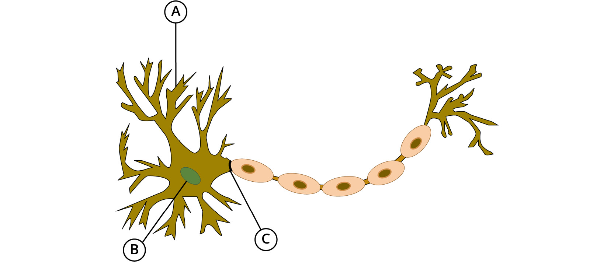
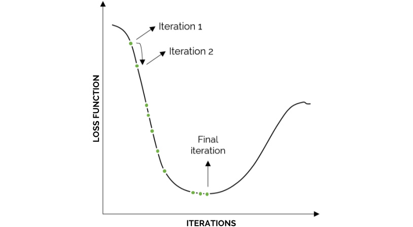
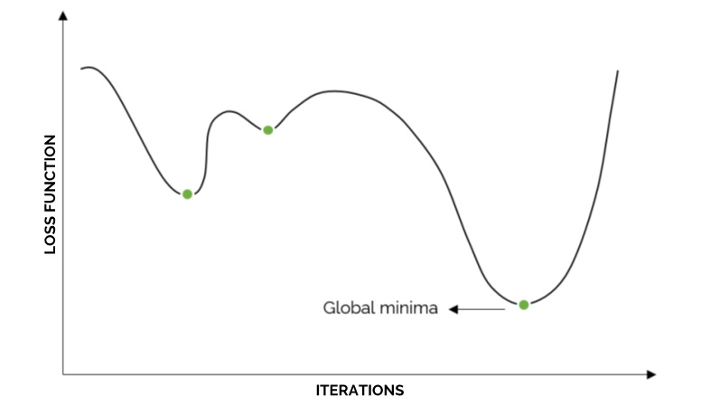
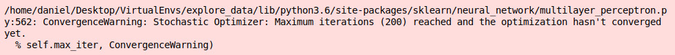
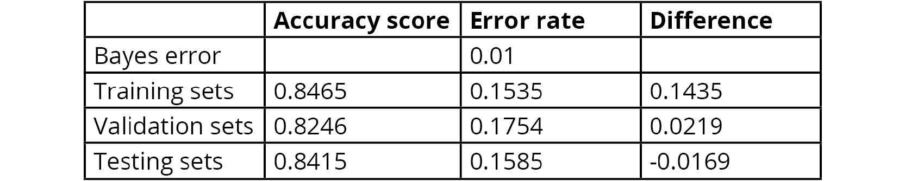
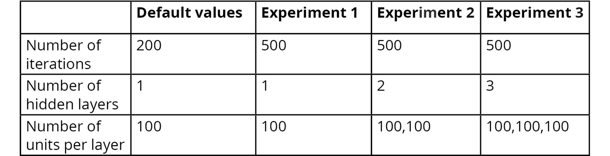
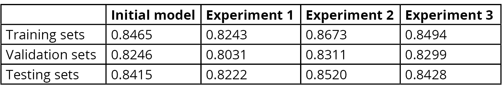
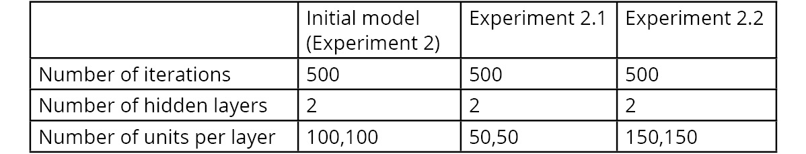
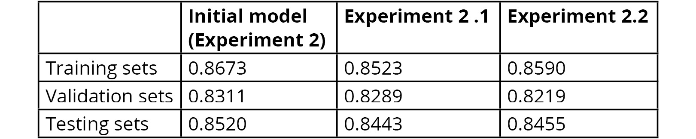
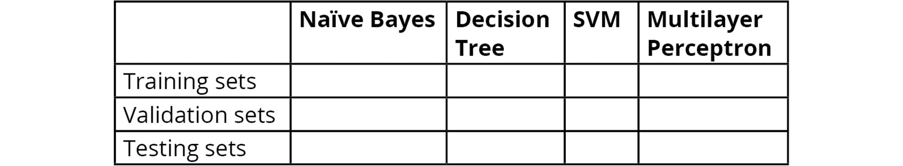

Lab 5. Supervised Learning -- Key Steps
===================================


Overview

In this lab, we will dive deep into the concept of neural networks
and describe the processes of forward and backpropagation. We will solve
a supervised learning classification problem using a neural network and
analyze the results of the neural network by performing error analysis.

By the end of this lab, you will be able to train a network to solve
a classification problem and fine-tune some of the hyperparameters of
the network to improve its performance.


#### Pre-reqs:
- Google Chrome (Recommended)

#### Lab Environment
Notebooks are ready to run. All packages have been installed. There is no requirement for any setup.

All examples are present in `~/work/ml-workshop/Lab05` folder. 

You can access lab at `http://<host-ip>/lab/workspaces/lab5_Steps`


Artificial Neural Networks
==========================


In the following diagram, a human neuron is displayed, where A
represents the **dendrites** that receive input information from other
neurons, B refers to the **nucleus** of the neuron that processes the
information, and C represents the **axon** that oversees the process of
passing the processed information to the next neuron:





### Forward Propagation

The input layer feeds the initial information to the ANN. The processing
of the data is done by propagating data bits through the depth (number
of hidden layers) and width (number of units in each layer) of the
network. The information is processed by each neuron in each layer using
a linear function, coupled with an activation function that aims to
break the linearity, as follows:


The preceding two formulas are calculated for each neuron in each layer,
where the value of *X* for the hidden layers (other than the input
layer) is replaced by the output of the previous layer, as follows:


### Cost Function


For classification tasks, the cost function most commonly used is the
**cross-entropy cost function**, where the higher the value of the cost
function, the greater the divergence between the predicted and actual
values.

For a binary classification task, that is, tasks with only two class
output labels, the cross-entropy cost function is calculated as follows:

```
cost = -(y * log(yhat) + (1-y) *(1-yhat))
```


For a multiclass classification task, the formula is as follows:


### Backpropagation


The following diagram displays an example of the training
process of an ANN through the different iterations, where the job of
backpropagation is to determine the direction in which the weights and
biases should be updated, so that the error can continue to be minimized
until it reaches a minimum point:




It is important to highlight that backpropagation does not always find
the global minima, since it stops updating once it has reached the
lowest point in a slope, regardless of any other regions. For instance,
consider the following diagram:




### Updating the Weights and Biases

Taking the derivatives\' average that was calculated during
backpropagation, the final step of an iteration is to update the values
of the weights and biases. This process is done using the following
formula for updating weights and biases:

```
New weight = old weight – derivative rate * learning rate
New bias = old bias – derivative rate * learning rate
```


Scikit-Learn\'s Multilayer Perceptron
-------------------------------------

To train an MLP classifier, it is required that you input two arrays:
first, the `X` input of dimensions (`n_samples`,
`n_features`) containing the training data, and then the
`Y` input of dimensions (`n_sample`) that contains
the label values for each sample.

Similar to the algorithms that we looked at in the previous lab, the
model is trained using the `fit` method, and then predictions
can be obtained by using the `predict` method on the trained
model.


Exercise 5.01: Applying the MLP Classifier Class
------------------------------------------------

In this exercise, you will train a model using scikit-learn\'s MLP to
solve a classification task that consists of determining whether the
fertility of the subjects has been affected by their demographics, their
environmental conditions, and their previous medical conditions.

Note

For the exercises and activities within this lab, you will need to
have Python 3.7, NumPy, Jupyter, pandas, and scikit-learn installed on
your system.

1.  Open a Jupyter Notebook to implement this exercise. Import all the
    necessary elements to read the dataset and to calculate a model\'s
    accuracy, as well as scikit-learn\'s `MLPClassifier`
    class:
    ```
    import pandas as pd
    from sklearn.neural_network import MLPClassifier
    from sklearn.metrics import accuracy_score
    ```

2.  Using the Fertility Dataset from the previous lab, read the
    `.csv` file. Make sure that you add the `header`
    argument equal to `None` to the `read_csv`
    function, considering that the dataset does not contain a header
    row:
    ```
    data = pd.read_csv("fertility_Diagnosis.csv", header=None)
    ```

3.  Split the dataset into `X` and `Y` sets in order
    to separate the features data from the label values:
    ```
    X = data.iloc[:,:9]
    Y = data.iloc[:,9]
    ```

4.  Instantiate the `MLPClassifier` class from the
    `neural_network` module of scikit-learn and use the
    `fit` method to train a model. When instantiating the
    model, leave all the hyperparameters at their default values, but
    add a `random_state` argument equal to `101` to
    ensure that you get the same results as the one shown in this
    exercise:

    ```
    model = MLPClassifier(random_state=101)
    model = model.fit(X, Y)
    ```

    Address the warning that appears after running the `fit`
    method:


    

    Figure 5.8: Warning message displayed after running the fit method

    As you can see, the warning specifies that after running the default
    number of iterations, which is `200`, the model has not
    reached convergence.

5.  To address this issue, try higher values for the iterations until
    the warning stops appearing. To change the number of iterations, add
    the `max_iter` argument inside the parentheses during the
    instantiation of the model:

    ```
    model = MLPClassifier(random_state=101, max_iter =1200)
    model = model.fit(X, Y)
    ```

    Furthermore, the output beneath the warning explains the values used
    for all of the hyperparameters of the MLP.

6.  Finally, perform a prediction by using the model that you trained
    previously, for a new instance with the following values for each
    feature: `−0.33`, `0.69`, `0`,
    `1`, `1`, `0`, `0.8`,
    `0`, `0.88`.

    Use the following code:

    ```
    pred = model.predict([[-0.33,0.69,0,1,1,0,0.8,0,0.88]])
    print(pred)
    ```

    The model\'s prediction is equal to `N`, that is, the
    model predicts the person with the specified features to have a
    normal diagnosis.

7.  Calculate the accuracy of your model, based on the predictions it
    achieves over the `X` variable, as follows:

    ```
    pred = model.predict(X)
    score = accuracy_score(Y, pred)
    print(score)
    ```

    The accuracy of your model is equal to `98%`.


Activity 5.01: Training an MLP for Our Census Income Dataset
------------------------------------------------------------

With the objective of comparing the performance of the algorithms
trained in the previous lab with the performance of a neural
network, for this activity, we will continue to work with the
Preprocessed Census Income Dataset. Consider the following scenario:
your company is continually offering a course for employees to improve
their abilities, and you have recently learned about neural networks and
their power. You have decided to build a network to model the dataset
that you were given previously in order to test whether a neural network
is better at predicting a person\'s income based on their demographic
data.

Perform the following steps to complete this activity:

1.  Import all the elements required to load and split a dataset, train
    an MLP, and to measure accuracy.

2.  Using the preprocessed Census Income Dataset, separate the features
    from the target, creating the variables `X` and
    `Y`.

3.  Divide the dataset into training, validation, and testing sets,
    using a split ratio of 10%.

    Note

    Remember to continue using a `random_state` argument equal
    to `101` when performing the dataset split in order to set
    a seed to arrive at the same results as the ones in this course.

4.  Instantiate the `MLPClassifier` class from scikit-learn
    and train the model with the training data.

    Leave all the hyperparameters at their default values. Again, use a
    `random_state` equal to 101.

    Although a warning will appear specifying that, with the given
    iterations, no convergence was reached, leave the warning
    unaddressed, since hyperparameter fine-tuning will be explored in
    the following sections of this lab.

5.  Calculate the accuracy of the model for all three sets (training,
    validation, and testing).


Error Analysis
--------------

Using the accuracy score calculated in *Activity 5.01*, *Training an MLP
for Our Census Income Dataset*, we can calculate the error rates for
each of the sets and compare them against one another to diagnose the
condition that is affecting the model. To do so, a Bayes error equal to
1% will be assumed, considering that other models in the previous
lab were able to achieve an accuracy level of over 97%:





Hyperparameter Fine-Tuning
--------------------------

Through error analysis, it was possible to determine that the network is
suffering from high bias. This is highly important as it indicates the
actions that need to be taken in order to improve the performance of the
model in greater proportion.

Considering that both the number of iterations and the size of the
network (number of layers and units) should be changed using a
trial-and-error approach, the following experiments will be performed:





Similar to adding the `random_state` argument to the
initialization of the MLP, the change in the values of the number of
iterations and the size of the network can be achieved using the
following code, which shows the values for Experiment 3:

```
from sklearn.neural_network import MLPClassifier
model = MLPClassifier(random_state=101, max_iter = 500, \
                      hidden_layer_sizes=(100,100,100))
model = model.fit(X_train, Y_train)
```

Note

To find what term to use in order to change each hyperparameter, visit
scikit-learn\'s `MLPClassifier` page at
<http://scikit-learn.org/stable/modules/generated/sklearn.neural_network.MLPClassifier.html>.

As you can see in the preceding snippet, the `max_iter`
argument is used to set the number of iterations to run during the
training of the network. The `hidden_layer_sizes` argument is
used to both set the number of hidden layers and set the number of units
in each. For instance, in the preceding example, by setting the argument
to `(100,100,100)`, the architecture of the network is of 3
hidden layers, each with 100 units. Of course, this architecture also
includes the required input and output layers.

Note

Using the example to train a network with the configurations of
Experiment 3, you are encouraged to try to execute the training process
for the configurations of Experiment 1 and 2.

The accuracy scores from running the preceding experiments can be seen
in the following table:





Nonetheless, in order to test the width of the hidden layers, the
following experiments will be considered, using the selected values for
the number of iterations and the number of hidden layers of Experiment
2, but varying the number of units in each layer:





The accuracy score of the two experiments is shown, followed by an
explanation of the logic behind them:





It can be seen that the accuracy for both experiments decreases for all
sets of data, in comparison to the initial model. By observing these
values, it can be concluded that the performance of Experiment 2 is the
highest in terms of testing sets, which leaves us with a network that
iterates for 500 steps, with one input and output layer and two hidden
layers with 100 units each.


Model Comparison
----------------

When more than one model has been trained, the final step related to the
process of creating a model is a comparison between the models in order
to choose the one that best represents the training data in a
generalized way, so that it works well over unseen data.

The comparison, as mentioned previously, must be done by using only the
metric that was selected to measure the performance of the models for
the data problem. This is important, considering that one model can
perform very differently for each metric, so the model that maximizes
the performance with the ideal metric should be selected.

Although the metric is calculated on all three sets of data (training,
validation, and testing) in order to be able to perform error analysis,
for most cases, comparison and selection should be done by prioritizing
the results obtained with the testing set. This is mainly due to the
purpose of the sets, considering that the training set is used to create
the model, the validation set is used to fine-tune the hyperparameters,
and finally, the testing set is used to measure the overall performance
of the model on unseen data.

Taking this into account, the model with a superior performance on the
testing set, after having improved all models to their fullest
potential, will be the one that performs best on unseen data.


Activity 5.02: Comparing Different Models to Choose the Best Fit for the Census Income Data Problem
---------------------------------------------------------------------------------------------------

Consider the following scenario: after training four different models
with the available data, you have been asked to perform an analysis to
choose the model that best suits the case study.

Note

The following activity is mainly analytical. Use the results obtained
from the activities in the previous lab, as well as the activity in
the current lab.

Perform the following steps to compare the different models:

1.  Open the Jupyter Notebooks that you used to train the models.

2.  Compare the four models, based only on their accuracy scores. Fill
    in the details in the following table:


    

    Figure 5.14: Accuracy scores of all four models for the Census Income Dataset

3.  On the basis of the accuracy scores, identify the model with the
    best performance.


#### Summary

This lab mainly focused on ANNs (the MLP, in particular), which have
become increasingly important in the field of machine learning due to
their ability to tackle highly complex data problems that usually use
extremely large datasets with patterns that are impossible to see with
the human eye.

In the next lab, we will learn how to develop an end-to-end machine
learning solution, starting from the understanding of the data and
training of the model, as seen thus far, and ending with the process of
saving a trained model in order to be able to make future use of it.
