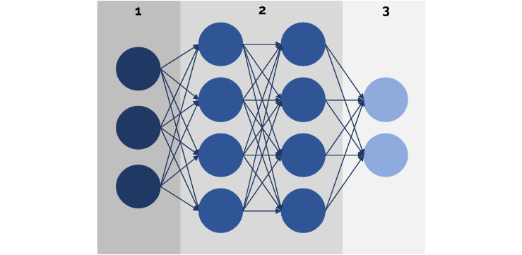

5. Supervised Learning -- Key Steps
===================================


Overview

In this lab, we will dive deep into the concept of neural networks
and describe the processes of forward and backpropagation. We will solve
a supervised learning classification problem using a neural network and
analyze the results of the neural network by performing error analysis.

By the end of this lab, you will be able to train a network to solve
a classification problem and fine-tune some of the hyperparameters of
the network to improve its performance.


Introduction
============


In the preceding lab, we explored three machine learning algorithms
to solve supervised learning tasks, either for classification or
regression. In this lab, we will explore one of the most popular
machine learning algorithms nowadays, artificial neural networks, which
belong to a subgroup of machine learning called deep learning.

**Artificial neural networks** (**ANNs**), also known as **Multilayer
Perceptrons** (**MLPs**), have become increasingly popular mostly
because they present a complex algorithm that can approach almost any
challenging data problem. Even though the theory was developed decades
back, during the 1940s, such networks are becoming more popular now,
thanks to all the improvements in technology that allow for the
gathering of large amounts of data, as well as the developments in
computer infrastructure that allow the training of complex algorithms
with large amounts of data.

Due to this, the following lab will focus on introducing ANNs, their
different types, and the advantages and disadvantages that they present.
Additionally, an ANN will be used to predict the income of an individual
based on demographic and financial information from the individual, as
per the previous lab, in order to present the differences in the
performance of ANNs in comparison to the other supervised learning
algorithms.


Artificial Neural Networks
==========================


Although there are several machine learning algorithms available to
solve data problems, as we have already stated, ANNs have become
increasingly popular among data scientists, on account of their ability
to find patterns in large and complex datasets that cannot be
interpreted by humans.

The **neural** part of the name refers to the resemblance of the
architecture of the model to the anatomy of the human brain. This part
is meant to replicate a human being\'s ability to learn from historical
data by transferring bits of data from neuron to neuron until an outcome
is reached.

In the following diagram, a human neuron is displayed, where A
represents the **dendrites** that receive input information from other
neurons, B refers to the **nucleus** of the neuron that processes the
information, and C represents the **axon** that oversees the process of
passing the processed information to the next neuron:


Figure 5.1: Visual representation of a human neuron

Moreover, the **artificial** part refers to the actual learning process
of the model, where the main objective is to minimize the error in the
model. This is an artificial learning process, considering that there is
no real evidence regarding how human neurons process the information
that they receive, and hence the model relies on mathematical functions
that map an input to a desired output.


How Do ANNs Work?
-----------------

Before we dive into the process that is followed by an ANN, let\'s start
by looking at its main components:

-   **Input layer**: This layer is also known as `X`, as it
    contains all the data from the dataset (each instance with its
    features).

-   **Hidden layers**: This layer is in charge of processing the input
    data in order to find patterns that are useful for making a
    prediction. The ANN can have as many hidden layers as desired, each
    with as many neurons (units) as required. The first layers are in
    charge of the simpler patterns, while the layers at the end search
    for the more complex ones.

    The hidden layers use a set of variables that represent weights and
    biases in order to help train the network. The values for the
    weights and biases are used as the variables that change in each
    iteration to approximate the prediction to the ground truth. This
    will be explained later.

-   **Output layer**: Also known as `Y_hat`, this layer is the
    prediction made by the model, based on the data received from the
    hidden layers. This prediction is presented in the form of a
    probability, where the class label with a higher probability is the
    one selected as the prediction.

The following diagram illustrates the architecture of the preceding
three layers, where the circles under 1 denote the neurons in the input
layer, the ones under 2 represent the neurons of 2 hidden layers (each
layer represented by a column of circles), and finally, the circles
under 3 are the neurons of the output layer:





### Forward Propagation

The input layer feeds the initial information to the ANN. The processing
of the data is done by propagating data bits through the depth (number
of hidden layers) and width (number of units in each layer) of the
network. The information is processed by each neuron in each layer using
a linear function, coupled with an activation function that aims to
break the linearity, as follows:


The preceding two formulas are calculated for each neuron in each layer,
where the value of *X* for the hidden layers (other than the input
layer) is replaced by the output of the previous layer, as follows:


Figure 5.4: The values calculated for the second layer of the ANN

Finally, the output from the last hidden layer is fed to the output
layer, where the linear function is once again calculated, along with an
activation function. The outcome from this layer, after some processing
as required, is the one that will be compared against the ground truth
in order to evaluate the performance of the algorithm before moving on
to the next iteration.

The values of the weights for the first iteration are randomly
initialized between 0 and 1, while the values for the biases can be set
to 0 initially. Once the first iteration is run, the values will be
updated, so that the process can start again.

The activation function can be of different types. Some of the most
common ones are the **Rectified Linear Unit** (**ReLU**), the
**Hyperbolic tangent** (**tanh**), and the **Sigmoid** and **Softmax**
functions, which will be explained in a subsequent section.


### Cost Function

Considering that the final objective of the training process is to build
a model based on a given set of data that maps an expected output, it is
particularly important to measure the model\'s ability to estimate a
relation between `X` and `Y` by comparing the
differences between the predicted value (`Y_hat`) and the
ground truth (`Y`). This is accomplished by calculating the
cost function (also known as the **loss function**) to determine how
poor the model\'s predictions are. The cost function is calculated for
each iteration to measure the progress of the model along the iteration
process, with the objective of finding the values for the weights and
biases that minimize the cost function.

For classification tasks, the cost function most commonly used is the
**cross-entropy cost function**, where the higher the value of the cost
function, the greater the divergence between the predicted and actual
values.

For a binary classification task, that is, tasks with only two class
output labels, the cross-entropy cost function is calculated as follows:

```
cost = -(y * log(yhat) + (1-y) *(1-yhat))
```


For a multiclass classification task, the formula is as follows:


Figure 5.5: The cost function for a multiclass classification task

Here, *c* represents a class label and *M* refers to the total number of
class labels.

Once the cost function is calculated, the training process proceeds to
perform the backpropagation step, which will be explained in the
following section.

Moreover, for regression tasks, the cost function would be the RMSE,
which was explained in *Lab 3*, *Supervised Learning -- Key Steps*.


### Backpropagation

The backpropagation procedure was introduced as part of the training
process of ANNs to make learning faster. It basically involves
calculating the partial derivatives of the cost function with respect to
the weights and biases along the network. The objective of this is to
minimize the cost function by changing the weights and the biases.

Considering that the weights and biases are not directly contained in
the cost function, a chain rule is used to propagate the error from the
cost function backward until it reaches the first layers of the network.
Next, a weighted average of the derivatives is calculated, which is used
as the value to update the weights and biases before running a new
iteration.

There are several algorithms that can be used to perform
backpropagation, but the most common one is **gradient descent**.
Gradient descent is an optimization algorithm that tries to find some
local or global minimum of a function, which, in this case, is the cost
function. It does so by determining the direction in which the model
should move to reduce the error.

For instance, the following diagram displays an example of the training
process of an ANN through the different iterations, where the job of
backpropagation is to determine the direction in which the weights and
biases should be updated, so that the error can continue to be minimized
until it reaches a minimum point:


Figure 5.6: Example of the iterative process of training an ANN

It is important to highlight that backpropagation does not always find
the global minima, since it stops updating once it has reached the
lowest point in a slope, regardless of any other regions. For instance,
consider the following diagram:


Figure 5.7: Examples of minimum points

Although all three points can be considered minimum points when compared
to the points to their left and right, only one of them is the global
minima.


### Updating the Weights and Biases

Taking the derivatives\' average that was calculated during
backpropagation, the final step of an iteration is to update the values
of the weights and biases. This process is done using the following
formula for updating weights and biases:

```
New weight = old weight – derivative rate * learning rate
New bias = old bias – derivative rate * learning rate
```

Here, the old values are those used to perform the forward propagation
step, the derivative rate is the value obtained from the backpropagation
step, which is different for the weights and the biases, and the
learning rate is a constant that is used to neutralize the effect of the
derivative rate, so that the changes in the weights and biases are small
and smooth. This has been proven to help reach the lowest point more
quickly.

Once the weights and the biases have been updated, the entire process
starts again.


Understanding the Hyperparameters
---------------------------------

Hyperparameters, as you have seen so far, are parameters that can be
fine-tuned to improve the accuracy of a model. For neural networks,
hyperparameters can be classified into two main groups:

-   Those that alter the structure of the network
-   Those that modify the process to train it

An important part of building an ANN is the process of fine-tuning the
hyperparameters by performing error analysis and by playing around with
the hyperparameters that help to solve the condition that is affecting
the network. As a general reminder, networks suffering from high bias
can usually be improved by creating bigger networks or training for
longer durations of time (that is, more iterations), whereas networks
suffering from high variance can benefit from the addition of more
training data or by introducing a regularization technique, which will
be explained in a subsequent section.

Considering that the number of hyperparameters that can be changed for
training an ANN is large, the most commonly used ones will be explained
in the following sections.


### Number of Hidden Layers and Units

The number of hidden layers and the number of units in each layer can be
set by the researcher, as mentioned previously. Again, there is no exact
science to select this number, and, on the contrary, the selection of
this number is part of the fine-tuning process to test different
approximations.

Nonetheless, when selecting the number of hidden layers, some data
scientists lean toward an approach wherein multiple networks are
trained, each with an extra layer. The model with the lowest error is
the one with the correct number of hidden layers. Unfortunately, this
approach does not always work well, as more complex data problems do not
really show a difference in performance through simply changing the
number of hidden layers, regardless of the other hyperparameters.

On the other hand, there are several techniques that you can use to
choose the number of units in a hidden layer. It is common for data
scientists to choose the initial values for both of these
hyperparameters based on similar research papers that are available
online. This means that a good starting point would be copying the
architecture of networks that have been successfully used for projects
in a similar field, and then, through error analysis, fine-tuning the
hyperparameters to improve performance.

Nonetheless, it is important to consider the fact that based on research
activity, deeper networks (networks with many hidden layers) outperform
wider networks (networks with many units in each layer).


### Activation Functions

As mentioned previously, the activation function is used to introduce
non-linearity to the model. The most commonly used activation functions
are the following:

-   **ReLU**: The output of this function is either 0 or the number
    derived from the linear function, whichever is higher. This means
    that the output will be the raw number it receives whenever this
    number is above 0, otherwise, the output would be 0.
-   **Tanh**: This function consists of the division of the hyperbolic
    sine by the hyperbolic cosine of the input. The output is a number
    between -1 and 1.
-   **Sigmoid**: The function has an S-shape. It takes the input and
    converts it into a probability. The output from this function is
    between 0 and 1.
-   **Softmax**: Similar to the sigmoid function, this calculates the
    probability of the input, with the difference being that the Softmax
    function can be used for multiclass classification tasks as it is
    capable of calculating the probability of a class label in reference
    to the others.

The selection of an activation function should be done by considering
that, conventionally, both the ReLU and the Hyperbolic tangent (tanh)
activation functions are used for all of the hidden layers, with ReLU
being the most popular one among scientists due to its performance in
relation to the majority of data problems.

Moreover, the Sigmoid and the Softmax activation functions should be
used for the output layer, as their outcome is in the form of a
probability. The Sigmoid activation function is used for binary
classification problems, as it only outputs the probability for two
class labels, whereas the Softmax activation function can be used for
either binary or multiclass classification problems.


### Regularization

Regularization is a technique used in machine learning to improve a
model that is suffering from overfitting, which means that this
hyperparameter is mostly used when it is strictly required, and its main
objective is to increase the generalization ability of the model.

There are different regularization techniques, but the most common ones
are the L1, L2, and dropout techniques. Although scikit-learn only
supports L2 for its MLP classifier, brief explanations of the three
forms of regularization are as follows:

-   The L1 and L2 techniques add a regularization term to the cost
    function as a way of penalizing high weights that may be affecting
    the performance of the model. The main difference between these
    approaches is that the regularization term for L1 is the absolute
    value of the magnitude of the weights, while for L2, it is the
    squared magnitude of the weights. For regular data problems, L2 has
    proven to work better, while L1 is mainly popular for feature
    extraction tasks since it creates sparse models.
-   Dropout, on the other hand, refers to the model\'s ability to drop
    out some units in order to ignore their output during a step in the
    iteration, which simplifies the neural network. The dropout value is
    set between 0 and 1, and it represents the percentage of units that
    will be ignored. The units that are ignored are different in each
    iteration step.


### Batch Size

Another hyperparameter to be tuned during the construction of an ANN is
the batch size. This refers to the number of instances to be fed to the
neural network during an iteration, which will be used to perform a
forward and a backward pass through the network. For the next iteration,
a new set of instances will be used.

This technique also helps to improve the model\'s ability to generalize
to the training data because, in each iteration, it is fed with new
combinations of instances, which is useful when dealing with an
overfitted model.

Note

As per the result of many years of research, a good practice is to set
the batch size to a value that is a multiple of 2. Some of the most
common values are 32, 64, 128, and 256.


### Learning Rate

The learning rate, as explained previously, is introduced to help
determine the size of the steps that the model will take to get to the
local or global minima in each iteration. The lower the learning rate,
the slower the learning process of the network, but this results in
better models. On the other hand, the larger the learning rate, the
faster the learning process of the model; however, this may result in a
model not converging.

Note

The default learning rate value is usually set to 0.001.


### Number of Iterations

A neural network is trained through an iterative process, as mentioned
previously. Therefore, it is necessary to set the number of iterations
that the model will perform. The best way to set up the ideal number of
iterations is to start low, between 200 and 500, and increase it, in the
event that the plot of the cost function over each iteration shows a
decreasing line. Needless to say, the larger the number of iterations,
the longer it takes to train a model.

Additionally, increasing the number of iterations is a technique known
to address underfitted networks. This is because it gives the network
more time to find the right weights and biases that generalize to the
training data.


Applications of Neural Networks
-------------------------------

In addition to the preceding architecture, a number of new architectures
have emerged over time, thanks to the popularity of neural networks.
Some of the most popular ones are **convolutional neural networks**,
which can handle the processing of images by using filters as layers,
and **recurrent neural networks**, which are used to process sequences
of data such as text translations.

On account of this, the applications of neural networks extend to almost
any data problem, ranging from simple to complex. While a neural network
is capable of finding patterns in really large datasets (either for
classification or regression tasks), they are also known for effectively
handling challenging problems, such as the autonomous abilities of
self-driving cars, the construction of chatbots, and the recognition of
faces.


Limitations of Neural Networks
------------------------------

Some of the limitations of training neural networks are as follows:

-   The training process takes time. Regardless of the hyperparameters
    used, they generally take time to converge.
-   They need very large datasets in order to work better. Neural
    networks are meant for larger datasets, as their main advantage is
    their ability to find patterns within millions of values.
-   They are considered a black box as there is no actual knowledge of
    how the network arrives at a result. Although the math behind the
    training process is clear, it is not possible to know what
    assumptions the model makes while being trained.
-   The hardware requirements are large. Again, the greater the
    complexity of the problem, the larger the hardware requirements.

Although ANNs can be applied to almost any data problem, due to their
limitations, it is always a good practice to test other algorithms when
dealing with simpler data problems. This is important because applying
neural networks to data problems that can be solved by simpler models
makes the costs outweigh the benefits.


Applying an Artificial Neural Network
=====================================


Now that you know the components of an ANN, as well as the different
steps that it follows to train a model and make predictions, let\'s
train a simple network using the scikit-learn library.

In this topic, scikit-learn\'s neural network module will be used to
train a network using the datasets used in the previous lab\'s
exercises and activities (that is, the Fertility Dataset and the
Processed Census Income Dataset). It is important to mention that
scikit-learn is not the most appropriate library for neural networks, as
it does not currently support many types of neural networks, and its
performance over deeper networks is not as good as other neural network
specialized libraries, such as TensorFlow and PyTorch.

The neural network module in scikit-learn currently supports an MLP for
classification, an MLP for regression, and a Restricted Boltzmann
Machine architecture. Considering that the case study consists of a
classification task, the MLP for classifications will be used.


Scikit-Learn\'s Multilayer Perceptron
-------------------------------------

An MLP is a supervised learning algorithm that, as the name indicates,
uses multiple layers (hidden layers) to learn a non-linear function that
translates the input values into output, either for classification or
regression. As we explained previously, the job of each unit of a layer
is to transform the data received from the previous layer by calculating
a linear function and then applying an activation function to break
the linearity.

It is important to mention the fact that an MLP has a non-convex loss
function that, as mentioned previously, signifies that there may be
multiple local minima. This means that different initializations of the
weights and biases will result in different trained models, which, in
turn, indicates different accuracy levels.

The MLP classifier in scikit-learn has around 20 different
hyperparameters associated with the architecture or the learning
process, which can be altered in order to modify the training process of
the network. Fortunately, all of these hyperparameters have set default
values, which allows us to run an initial model without much effort. The
results from this model can then be used to tune the hyperparameters as
required.

To train an MLP classifier, it is required that you input two arrays:
first, the `X` input of dimensions (`n_samples`,
`n_features`) containing the training data, and then the
`Y` input of dimensions (`n_sample`) that contains
the label values for each sample.

Similar to the algorithms that we looked at in the previous lab, the
model is trained using the `fit` method, and then predictions
can be obtained by using the `predict` method on the trained
model.


Exercise 5.01: Applying the MLP Classifier Class
------------------------------------------------

In this exercise, you will train a model using scikit-learn\'s MLP to
solve a classification task that consists of determining whether the
fertility of the subjects has been affected by their demographics, their
environmental conditions, and their previous medical conditions.

Note

For the exercises and activities within this lab, you will need to
have Python 3.7, NumPy, Jupyter, pandas, and scikit-learn installed on
your system.

1.  Open a Jupyter Notebook to implement this exercise. Import all the
    necessary elements to read the dataset and to calculate a model\'s
    accuracy, as well as scikit-learn\'s `MLPClassifier`
    class:
    ```
    import pandas as pd
    from sklearn.neural_network import MLPClassifier
    from sklearn.metrics import accuracy_score
    ```

2.  Using the Fertility Dataset from the previous lab, read the
    `.csv` file. Make sure that you add the `header`
    argument equal to `None` to the `read_csv`
    function, considering that the dataset does not contain a header
    row:
    ```
    data = pd.read_csv("fertility_Diagnosis.csv", header=None)
    ```

3.  Split the dataset into `X` and `Y` sets in order
    to separate the features data from the label values:
    ```
    X = data.iloc[:,:9]
    Y = data.iloc[:,9]
    ```

4.  Instantiate the `MLPClassifier` class from the
    `neural_network` module of scikit-learn and use the
    `fit` method to train a model. When instantiating the
    model, leave all the hyperparameters at their default values, but
    add a `random_state` argument equal to `101` to
    ensure that you get the same results as the one shown in this
    exercise:

    ```
    model = MLPClassifier(random_state=101)
    model = model.fit(X, Y)
    ```

    Address the warning that appears after running the `fit`
    method:


    

    Figure 5.8: Warning message displayed after running the fit method

    As you can see, the warning specifies that after running the default
    number of iterations, which is `200`, the model has not
    reached convergence.

5.  To address this issue, try higher values for the iterations until
    the warning stops appearing. To change the number of iterations, add
    the `max_iter` argument inside the parentheses during the
    instantiation of the model:

    ```
    model = MLPClassifier(random_state=101, max_iter =1200)
    model = model.fit(X, Y)
    ```

    Furthermore, the output beneath the warning explains the values used
    for all of the hyperparameters of the MLP.

6.  Finally, perform a prediction by using the model that you trained
    previously, for a new instance with the following values for each
    feature: `−0.33`, `0.69`, `0`,
    `1`, `1`, `0`, `0.8`,
    `0`, `0.88`.

    Use the following code:

    ```
    pred = model.predict([[-0.33,0.69,0,1,1,0,0.8,0,0.88]])
    print(pred)
    ```

    The model\'s prediction is equal to `N`, that is, the
    model predicts the person with the specified features to have a
    normal diagnosis.

7.  Calculate the accuracy of your model, based on the predictions it
    achieves over the `X` variable, as follows:

    ```
    pred = model.predict(X)
    score = accuracy_score(Y, pred)
    print(score)
    ```

    The accuracy of your model is equal to `98%`.


Activity 5.01: Training an MLP for Our Census Income Dataset
------------------------------------------------------------

With the objective of comparing the performance of the algorithms
trained in the previous lab with the performance of a neural
network, for this activity, we will continue to work with the
Preprocessed Census Income Dataset. Consider the following scenario:
your company is continually offering a course for employees to improve
their abilities, and you have recently learned about neural networks and
their power. You have decided to build a network to model the dataset
that you were given previously in order to test whether a neural network
is better at predicting a person\'s income based on their demographic
data.

Perform the following steps to complete this activity:

1.  Import all the elements required to load and split a dataset, train
    an MLP, and to measure accuracy.

2.  Using the preprocessed Census Income Dataset, separate the features
    from the target, creating the variables `X` and
    `Y`.

3.  Divide the dataset into training, validation, and testing sets,
    using a split ratio of 10%.

    Note

    Remember to continue using a `random_state` argument equal
    to `101` when performing the dataset split in order to set
    a seed to arrive at the same results as the ones in this course.

4.  Instantiate the `MLPClassifier` class from scikit-learn
    and train the model with the training data.

    Leave all the hyperparameters at their default values. Again, use a
    `random_state` equal to 101.

    Although a warning will appear specifying that, with the given
    iterations, no convergence was reached, leave the warning
    unaddressed, since hyperparameter fine-tuning will be explored in
    the following sections of this lab.

5.  Calculate the accuracy of the model for all three sets (training,
    validation, and testing).


Error Analysis
--------------

Using the accuracy score calculated in *Activity 5.01*, *Training an MLP
for Our Census Income Dataset*, we can calculate the error rates for
each of the sets and compare them against one another to diagnose the
condition that is affecting the model. To do so, a Bayes error equal to
1% will be assumed, considering that other models in the previous
lab were able to achieve an accuracy level of over 97%:


Hyperparameter Fine-Tuning
--------------------------

Through error analysis, it was possible to determine that the network is
suffering from high bias. This is highly important as it indicates the
actions that need to be taken in order to improve the performance of the
model in greater proportion.

Considering that both the number of iterations and the size of the
network (number of layers and units) should be changed using a
trial-and-error approach, the following experiments will be performed:


Similar to adding the `random_state` argument to the
initialization of the MLP, the change in the values of the number of
iterations and the size of the network can be achieved using the
following code, which shows the values for Experiment 3:

```
from sklearn.neural_network import MLPClassifier
model = MLPClassifier(random_state=101, max_iter = 500, \
                      hidden_layer_sizes=(100,100,100))
model = model.fit(X_train, Y_train)
```

Note

To find what term to use in order to change each hyperparameter, visit
scikit-learn\'s `MLPClassifier` page at
<http://scikit-learn.org/stable/modules/generated/sklearn.neural_network.MLPClassifier.html>.

As you can see in the preceding snippet, the `max_iter`
argument is used to set the number of iterations to run during the
training of the network. The `hidden_layer_sizes` argument is
used to both set the number of hidden layers and set the number of units
in each. For instance, in the preceding example, by setting the argument
to `(100,100,100)`, the architecture of the network is of 3
hidden layers, each with 100 units. Of course, this architecture also
includes the required input and output layers.

Note

Using the example to train a network with the configurations of
Experiment 3, you are encouraged to try to execute the training process
for the configurations of Experiment 1 and 2.

The accuracy scores from running the preceding experiments can be seen
in the following table:


Nonetheless, in order to test the width of the hidden layers, the
following experiments will be considered, using the selected values for
the number of iterations and the number of hidden layers of Experiment
2, but varying the number of units in each layer:


The accuracy score of the two experiments is shown, followed by an
explanation of the logic behind them:


It can be seen that the accuracy for both experiments decreases for all
sets of data, in comparison to the initial model. By observing these
values, it can be concluded that the performance of Experiment 2 is the
highest in terms of testing sets, which leaves us with a network that
iterates for 500 steps, with one input and output layer and two hidden
layers with 100 units each.


Model Comparison
----------------

When more than one model has been trained, the final step related to the
process of creating a model is a comparison between the models in order
to choose the one that best represents the training data in a
generalized way, so that it works well over unseen data.

The comparison, as mentioned previously, must be done by using only the
metric that was selected to measure the performance of the models for
the data problem. This is important, considering that one model can
perform very differently for each metric, so the model that maximizes
the performance with the ideal metric should be selected.

Although the metric is calculated on all three sets of data (training,
validation, and testing) in order to be able to perform error analysis,
for most cases, comparison and selection should be done by prioritizing
the results obtained with the testing set. This is mainly due to the
purpose of the sets, considering that the training set is used to create
the model, the validation set is used to fine-tune the hyperparameters,
and finally, the testing set is used to measure the overall performance
of the model on unseen data.

Taking this into account, the model with a superior performance on the
testing set, after having improved all models to their fullest
potential, will be the one that performs best on unseen data.


Activity 5.02: Comparing Different Models to Choose the Best Fit for the Census Income Data Problem
---------------------------------------------------------------------------------------------------

Consider the following scenario: after training four different models
with the available data, you have been asked to perform an analysis to
choose the model that best suits the case study.

Note

The following activity is mainly analytical. Use the results obtained
from the activities in the previous lab, as well as the activity in
the current lab.

Perform the following steps to compare the different models:

1.  Open the Jupyter Notebooks that you used to train the models.

2.  Compare the four models, based only on their accuracy scores. Fill
    in the details in the following table:


    

    Figure 5.14: Accuracy scores of all four models for the Census
    Income Dataset

3.  On the basis of the accuracy scores, identify the model with the
    best performance.


#### Summary

This lab mainly focused on ANNs (the MLP, in particular), which have
become increasingly important in the field of machine learning due to
their ability to tackle highly complex data problems that usually use
extremely large datasets with patterns that are impossible to see with
the human eye.

In the next lab, we will learn how to develop an end-to-end machine
learning solution, starting from the understanding of the data and
training of the model, as seen thus far, and ending with the process of
saving a trained model in order to be able to make future use of it.
