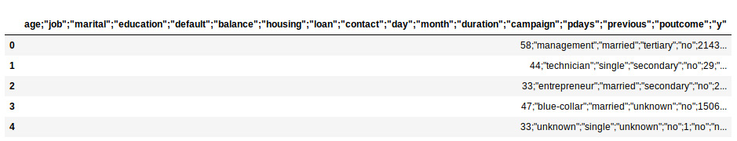
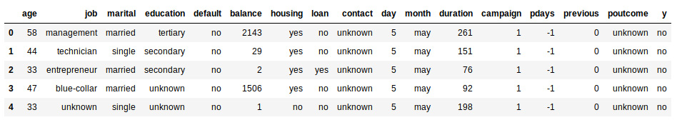
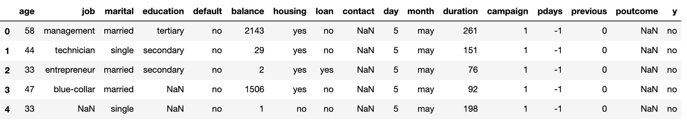
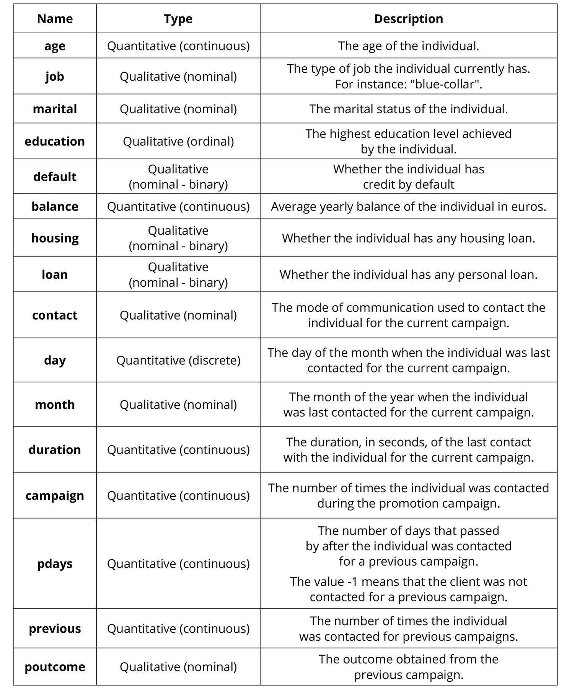
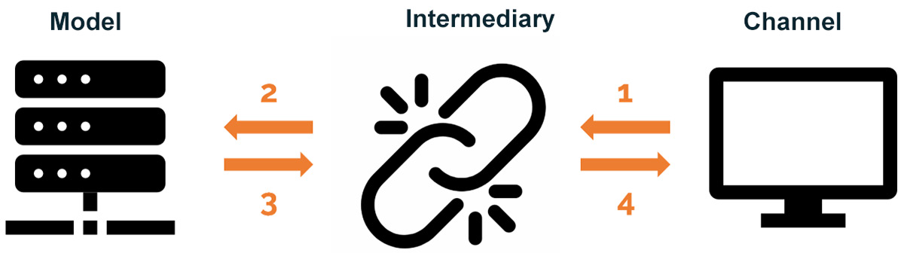

Lab 6. Building Your Own Program
============================


**Overview**

In this lab, we will present all the steps required to solve a
problem using machine learning. We will take a look at the key stages
involved in building a comprehensive program. We will save a model in
order to get the same results every time it is run and call a saved
model to use it for predictions on unseen data. By the end of this
lab, you will be able to create an interactive version of your
program so that anyone can use it effectively.


#### Pre-reqs:
- Google Chrome (Recommended)

#### Lab Environment
Notebooks are ready to run. All packages have been installed. There is no requirement for any setup.

All examples are present in `~/work/ml-workshop/Lab06` folder. 

You can access lab at `http://<host-ip>/lab/workspaces/lab6_Program`


Understanding the Dataset
-------------------------

To learn how to implement the processes in the *Interaction* section, we
will build a program that\'s capable of predicting whether a person will
be interested in investing in a term deposit, which will help the bank
target its promotion efforts. A term deposit is money that is deposited
into a banking institution that cannot be withdrawn for a specific
period of time.

The dataset that was used to build this program is available in the UC Irvine Machine Learning Repository under the name **Bank Marketing Dataset**.


Once you have accessed the link of the UC Irvine Machine Learning
repository, follow these steps to download the dataset:

1.  First, click on the `Data Folder` link.

2.  Click the `bank` hyperlink to trigger the download

3.  Open the `.zip` folder and extract the
    `bank-full.csv` file.

    In this section, we will perform a quick exploration of the dataset
    in a Jupyter Notebook. However, in *Activity 6.01*, *Performing the
    Preparation and Creation Stages for the Bank Marketing Dataset*, you
    will be encouraged to perform a good exploration and pre-process the
    dataset to arrive at a better mode.

4.  Import the required libraries:
    ```
    import pandas as pd
    import numpy as np
    ```

5.  As we have learned thus far, the dataset can be loaded into a
    Jupyter Notebook using Pandas:

    ```
    data = pd.read_csv("bank-full.csv")
    data.head()
    ```

    The preceding code reads all the features for one instance in a
    single column, since the `read_csv` function uses commas
    as the default delimiter for columns, while the dataset uses
    semicolons as the delimiter, as can be seen by displaying the head
    of the resulting DataFrame.

    Note

    The delimiter refers to the character that\'s used to split a string
    into columns. For instance, a comma-delimited file is one that
    separates text into columns on the appearances of commas.

    The DataFrame will look as follows:


    

    This can be fixed by adding the `delimiter` parameter to
    the `read_csv` function and defining the semicolon as the
    delimiter, as shown in the following code snippet:

    ```
    data = pd.read_csv("bank-full.csv", delimiter = ";")
    data.head()
    ```

    After this step, the data should look as follows:


    


    As shown in the preceding screenshot, the file contains unknown
    values that should be handled as missing values.

6.  To aid the process of dealing with missing values, all unknown
    values will be replaced by `NaN` using Pandas\'
    `replace` function, as well as NumPy, as follows:

    ```
    data = data.replace("unknown", np.NaN)
    data.head()
    ```

    By printing the head of the `data` variable, the output of
    the preceding code snippet is as follows:


    

    

    This will allow us to easily handle missing values during the
    pre-processing of the dataset.

7.  Finally, the edited dataset is saved in a new `.csv` file
    so that it can be used for the activities throughout this lab.
    You can do this by using the `to_csv` function, as
    follows:

    ```
    data.to_csv("bank-full-dataset.csv")
    ```


The following table displays brief descriptions of all 16 features. This
will help you determine the relevance of each feature to the study, and
will provide an idea of some of the steps required to pre-process the
data:





Note

You can find the preceding descriptions and more in this course\'s GitHub
repository, in the folder named `Lab06`. The file for the
preceding example is named `bank-names.txt` and can be found
in the `.zip` folder called `bank.zip`.


Activity 6.01: Performing the Preparation and Creation Stages for the Bank Marketing Dataset
--------------------------------------------------------------------------------------------

The objective of this activity is to perform the processes in the
*preparation* and *creation* stages to build a comprehensive machine
learning problem.


Note

For a reminder of how to pre-process your dataset, revisit *Lab 1*,
*Introduction to Scikit-Learn*. On the other hand, for a reminder of how
to train a supervised model, evaluate performance, and perform error
analysis, revisit *Lab 3*, *Supervised Learning -- Key Steps*, and
*Lab 4*, *Supervised Learning Algorithms: Predicting Annual Income*.

1.  Open a Jupyter Notebook to implement this activity and import all
    the required elements.

2.  Load the dataset into the notebook. Make sure that you load the one
    that was edited previously, named `bank-full-dataset.csv`.

3.  Select the metric that is the most appropriate for measuring the
    performance of the model, considering that the purpose of the study
    is to detect clients who are likely to subscribe to the term
    deposit.

4.  Pre-process the dataset.

    Note that one of the qualitative features is ordinal, which is why
    it must be converted into a numeric form that follows the respective
    order. Use the following code snippet to do so:

    ```
    data["education"] = data["education"].fillna["unknown"]
    encoder = ["unknown", "primary", "secondary", "tertiary"]
    for i, word in enumerate(encoder):
        data["education"] = data["education"].\
                            str.replace(word,str(i))
        data["education"] = data["education"].astype("int64")
    ```

5.  Separate the features from the class label and split the dataset
    into three sets (training, validation, and testing).

6.  Use the decision tree algorithm on the dataset and train the model.

7.  Use the multilayer perceptron algorithm on the dataset and train the
    model.

    Note

    You can also try this with the other classification algorithms we
    discussed in this course. However, these two have been chosen so that
    you are also able to compare the difference in training times.

8.  Evaluate both models by using the metric that you selected
    previously.

9.  Fine-tune some of the hyperparameters to fix the issues you detected
    while evaluating the model by performing error analysis.

10. Compare the final versions of your models and select the one that
    you believe best fits the data.

Expected output:


Saving and Loading a Trained Model
==================================


Although the process of manipulating a dataset and training the right
model is crucial for developing a machine learning project, the work
does not end there. Knowing how to save a trained model is key as this
will allow you to save the hyperparameters, as well as the values for
the weights and biases of your final model, so that it remains unchanged
when it is run again.

Moreover, after the model has been saved to a file, it is also important
to know how to load the saved model in order to use it to make
predictions on new data. By saving and loading a model, we allow for the
model to be reused at any moment and through many different means.


Saving a Model
--------------

The process of saving a model is also called **serialization**, and it
has become increasingly important due to the popularity of neural
networks that use many parameters (weights and biases) that are randomly
initialized every time the model is trained, as well as due to the
introduction of bigger and more complex datasets that make the training
process last for days, weeks, and sometimes months.

Considering this, the process of saving a model helps to optimize the
use of machine learning solutions by standardizing the results to the
saved version of the model. It also saves time as it allows you to
directly apply the saved model to new data, without the need for
retraining.

There are two main ways to save a trained model, one of which will be
explained in this section. The `pickle` module is the standard
way to serialize objects in Python, and it works by implementing a
powerful algorithm that serializes the model and then saves it as a
`.pkl` file.

Note

The other module that\'s available for saving a trained model is
`joblib`, which is part of the SciPy ecosystem.

However, take into account that models are only saved when they are
meant to be used in future projects or for future predictions. When a
machine learning project is developed to understand the current data,
there is no need to save it as the analysis will be performed after the
model has been trained.


Exercise 6.01: Saving a Trained Model
-------------------------------------

For the following exercise, we will use the Fertility Dataset that we
downloaded in *Lab 5*, *Artificial Neural Networks: Predicting
Annual Income*. A neural network will be trained over the training data,
and then saved. Follow these steps to complete this exercise:


1.  Open a Jupyter Notebook to implement this exercise and import all
    the required elements to load a dataset, train a multilayer
    perceptron, and save a trained model:

    ```
    import pandas as pd
    from sklearn.neural_network import MLPClassifier
    import pickle
    import os
    ```

    The `pickle` module, as explained previously, will be used
    to save the trained model. The `os` module is used to
    locate the current working directory of the Jupyter Notebook in
    order to save the model in the same path.

2.  Load the Fertility dataset and split the data into a features
    matrix, `X`, and a target matrix, `Y`. Use the
    `header = None` argument, since the dataset does not have
    a header row:
    ```
    data = pd.read_csv("fertility_Diagnosis.csv", header=None)
    X = data.iloc[:,:9]
    Y = data.iloc[:,9]
    ```

3.  Train a multilayer perceptron classifier over the data. Set the
    number of iterations to `1200` to avoid getting a warning
    message indicating that the default number of iterations is
    insufficient to achieve convergence:

    ```
    model = MLPClassifier(max_iter = 1200)
    model.fit(X,Y)
    ```

    Note

    As a reminder, the output from calling the `fit` method
    consists of the model currently being trained with all the
    parameters that it takes in.

4.  Serialize the model and save it in a file named
    `model_exercise.pkl`. Use the following code to do so:

    ```
    path = os.getcwd() + "/model_exercise.pkl"
    file = open(path, "wb")
    pickle.dump(model, file)
    ```


Exercise 6.02: Loading a Saved Model
------------------------------------

In this exercise, using a different Jupyter Notebook, we will load the
previously trained model (*Exercise 6.01*, *Saving a Trained Model*) and
perform a prediction. Follow these steps to complete this exercise:

1.  Open a Jupyter Notebook to implement this exercise.

2.  Import the `pickle` and `os` modules. Also,
    import the `MLPCLassifier` class:

    ```
    import pickle
    import os
    from sklearn.neural_network import MLPClassifier
    ```

    The `pickle` module, as explained previously, will be used
    to load the trained model. The `os` module is used to
    locate the current working directory of the Jupyter Notebook in
    order to find the file containing the saved model.

3.  Use `pickle` to load the saved model, as follows:

    ```
    path = os.getcwd() + "/model_exercise.pkl"
    file = open(path, "rb")
    model = pickle.load(file)
    ```

    Here, the `path` variable is used to store the path to the
    file containing the saved model. Next, the `file` variable
    is used to open the file using the `rb` file mode, which
    stands for **read** and **binary**. Finally, the `load`
    method is applied on the `pickle` module to deserialize
    and load the model into the `model` variable.

4.  Use the loaded model to make a prediction for an individual, with
    the following values as the values for the features:
    `-0.33, 0.67, 1, 1, 0, 0, 0.8, -1, 0.5`.

    Store the output obtained by applying the `predict` method
    to the `model` variable, in a variable named
    `pred`:

    ```
    pred = model.predict([[-0.33,0.67,1,1,0,0,0.8,-1,0.5]])
    print(pred)
    ```

    By printing the `pred` variable, we get the value of the
    prediction to be equal to `O`, which means that the
    individual has an altered diagnosis, as shown here:

    ```
    ['O']
    ```

You have successfully loaded a saved model.


Activity 6.02: Saving and Loading the Final Model for the Bank Marketing Dataset
--------------------------------------------------------------------------------

Consider the following scenario: you have to save the model you created
using the Bank Marketing Dataset so that it can be used in the future
without the need to retrain the model and without the risk of getting
different results each time. For this purpose, you need to save and load
the model that you created in *Activity 6.01*, *Performing the
Preparation and Creation Stages for the Bank Marketing Dataset*.

Note: The following activity will be divided into two parts.

The first part carries out the process of saving the model and will be
performed using the same Jupyter Notebook from *Activity 6.01*,
*Performing the Preparation and Creation Stages for the Bank Marketing
Dataset*. The second part consists of loading the saved model, which
will be done using a different Jupyter Notebook.

Follow these steps to complete this activity:

1.  Open the Jupyter Notebook from *Activity 6.01*, *Performing the
    Preparation and Creation Stages for the Bank Marketing Dataset*.

2.  For learning purposes, take the model that you selected as the best
    model, remove the `random_state` argument, and run it a
    couple of times.

    Make sure that you run the calculation of the precision metric every
    time you run the model in order to see the difference in performance
    that\'s achieved with every run. Feel free to stop when you think
    you have landed at a model with good performance out of all the
    results you get from previous runs.

    Note

    The results obtained in this course use a `random_state` of
    `2`.

3.  Save the model that you choose as the best performing one in a file
    named `final_model.pkl`.

    Note

    Make sure that you use the `os` module to save the model
    in the same path as the current Jupyter Notebook.

4.  Open a new Jupyter Notebook and import the required modules and
    class.

5.  Load the model.

6.  Perform a prediction for an individual by using the following
    values: `42`, `2`, `0`, `0`,
    `1`, `2`, `1`, `0`,
    `5`, `8`, `380`, `1`,
    `-1`, `0`.

    Expected output:

    ```
    [0] 
    ```


Interacting with a Trained Model
================================


Once the model has been created and saved, it is time for the last step
of building a comprehensive machine learning program: allowing easy
interaction with the model. This step not only allows the model to be
reused, but also introduces efficiency to the implementation of machine
learning solutions by allowing you to perform classifications using just
input data.

There are several ways to interact with a model, and the decision
that\'s made between choosing one or the other depends on the nature of
the user (the individuals that will be making use of the model on a
regular basis). Machine learning projects can be accessed in different
ways, some of which require the use of an API, an online or offline
program (application), or a website.

Moreover, once the channel is defined based on the preference or
expertise of the users, it is important to code the connection between
the final user and the model, which could be either a function or a
class that deserializes the model and loads it, then performs the
classification, and ultimately returns an output that is displayed again
to the user.

The following diagram displays the relationship built between the
channel and the model, where the icon to the left represents the model,
the one in the middle is the function or class (the intermediary)
performing the connection, and the icon to the right is the channel.
Here, as we explained previously, the channel feeds the input data to
the intermediary, which then feeds the information into the model to
perform a classification. The output from the classification is sent
back to the intermediary, which passes it along the channel in order to
be displayed:





Exercise 6.03: Creating a Class and a Channel to Interact with a Trained Model
------------------------------------------------------------------------------

In this exercise, we will create a class in a text editor that takes the
input data and feeds it to the model that was trained in *Exercise
6.01*, *Saving a Trained Model*, with the
`Fertility Diagnosis` dataset. Additionally, we will create a
form in a Jupyter Notebook, where users can input the data and obtain a
prediction.

To create a class in a text editor, follow these steps:

1.  Open a text editor of preference, such as PyCharm.

2.  Import `pickle` and `os`:
    ```
    import pickle
    import os
    ```

3.  Create a class object and name it `NN_Model`:
    ```
    Class NN_Model(object):
    ```

4.  Inside of the class, create an initializer method that loads the
    file containing the saved model (`model_exercise.pkl`)
    into the code:

    ```
    def __init__(self):
        path = os.getcwd() + "/model_exercise.pkl"
        file = open(path, "rb")
        self.model = pickle.load(file)
    ```

    Note

    Remember to indent the method inside of the class object.

    As a general rule, all the methods inside a class object must have
    the `self` argument. On the other hand, when defining the
    variable of the model using the `self` statement, it is
    possible to make use of the variable in any other method of the same
    class.

5.  Inside the class named `NN_Model`, create a
    `predict` method. It should take in the feature values and
    input them as arguments to the `predict` method of the
    model so that it can feed them into the model and make a prediction:

    ```
    def predict(self, season, age, childish, trauma, \
                surgical, fevers, alcohol, smoking, sitting):
        X = [[season, age, childish, trauma, surgical, \
              fevers, alcohol, smoking, sitting]]
        return self.model.predict(X)
    ```

    Note

    Remember to indent the method inside of the class object.

6.  Save the code as a Python file (`.py`) and name it
    `exerciseClass.py`. The name of this file will be used to
    load the class into the Jupyter Notebook for the following steps.

    Now, let\'s code the frontend solution of the program, which
    includes creating a form where users can input data and obtain a
    prediction.

    Note

    For learning purposes, the form will be created in a Jupyter
    Notebook. However, it is often the case that the frontend is in the
    form of a website, an app, or something similar.

7.  Open a Jupyter Notebook.

8.  To import the model class that was saved as a Python file in *Step
    6*, use the following code snippet:
    ```
    from exerciseClass import NN_Model
    ```

9.  Initialize the `NN_Model` class and store it in a variable
    called `model`:

    ```
    model = NN_Model()
    ```

    By making a call to the class that was saved in the Python file, the
    initializer method is automatically triggered, which loads the saved
    model into the variable.

10. Create a set of variables where the user can input the value for
    each feature, which will then be fed to the model. Use the following
    values:

    Note

    The `#` symbol in the code snippet
    below denotes a code comment. Comments are added into code to help
    explain specific bits of logic.

    ```
    a = 1      # season in which the analysis was performed
    b = 0.56   # age at the time of the analysis
    c = 1      # childish disease
    d = 1      # accident or serious trauma
    e = 1      # surgical intervention
    f = 0      # high fevers in the last year
    g = 1      # frequency of alcohol consumption
    h = -1     # smoking habit
    i = 0.63   # number of hours spent sitting per day
    ```

11. Perform a prediction by using the `predict` method over
    the `model` variable. Input the feature values as
    arguments, taking into account that you must name them in the same
    way that you did when creating the `predict` function in
    the text editor:
    ```
    pred = model.predict(season=a, age=b, childish=c, \
                         trauma=d, surgical=e, fevers=f, \
                         alcohol=g, smoking=h, sitting=i)
    print(pred)
    ```

12. By printing the prediction, we get the following output:

    ```
    ['N']
    ```

    This means that the individual has a normal diagnosis.


Activity 6.03: Allowing Interaction with the Bank Marketing Dataset Model
-------------------------------------------------------------------------

Consider the following scenario: after seeing the results that you
presented in the previous activity, your boss has asked you to build a
very simple way for him to test the model with data that he will receive
over the course of the next month. If all the tests work well, he will
be asking you to launch the program in a more effective way. Hence, you
have decided to share a Jupyter Notebook with your boss, where he can
just input the information and get a prediction.


Follow these steps to complete this activity:

1.  In a text editor, create a class object that contains two main
    methods. One should be an initializer that loads the saved model,
    while the other should be a `predict` method, wherein the
    data is fed to the model to retrieve an output.
2.  In a Jupyter Notebook, import and initialize the class that you
    created in the previous step. Next, create the variables that will
    hold the values for all the features of a new observation. Use the
    following values: `42`, `2`, `0`,
    `0`, `1`, `2`, `1`,
    `0`, `5`, `8`, `380`,
    `1`, `-1`, `0`.
3.  Perform a prediction by applying the `predict` method.

Expected output: You will get `0` as the output when you
complete this activity.


#### Summary

This lab wraps up all of the concepts and techniques that are
required to successfully train a machine learning model based on
training data. In this lab, we introduced the idea of building a
comprehensive machine learning program that not only accounts for the
stages involved in the preparation of the dataset and creation of the
ideal model, but also the stage related to making the model accessible
for future use, which is accomplished by carrying out three main
processes: saving the model, loading the model, and creating a channel
that allows users to easily interact with the model and obtain an
outcome.
